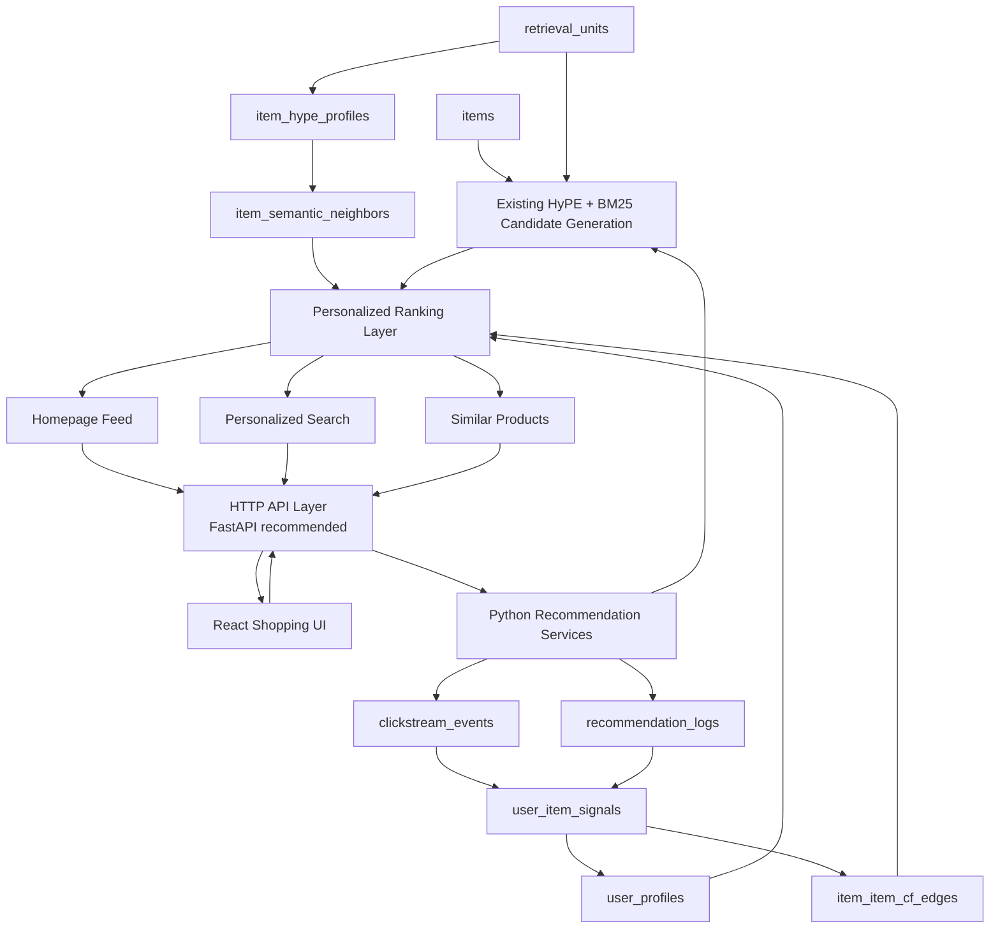

# ColdStart Killer — Final Recommendation Upgrade Plan

**Version:** v2.0 canonical implementation plan  
**Date:** May 2026  
**Project:** MongoDB Hackathon / Recommendation System upgrade  
**Merged from:** `ColdStart_Killer_Personalized_Recommendation_Implementation_Plan.md` + `PLAN_IMPROVEMENTS.md`  
**Primary stack:** React + Vite + TypeScript + Tailwind/shadcn UI, Core Required HTTP API layer, Python service modules, FastAPI recommended but replaceable, PyMongo, MongoDB Atlas  
**Core rule:** keep the existing HyPE + BM25 + `$unionWith` RRF retrieval core intact.

## Status Update - 2026-05-25

This file remains the canonical product/architecture plan, but its execution status has advanced significantly since the original planning pass.

Current execution snapshot:

- Core implementation phases through Phase 13 have been delivered for the demo branch.
- The behavior pipeline, API layer, React frontend, evaluation flow, and demo reset/recovery workflow are live in the repo.
- Bundle A recommendation hygiene has been implemented and validated; Bundle B correctness for negative suppression and search seed eligibility has been applied, while the qualified-CF evidence gate remains open.
- Bundle C explanation faithfulness has been implemented without ranking tuning: primary reasons/badges now follow material weighted contributions, forced cold insertion is attributed, and frontend cards trust backend badge output.
- Bundle D safety/evidence closeout is complete: incremental pending processing refreshes affected signals/item stats/profiles, freshness explicitly identifies lagging CF, evaluation uses the runtime CF computation, and live CF edges now persist the full Bundle D lineage contract.
- After tests and read-only evaluation, an explicitly approved rebuild wrote `1157` signal v4 documents, `43` profile v4 documents, and `514` current-policy CF edges sourced from signal v4.
- Bundle C uses `explain_v3_contribution_faithful` and needs no Mongo rebuild; a read-only `phuc_demo` sample reported `0` primary attribution mismatches across top `10` cards.
- Runtime CF remains on `CF_RUNTIME_INPUT_POLICY=current_supported` while `profile_plus_qualified_cf` is evaluated offline with `min_support=2`; a final current-policy CF rewrite refreshed `514` live edges to persist Bundle D lineage metadata without changing runtime policy.
- Remaining forward-looking scope is the qualified-CF promotion decision after real deliberate multi-user support exists, plus production scheduling/SLO work.

Latest execution evidence and reproduction:

- `RECOMMENDATION_ENHANCEMENT_PLAN_AFTER_AUDIT.md`
- `python scripts/run_personalization_evaluation.py --dry-run --write-artifacts --out .runtime/evaluation/bundle_b_cf_gate_<timestamp> --print-json-summary`
- `python scripts/report_personalization_baseline.py --user-id u_api_5ea7eb5ac87d4abe --top-k 10`
- `python scripts/process_pending_behavior.py --dry-run --max-events 100`

Artifacts under `.runtime/evaluation/` are local ignored outputs; their command and summary metrics must be recorded when used as evidence.

Initial CF gate run (`bundle_b_cf_gate_20260525_2124`, pre-evaluator parity correction): current `profile_plus_cf` achieved `HitRate@10=0.166667`, `Recall@20=0.086508`, `MAP@20=0.019393` with `278` train directional CF edges; qualified CF achieved `0.119048`, `0.078571`, `0.010767` with `0` qualified edges. Decision: `needs_more_evidence`; the approved lineage rebuild therefore retained current CF policy and did not switch runtime CF.

Bundle D parity rerun on 2026-05-25 corrected the evaluator to share the runtime CF edge computation (including caps, recency decay, and symmetric pruning). It reports current `profile_plus_cf` at `HitRate@10=0.166667`, `Recall@20=0.069841`, `MAP@20=0.023210`, `NDCG@20=0.047865` with `268` train directional edges; qualified CF still has `0` edges and the decision remains `needs_more_evidence`. A later closeout rewrite refreshed live current-policy CF edges only to persist lineage metadata; it did not switch runtime policy or promote qualified CF.

This document replaces the planning role of the two earlier plan files. It is a ready-to-implement canonical plan for upgrading ColdStart Killer from a cold-start hybrid retrieval engine into a personalized recommendation engine with behavior logging, user profiles, item-item collaborative filtering, React demo UI, explainability, and evaluation.

---

## 0. One-line Decision

ColdStart Killer will become a **HyPE-assisted personalized recommendation engine**:

1. Existing `items` + `retrieval_units` remain the cold-start content retrieval foundation.
2. New behavior collections record what each user saw and did.
3. User profiles are derived from behavior events, not inserted directly.
4. Item-item collaborative filtering is built from multi-user implicit interactions.
5. React provides a professional demo surface for homepage recommendations, search, product detail, similar products, score breakdowns, and debug panels.

The system must be honest about its layers:

```text
HyPE / propositions / Vector Search / BM25 = cold-start content retrieval
Behavior HyPE profile = semantic personalization
item_semantic_neighbors = semantic item similarity
item_item_cf_edges = true item-item Collaborative Filtering
```

---

## 1. Current Repo Baseline

The current repository already contains a working cold-start retrieval system.

### 1.1 Existing Collections

| Collection | Current role |
|---|---|
| `items` | Product metadata, price, image, category, cold-start state |
| `retrieval_units` | HyPE question units with embeddings and proposition units for BM25 |

### 1.2 Existing Core Files

| File | Current role |
|---|---|
| `src/mongodb.py` | Existing MongoDB connector and collection getters |
| `src/schemas.py` | Existing Pydantic schemas for `items` and `retrieval_units` |
| `src/indexing.py` | Existing dataset-to-MongoDB indexing pipeline |
| `src/query_processor.py` | Query language detection, translation, filter extraction, BGE-M3 embedding |
| `src/search_pipeline.py` | Existing hybrid MongoDB retrieval pipeline |
| `src/retrieval_output.py` | Explainable result formatting |
| `src/evaluation/` | Existing retrieval evaluation framework |

### 1.3 Existing Retrieval Core

The existing buyer search flow is:

```text
raw query
  -> src/query_processor.process_query()
  -> fixture with bm25_search_query_en, hype_search_query_en, query_embedding, hard_filters
  -> src/search_pipeline.run_search()
  -> $vectorSearch over HyPE units
  -> $search BM25 over proposition units
  -> $unionWith manual RRF fusion
  -> $lookup items
  -> scoring and explainable output
```

Current known constants from code/docs:

| Value | Current |
|---|---:|
| items | 3,000 |
| retrieval_units | 29,753 |
| HyPE units | 13,580 |
| proposition units | 16,173 |
| cold items | 3,000, 100% cold |
| embedding dimensions | 1024 |
| vector index | `vector_index` |
| text index | `text_index` |
| vector numCandidates | 400 |
| vector channel limit | 20 |
| default search mode | `$unionWith` |

### 1.4 Dataset Assumption

The current repo/docs indicate two source categories:

```text
All_Beauty
Cell_Phones_and_Accessories
```

Category taxonomy rule:

```text
source_category = raw dataset/source value, e.g. "All_Beauty"
category_id = normalized lowercase internal id, e.g. "all_beauty"
category_path = richer hierarchy/subcategory path if available
```

Synthetic personas, offline builders, and internal filters should use normalized `category_id`. The React UI can display human-readable labels derived from `source_category` and `category_path`. This prevents AI-generated scripts from accidentally matching raw source names against normalized internal category IDs.

The old phrase "20-category diverse MVP slice" is outdated for this repo state. Future category diversity should come from:

- `source_category`
- `category_id`
- `category_path`
- product subcategories
- intent/persona segments
- price buckets
- behavior-derived clusters

Recommended synthetic personas for the current dataset:

1. budget skincare shopper
2. premium skincare shopper
3. makeup/gift beauty shopper
4. phone case/accessory shopper
5. charger/cable shopper
6. wireless/audio accessory shopper
7. budget shopper across both categories
8. mixed gift/exploration shopper

---

## 1.5 Product Problem

This upgrade exists because the current system solves cold-start retrieval, but not the full recommendation lifecycle.

### 1.5.1 Item Cold-start Problem

New or low-interaction items have little or no behavioral evidence:

```text
no clicks
no carts
no purchases
no co-interaction edges
```

The current HyPE + proposition retrieval layer already addresses this by creating retrieval units from product content. The recommendation upgrade must preserve that strength: cold-start items should remain eligible through semantic intent matching, propositions, product facts, and controlled exploration even before they collect behavior.

### 1.5.2 User Cold-start Problem

New users have no interaction history, so the system cannot immediately know their preferences.

The upgraded system handles this with:

- optional onboarding preferences,
- seed item selection,
- session-level behavior,
- exploration-heavy homepage ranking,
- fast profile updates after the first few interactions.

User profiles must be derived from events. They must not be inserted as perfect hand-authored profiles.

### 1.5.3 Recommendation Engine Problem

A production recommendation engine must solve more than search relevance:

| Problem | Required capability |
|---|---|
| What should a user see on the homepage? | Personalized feed generation |
| What should similar products mean? | Semantic similarity + item-item CF |
| How should behavior affect future ranking? | Event scoring and profile updates |
| How do we prove recommendation quality? | Evaluation, baselines, explainability |
| How do we avoid fake CF claims? | CF edges built from multi-user implicit feedback |

The final system should combine content retrieval, user behavior, item-item collaborative filtering, and explainable score breakdowns without rewriting the working retrieval core.

---

## 1.6 Core Concepts

### 1.6.1 Retrieval Unit vs Item

An `item` is the product shown to the user. A `retrieval_unit` is a searchable representation of an item.

| Concept | Stored in | Purpose |
|---|---|---|
| Item | `items` | Product metadata, price, image, brand, cold-start state |
| HyPE retrieval unit | `retrieval_units` | Intent-like question/query representation with embedding |
| Proposition retrieval unit | `retrieval_units` | Factual text representation for BM25/proposition matching |

Ranking should eventually collapse retrieval-unit matches back to item-level recommendations. Explanations should preserve which retrieval unit or fact helped the item appear.

### 1.6.2 Recommendation Snapshot

A recommendation snapshot records exactly what the system showed before the user acted.

```text
surface request
  -> ranked item list
  -> request_id
  -> recommendation_logs
  -> later clickstream_events join back to the snapshot
```

This snapshot is required for attribution: a click only becomes useful training signal if we know why and where the item was shown.

### 1.6.3 Query Intent vs Long-term Preference

Search intent and long-term preference are different signals.

| Signal | Example | Ranking rule |
|---|---|---|
| Query intent | "phone case samsung galaxy s22" | Must dominate search relevance |
| Long-term preference | user often clicks skincare | Light rerank only within query-relevant candidates |
| Session intent | user recently clicked chargers | Can influence homepage and similar products |

Guardrail: profile must never override explicit query intent.

### 1.6.4 Multi-interest User Profile

A user can have more than one interest at the same time.

Example:

```text
interest 1: budget skincare
interest 2: phone accessories
interest 3: gift exploration
```

The profile should store multiple weighted interest vectors instead of one averaged vector. This prevents unrelated interests from collapsing into a blurry representation and supports better homepage diversification.

---

## 2. Final Locked Decisions

| Topic | Decision |
|---|---|
| UI stack | React + Vite + TypeScript |
| UI styling | TailwindCSS + shadcn/ui or equivalent component system |
| Routing | React Router |
| HTTP API layer | Core Required for React; FastAPI is recommended but replaceable |
| Backend service layer | Python service modules called by the API; core logic stays testable without HTTP |
| MongoDB driver | PyMongo |
| Existing retrieval | Reuse `src/query_processor.py` and `src/search_pipeline.py` |
| Search fusion default | Manual `$unionWith` + score blending |
| `$rankFusion` / `$scoreFusion` | Future comparison only, never required for demo |
| User profile | Multi-interest, behavior-derived |
| CF type | Item-item CF from `user_item_signals` |
| Search personalization | Query-first, light rerank only |
| Homepage | Profile-first, diversity-aware |
| Similar products | HyPE semantic neighbors + item-item CF edges |
| Synthetic behavior | Seed events and logs; never seed perfect profiles directly |
| Expensive work | Batch/precompute |
| Realtime work | log event, process one event, lightweight profile update |
| Mongo connector | Extend `src/mongodb.py`; do not create duplicate Mongo clients |

---

## 3. Non-negotiable Guardrails

These guardrails must be copied into every AI coding prompt for this upgrade.

### 3.1 Do Not Rewrite Existing Retrieval Core

- Do not rewrite `src/search_pipeline.py`.
- Do not rewrite `src/query_processor.py`.
- Do not rewrite `src/indexing.py`.
- Do not change `items` or `retrieval_units` contracts unless explicitly required and reviewed.
- Personalized search must wrap existing search:

```text
process_query(raw_query)
  -> run_search(fixture, top_k=N)
  -> rerank returned candidates lightly using profile/CF/metadata
```

### 3.2 Do Not Duplicate MongoDB Connection Logic

Use and extend:

```text
src/mongodb.py
```

Add collection getters there when implementation begins:

```python
get_users_collection()
get_sessions_collection()
get_recommendation_logs_collection()
get_clickstream_events_collection()
get_user_item_signals_collection()
get_user_profiles_collection()
get_item_hype_profiles_collection()
get_item_semantic_neighbors_collection()
get_item_item_cf_edges_collection()
get_item_stats_collection()
get_query_embedding_cache_collection()
```

Do not create `src/storage/mongo.py` if it only duplicates `src/mongodb.py`. If a storage layer is introduced later, it must wrap/re-export the existing connector and must not create a new `MongoClient`.

### 3.3 Do Not Mislabel Semantic Similarity as CF

Allowed wording:

```text
HyPE profile = semantic personalization
item_semantic_neighbors = semantic item similarity
item_item_cf_edges = Collaborative Filtering
```

Forbidden wording:

```text
Do not describe HyPE vector similarity as collaborative filtering.
Do not describe semantic neighbors as collaborative filtering.
Do not describe a user profile embedding alone as collaborative filtering.
```

### 3.4 Do Not Seed Perfect Profiles

Synthetic data flow must be:

```text
synthetic_personas
  -> recommendation_logs
  -> clickstream_events
  -> user_item_signals
  -> user_profiles
  -> item_item_cf_edges
```

`user_profiles` must be derived from events/signals. Direct insertion of perfect profiles is allowed only for tiny unit-test fixtures, not for demo data.

### 3.5 Do Not Run Realtime All-pair CF

`item_item_cf_edges` must be batch/precomputed. Realtime UI interactions may update a lightweight user profile, but not rebuild all item-item pairs.

### 3.6 Do Not Let Profile Override Query Intent

Search is query-first. Profile and CF only help rank among query-relevant candidates.

### 3.7 Do Not Duplicate React Impressions

React re-renders must not produce duplicate impression events.

Rules:

```text
One surface view = one stable request_id.
Impression insert is idempotent by idempotency_key or a partial unique index for impressions only.
New feed refresh = new request_id.
Re-render of same feed = same request_id.
```

Backend must enforce idempotency even if frontend sends duplicates. Do not create a global unique constraint on `{request_id, item_id, event_type}` for every event type: repeated clicks, dwell updates, add-to-cart retries, or later purchase events must remain representable. Use deterministic idempotency only where the event semantics require it, especially impressions.

---

## 4. Target Architecture



### Architecture Principle

The existing `items` + `retrieval_units` layer remains the content retrieval foundation. The new recommendation layer adds:

```text
clickstream_events
  -> user_item_signals
  -> user_profiles
  -> item_item_cf_edges
  -> personalized ranking
```

---

## 5. Priority Taxonomy

Use this taxonomy instead of deleting future ideas.

| Priority | Meaning |
|---|---|
| Core Required | Needed for the recommendation-system demo and core claim |
| Strongly Recommended | Adds major quality/wow factor; implement after Core Required |
| Advanced / Future | Keep in vision, implement after demo path is stable |
| Guardrail / Do Not Violate | Constraint that protects existing repo correctness |

### 5.1 Current Priority Classification

| Component | Priority |
|---|---|
| React UI | Core Required |
| HTTP API layer, FastAPI recommended but replaceable | Core Required for React |
| `recommendation_logs` | Core Required |
| `clickstream_events` | Core Required |
| `user_item_signals` | Core Required |
| `user_profiles` | Core Required |
| `item_hype_profiles` | Core Required |
| `item_item_cf_edges` | Core Required |
| score breakdown / explanation | Core Required |
| synthetic behavior seed | Core Required |
| homepage personalized feed | Core Required |
| search reranking wrapper | Strongly Recommended |
| `item_semantic_neighbors` | Strongly Recommended |
| similar products | Strongly Recommended |
| diversity reranking | Strongly Recommended |
| multi-interest profile | Strongly Recommended; simplified MVP acceptable |
| evaluation personalization + CF | Strongly Recommended |
| debug/admin panel | Strongly Recommended |
| onboarding | Advanced / Future |
| seller add product | Advanced / Future |
| Tavily/web enrichment | Advanced / Future |
| query embedding cache | Advanced / Future |
| Redis | Advanced / Future |
| rewrite `search_pipeline.py` | Guardrail / Do Not Violate |

---

## 6. MongoDB Collections

### 6.1 Existing Collections

Keep existing collections unchanged:

```text
items
retrieval_units
```

Current key fields from code:

```text
items:
  _id, source_category, title_en, brand, category_id, category_path,
  price_vnd, price_bucket, in_stock, image_url, content_richness,
  quality_score, cold_start.is_cold_item, cold_start.interaction_count,
  description_enriched.seller_confirmed

retrieval_units:
  _id, item_id, unit_type, language, raw_text, confidence,
  category_id, price_vnd, price_bucket, in_stock, is_cold_item,
  seller_confirmed, aspect, embedding_text, embedding,
  proposition_type, text_search, item_title_en, item_brand
```

### 6.2 New Collections

| Collection | Priority | Purpose |
|---|---|---|
| `users` | Core Required | Anonymous demo user identity and privacy settings |
| `sessions` | Core Required | Session context for UI/API |
| `recommendation_logs` | Core Required | What was shown and why |
| `clickstream_events` | Core Required | Raw interactions |
| `user_item_signals` | Core Required | Aggregated implicit user-item feedback |
| `user_profiles` | Core Required | Multi-interest personalization state |
| `item_hype_profiles` | Core Required | Item-level semantic centroid from HyPE units |
| `item_item_cf_edges` | Core Required | True item-item collaborative filtering graph |
| `item_semantic_neighbors` | Strongly Recommended | Semantic item similarity graph |
| `item_stats` | Strongly Recommended | Item-level behavioral aggregates |
| `query_embedding_cache` | Advanced / Future | Cache hot query embeddings |
| `synthetic_personas` | Advanced / Future | Persist persona configs if useful |
| `evaluation_runs` | Advanced / Future | Persist personalization evaluation runs |

---

## 7. New Collection Schemas and Indexes

The exact implementation can use Pydantic models, dataclasses, or plain validated dictionaries, but field names should match this contract.

### 7.1 `users`

```json
{
  "_id": "ObjectId",
  "user_id_hash": "u_demo_skincare",
  "created_at": "ISODate",
  "profile_status": "new|onboarded|warming|warm",
  "privacy": {
    "allow_personalization": true,
    "allow_clickstream_logging": true
  },
  "onboarding": {
    "completed": false,
    "completed_at": null,
    "selected_categories": [],
    "selected_price_buckets": [],
    "selected_seed_item_ids": []
  },
  "updated_at": "ISODate"
}
```

Indexes:

```javascript
db.users.createIndex({ user_id_hash: 1 }, { unique: true })
db.users.createIndex({ profile_status: 1 })
```

Privacy rule: no names, email, phone, IP address, physical address, or raw cookie.

### 7.2 `sessions`

```json
{
  "_id": "ObjectId",
  "session_id": "sess_001",
  "user_id_hash": "u_demo_skincare",
  "started_at": "ISODate",
  "ended_at": null,
  "locale": "vi|en",
  "device_type": "desktop|mobile|unknown",
  "entry_source": "home|search|direct|demo",
  "active_surface": "home|search|detail|debug",
  "created_at": "ISODate",
  "updated_at": "ISODate"
}
```

Indexes:

```javascript
db.sessions.createIndex({ session_id: 1 }, { unique: true })
db.sessions.createIndex({ user_id_hash: 1, started_at: -1 })
```

Minimal implementation note:

```text
Implement sessions minimally first:
session_id, user_id_hash, started_at, active_surface, created_at, updated_at.
Advanced device analytics, attribution funnels, and session replay fields can be added later.
```

### 7.3 `recommendation_logs`

Purpose: display snapshot per shown item.

```json
{
  "_id": "ObjectId",
  "request_id": "req_001",
  "surface": "search|home|detail_similar|seller_preview",
  "user_id_hash": "u_demo_skincare",
  "session_id": "sess_001",
  "algorithm_version": "rec_v1_profile_cf_hype",
  "ranking_version": "rank_v1_default_weights",
  "query": {
    "raw_query": "kem chống nắng cho da dầu",
    "english_query": "sunscreen for oily skin",
    "query_type": "specific|broad|exploratory|none",
    "query_embedding_hash": "qhash_001"
  },
  "item_id": "B0ABC123",
  "rank_position": 2,
  "scores": {
    "query_hybrid_score": 0.68,
    "profile_score": 0.18,
    "semantic_neighbor_score": 0.0,
    "item_item_cf_score": 0.0,
    "category_affinity_score": 0.12,
    "brand_affinity_score": 0.04,
    "price_affinity_score": 0.09,
    "cold_start_boost": 0.05,
    "exploration_score": 0.02,
    "seen_penalty": 0.0,
    "negative_penalty": 0.0,
    "diversity_adjustment": 0.0,
    "final_score": 0.81
  },
  "attribution": {
    "matched_unit_ids": ["ru_01", "ru_08"],
    "matched_intents": ["oil-control sunscreen for oily skin"],
    "matched_facts": ["SPF50 PA++++"],
    "matched_channels": ["vector_hype", "bm25"],
    "candidate_sources": ["query_vector", "query_bm25", "profile", "cf"],
    "matched_profile_interest_ids": [],
    "cf_evidence": {
      "source_item_id": "B0SOURCE",
      "support": 4,
      "cf_score": 0.61
    },
    "explanation": "Matched your search and your skincare interest."
  },
  "shown_at": "ISODate"
}
```

Indexes:

```javascript
db.recommendation_logs.createIndex({ request_id: 1, item_id: 1 }, { unique: true })
db.recommendation_logs.createIndex({ user_id_hash: 1, shown_at: -1 })
db.recommendation_logs.createIndex({ session_id: 1, shown_at: -1 })
db.recommendation_logs.createIndex({ item_id: 1, shown_at: -1 })
db.recommendation_logs.createIndex({ surface: 1, shown_at: -1 })
```

Versioning rule:

```text
algorithm_version tracks the service/ranking recipe that generated the snapshot.
ranking_version tracks weights, quotas, and scoring constants.
Every evaluation run and debug panel should preserve these values for reproducibility.
```

### 7.4 `clickstream_events`

Purpose: raw user interactions.

```json
{
  "_id": "ObjectId",
  "event_id": "evt_001",
  "idempotency_key": "imp:req_001:B0ABC123",
  "request_id": "req_001",
  "user_id_hash": "u_demo_skincare",
  "session_id": "sess_001",
  "surface": "search|home|detail_similar|cart|onboarding",
  "event_type": "impression|click|view_detail|add_to_cart|purchase|hide|dislike|wishlist",
  "item_id": "B0ABC123",
  "query_text": "kem chống nắng cho da dầu",
  "rank_position": 2,
  "dwell_time_ms": 8500,
  "is_synthetic": false,
  "client": {
    "component": "product_card|detail_page|cart_button|survey",
    "device_type": "desktop|mobile|unknown"
  },
  "metadata": {
    "category_id": "all_beauty",
    "brand": "Anessa",
    "price_vnd": 250000,
    "price_bucket": "100k-300k"
  },
  "timestamp": "ISODate",
  "processed": false,
  "created_at": "ISODate"
}
```

Indexes:

```javascript
db.clickstream_events.createIndex({ event_id: 1 }, { unique: true })
db.clickstream_events.createIndex(
  { idempotency_key: 1 },
  {
    unique: true,
    partialFilterExpression: {
      idempotency_key: { $exists: true }
    }
  }
)
db.clickstream_events.createIndex(
  { request_id: 1, item_id: 1 },
  {
    unique: true,
    partialFilterExpression: {
      event_type: "impression"
    }
  }
)
db.clickstream_events.createIndex({ request_id: 1, item_id: 1, event_type: 1 })
db.clickstream_events.createIndex({ user_id_hash: 1, timestamp: -1 })
db.clickstream_events.createIndex({ session_id: 1, timestamp: -1 })
db.clickstream_events.createIndex({ item_id: 1, event_type: 1, timestamp: -1 })
db.clickstream_events.createIndex({ processed: 1, timestamp: 1 })
db.clickstream_events.createIndex({ timestamp: 1 }, { expireAfterSeconds: 7776000 })
```

Retention note:

```text
For hackathon/demo, TTL can be disabled or set long enough to avoid deleting seeded behavior before demo.
For production, use TTL or archival policy according to privacy and data-retention requirements.
```

Idempotency rules:

```text
impression:
  deterministic idempotency_key = "imp:{request_id}:{item_id}"
  one insert per request_id + item_id

click/add_to_cart/wishlist/hide/dislike/purchase:
  unique event_id is always required
  idempotency_key is optional and used only for frontend retry protection
  do not globally dedupe all event types by request_id + item_id + event_type

view_detail:
  unique event_id is required
  optional idempotency_key can represent one detail view lifecycle
```

### 7.5 `user_item_signals`

Purpose: aggregate implicit feedback for each `(user, item)` pair.

```json
{
  "_id": {
    "user_id_hash": "u_demo_skincare",
    "item_id": "B0ABC123"
  },
  "user_id_hash": "u_demo_skincare",
  "item_id": "B0ABC123",
  "implicit_score": 4.25,
  "confidence": 2.70,
  "positive_score": 4.80,
  "negative_score": 0.55,
  "preference": true,
  "event_counts": {
    "impression": 5,
    "click": 2,
    "view_detail": 1,
    "add_to_cart": 1,
    "purchase": 0,
    "wishlist": 0,
    "hide": 0,
    "dislike": 0
  },
  "reason_scores": [
    {
      "intent": "oil-control sunscreen for oily skin",
      "score": 1.62,
      "source": "search_click",
      "last_seen_at": "ISODate"
    }
  ],
  "last_interaction_at": "ISODate",
  "first_interaction_at": "ISODate",
  "updated_at": "ISODate"
}
```

Indexes:

```javascript
db.user_item_signals.createIndex({ user_id_hash: 1, item_id: 1 }, { unique: true })
db.user_item_signals.createIndex({ user_id_hash: 1, implicit_score: -1 })
db.user_item_signals.createIndex({ item_id: 1, implicit_score: -1 })
db.user_item_signals.createIndex({ last_interaction_at: -1 })
```

### 7.6 `user_profiles`

Purpose: multi-interest user personalization state.

```json
{
  "_id": "u_demo_skincare",
  "user_id_hash": "u_demo_skincare",
  "profile_status": "new|onboarded|warming|warm",
  "profile_quality": {
    "num_events": 42,
    "num_positive_items": 12,
    "num_purchases": 1,
    "num_categories": 2,
    "confidence": 0.68
  },
  "explicit_prefs": {
    "source": "none|onboarding",
    "categories": [],
    "price_buckets": [],
    "seed_item_ids": []
  },
  "category_affinity": {
    "all_beauty": 0.72
  },
  "brand_affinity": {
    "Anessa": 0.48
  },
  "price_affinity": {
    "preferred_buckets": {
      "100k-300k": 0.64
    },
    "median_clicked_price": 220000,
    "median_cart_price": 260000,
    "median_purchased_price": null
  },
  "intent_affinity": [
    {
      "intent": "oil-control sunscreen for oily skin",
      "score": 0.81,
      "source": "search_click",
      "last_seen_at": "ISODate"
    }
  ],
  "short_term_embedding": [0.01, -0.02],
  "long_term_embedding": [0.03, 0.04],
  "interest_vectors": [
    {
      "interest_id": "int_001",
      "label": "oil-control skincare",
      "embedding": [0.12, -0.04],
      "weight": 3.8,
      "categories": ["all_beauty"],
      "top_intents": ["oil-control sunscreen for oily skin"],
      "evidence": {
        "click": 4,
        "view_detail": 2,
        "add_to_cart": 1,
        "purchase": 0
      },
      "top_item_ids": ["B0ABC123"],
      "last_updated_at": "ISODate"
    }
  ],
  "negative_preferences": {
    "item_ids": [],
    "brands": [],
    "categories": [],
    "intents": []
  },
  "recent_item_ids": [],
  "purchased_item_ids": [],
  "updated_at": "ISODate"
}
```

Indexes:

```javascript
db.user_profiles.createIndex({ user_id_hash: 1 }, { unique: true })
db.user_profiles.createIndex({ profile_status: 1 })
db.user_profiles.createIndex({ updated_at: -1 })
```

### 7.7 `item_hype_profiles`

Purpose: item-level semantic centroid from all HyPE units.

```json
{
  "_id": "B0ABC123",
  "item_id": "B0ABC123",
  "item_semantic_embedding": [0.01, 0.02],
  "top_hype_unit_ids": ["ru_01", "ru_02", "ru_03"],
  "top_aspects": ["constraint", "persona"],
  "num_hype_units": 5,
  "updated_at": "ISODate"
}
```

Indexes:

```javascript
db.item_hype_profiles.createIndex({ item_id: 1 }, { unique: true })
```

### 7.8 `item_semantic_neighbors`

Purpose: semantic item-item neighbors from HyPE unit/vector similarity. This is not CF.

```json
{
  "_id": "B0ABC123",
  "item_id": "B0ABC123",
  "neighbors": [
    {
      "neighbor_item_id": "B0XYZ456",
      "neighbor_score": 0.84,
      "matched_unit_ids": ["ru_01", "ru_07"],
      "matched_aspects": ["persona", "function"],
      "source": "hype_unit_vector_search"
    }
  ],
  "updated_at": "ISODate"
}
```

Indexes:

```javascript
db.item_semantic_neighbors.createIndex({ item_id: 1 }, { unique: true })
db.item_semantic_neighbors.createIndex({ "neighbors.neighbor_item_id": 1 })
```

### 7.9 `item_item_cf_edges`

Purpose: true item-item Collaborative Filtering edges from behavior.

```json
{
  "_id": "B0ABC123::B0XYZ456",
  "item_id": "B0ABC123",
  "neighbor_item_id": "B0XYZ456",
  "cf_score": 0.74,
  "co_view_count": 12,
  "co_click_count": 7,
  "co_cart_count": 3,
  "co_purchase_count": 1,
  "support": 14,
  "confidence": 0.61,
  "top_common_user_hashes_sample": [],
  "explanation": "Users who clicked or carted this item also interacted with this recommendation.",
  "updated_at": "ISODate"
}
```

Indexes:

```javascript
db.item_item_cf_edges.createIndex({ item_id: 1, cf_score: -1 })
db.item_item_cf_edges.createIndex({ neighbor_item_id: 1 })
db.item_item_cf_edges.createIndex({ updated_at: -1 })
```

### 7.10 `item_stats`

Purpose: item-level behavior aggregates and popularity baseline.

```json
{
  "_id": "B0ABC123",
  "item_id": "B0ABC123",
  "impression_count": 100,
  "click_count": 20,
  "view_detail_count": 15,
  "add_to_cart_count": 5,
  "purchase_count": 2,
  "hide_count": 1,
  "ctr": 0.20,
  "cart_rate": 0.05,
  "purchase_rate": 0.02,
  "first_seen_at": "ISODate",
  "last_interaction_at": "ISODate",
  "cold_start": {
    "is_cold_item": false,
    "interaction_count": 142,
    "age_days": 8
  },
  "quality_score": 0.68,
  "updated_at": "ISODate"
}
```

Indexes:

```javascript
db.item_stats.createIndex({ item_id: 1 }, { unique: true })
db.item_stats.createIndex({ "cold_start.is_cold_item": 1, quality_score: -1 })
db.item_stats.createIndex({ ctr: -1 })
```

### 7.11 `query_embedding_cache`

Advanced / Future. Use only after the base system is stable.

```json
{
  "_id": "qhash_001",
  "query_hash": "qhash_001",
  "raw_query": "kem chống nắng cho da dầu",
  "english_query": "sunscreen for oily skin",
  "embedding": [0.01, 0.02],
  "embedding_model": "BAAI/bge-m3",
  "created_at": "ISODate",
  "last_used_at": "ISODate",
  "usage_count": 5
}
```

---

## 8. Event Taxonomy and Weights

### 8.1 Base Event Weights

```python
EVENT_WEIGHTS = {
    "impression": 0.0,
    "click": 0.6,
    "view_detail_short": 0.3,
    "view_detail_medium": 0.8,
    "view_detail_long": 1.5,
    "wishlist": 2.2,
    "add_to_cart": 3.0,
    "purchase": 5.0,
    "hide": -2.0,
    "dislike": -3.0,
}
```

### 8.2 Surface Weights

```python
SURFACE_WEIGHTS = {
    "search": 1.10,
    "home": 0.85,
    "detail_similar": 0.95,
    "onboarding": 1.00,
}
```

### 8.3 Query Intent Strength

Search behavior should count more when the query is explicit and constraint-rich. Homepage and similar-product behavior should use a neutral value unless the event is attached to a known query.

| Query type | Example | query_intent_strength |
|---|---|---:|
| `specific` | "samsung galaxy s22 clear case" | 1.20 |
| `constraint_rich` | "wireless charger under 300k iphone" | 1.12 |
| `normal` | "moisturizing cream dry skin" | 1.00 |
| `broad` | "phone accessories" | 0.85 |
| `exploratory` | "gift ideas" | 0.75 |
| no query | homepage click | 1.00 |

Definition:

```text
query_intent_strength measures how strongly an event should update
the user's profile because it came from an explicit user query.
```

It is used inside `event_update_score`. A click from a specific search query updates the profile more strongly than a click from a broad/exploratory query.

### 8.4 Recency Decay

Use exponential half-life decay:

```python
recency_decay = 0.5 ** (age_days / half_life_days)
```

Recommended half-lives:

| Signal target | half_life_days | Reason |
|---|---:|---|
| short-term session profile | 3 | Captures current shopping intent |
| long-term user profile | 30 | Keeps stable preference memory |
| item-item CF support | 45 | Co-interactions should decay slowly |
| negative preference | 14 | Avoid over-penalizing old dislikes |

Synthetic events may set `age_days = 0` for a fresh demo state, or use generated timestamps when evaluating temporal split behavior.

### 8.5 Dwell Factor

```text
0-2 sec        -> short / weak
2-10 sec       -> medium
10-60 sec      -> long
> 5 min        -> cap, do not keep increasing score
```

### 8.6 Position Factor

Position factor corrects real position bias:

```text
Click at rank 8 can be a stronger intent signal than click at rank 1,
because the user had to scroll farther.
```

For real React UI events:

```python
position_factor = compute_position_factor(rank_position)
```

For synthetic events:

```python
position_factor = 1.0
```

Reason: the synthetic generator already simulates position bias in click probability. Applying correction again can double-count/cancel the signal and make synthetic profiles noisy.

### 8.7 Final Event Update Score

```python
event_update_score = (
    base_event_weight
  * surface_weight
  * attribution_confidence
  * query_intent_strength
  * dwell_factor
  * position_factor
  * recency_decay
)
```

---

## 9. Recommendation Attribution

`recommendation_logs` must store why an item was shown before user interaction happens.

This matters because profile updates should be behavior-attributed:

```text
Displayed ranking score explains why an item was shown.
User profile updates are driven by actual behavior events,
weighted by the ranking attribution.
```

When a user clicks an item, the system joins:

```text
clickstream_event.request_id + item_id
  -> recommendation_logs.request_id + item_id
  -> scores + attribution
  -> event_update_score + event_vector
```

Attribution confidence examples:

| Source | Confidence |
|---|---:|
| vector HyPE + BM25 both matched | high |
| vector HyPE only | medium-high |
| BM25 fact only | medium |
| exploration/random | low |
| CF edge with support >= 3 | medium-high |

### 9.1 Data Lineage for Demo Trust

The demo/debug panel should be able to show lineage for at least one recommendation:

```text
Recommendation shown
  -> recommendation_logs
User action
  -> clickstream_events
Aggregation
  -> user_item_signals
Personalization
  -> user_profiles
Collaborative Filtering
  -> item_item_cf_edges
```

This lineage proves that profile and CF evidence are derived from behavior, not hardcoded. It also helps judges trace why an item appeared and which algorithm/ranking version produced it.

---

## 10. Item Semantic Embedding Strategy

### 10.1 Two Item Representations

Use two complementary representations:

1. **All HyPE units** for attribution and neighbor expansion.
2. **Item centroid embedding** for fast profile update and scoring.

```text
item_semantic_embedding = weighted average of all hype_question embeddings for the item
```

Default unit weight:

```python
unit_weight = confidence * aspect_weight
```

Aspect weights:

| Aspect | Weight |
|---|---:|
| `constraint` | 1.15 |
| `persona` | 1.10 |
| `benefit` | 1.05 |
| `function` | 1.00 |
| `occasion` | 0.95 |
| `style` | 0.90 |
| unknown | 1.00 |

### 10.2 Build `item_hype_profiles`

Script to implement later:

```text
scripts/build_item_hype_profiles.py
```

Algorithm:

```text
For each item_id:
  read all retrieval_units where unit_type = "hype_question"
  validate each embedding is 1024-dim and finite
  compute weighted centroid
  normalize centroid
  choose top_hype_unit_ids by confidence * aspect_weight
  upsert item_hype_profiles[item_id]
```

Acceptance criteria:

```text
item_hype_profiles count ~= items count, except items with no HyPE units.
Every item_semantic_embedding is 1024-dim.
No NaN/Inf values.
Centroid norm is close to 1.0.
```

---

## 11. Synthetic Behavior Seed Data

Synthetic data is required because the current catalog is 100% cold and has no real user interaction history. It must be honest, behavior-derived, and explainable.

### 11.1 Persona Strategy

Use current dataset categories but create diversity through intent:

| Persona | Main intent |
|---|---|
| `p_budget_skincare` | affordable moisturizers/cleansers |
| `p_premium_skincare` | premium beauty/skincare |
| `p_makeup_gift` | beauty gifts / makeup |
| `p_phone_case` | phone cases and protection |
| `p_charger_cable` | chargers, USB-C, fast charging |
| `p_wireless_audio` | earbuds, headphones, audio accessories |
| `p_budget_cross_category` | cheap useful items across both categories |
| `p_mixed_explorer` | mixed gift/exploration behavior |

### 11.2 Persona Schema

```json
{
  "persona_id": "p_budget_skincare",
  "label": "Budget skincare shopper",
  "preferred_categories": {
    "all_beauty": 0.80,
    "cell_phones_and_accessories": 0.20
  },
  "preferred_price_buckets": {
    "100k-300k": 0.75,
    "300k-500k": 0.25
  },
  "brand_bias": {},
  "intent_keywords": ["oil control", "sensitive skin", "lightweight", "budget"],
  "negative_keywords": ["expensive", "heavy texture"],
  "intent_embedding": [0.01, 0.02]
}
```

### 11.3 Persona-item Match Formula

Merge of PLAN_IMPROVEMENTS G1.

```python
def compute_persona_item_match(persona: dict, item: dict, item_hype_profile: dict) -> float:
    """
    Return persona-item match score in [0, 1].
    """
    item_category = item.get("category_id", "")
    category_score = persona["preferred_categories"].get(item_category, 0.0)

    item_price_bucket = item.get("price_bucket", "")
    price_score = persona["preferred_price_buckets"].get(item_price_bucket, 0.0)

    semantic_score = cosine_similarity(
        persona["intent_embedding"],
        item_hype_profile["item_semantic_embedding"],
    )
    semantic_score = (semantic_score + 1) / 2

    return (
        0.40 * category_score
      + 0.20 * price_score
      + 0.40 * semantic_score
    )
```

Minimum viable fallback:

```text
If persona intent embeddings are not precomputed yet:
  raw_match = 0.60 * category_score + 0.40 * price_score
```

### 11.4 Click Probability

```python
def simulate_click_probability(match_score: float, rank_position: int) -> float:
    position_bias = 1.0 / (1.0 + 0.08 * (rank_position - 1))
    base_prob = 1 / (1 + math.exp(-8 * (match_score - 0.5)))
    return base_prob * position_bias
```

### 11.5 Cart / Purchase Probability

```python
def should_add_to_cart(match_score: float, clicked: bool) -> bool:
    if not clicked:
        return False
    cart_prob = max(0, (match_score - 0.65) * 2.0)
    return random.random() < cart_prob
```

Purchases should be rarer than carts:

```text
purchase_prob = cart_prob * 0.20 to 0.35
```

### 11.6 Synthetic Event Counts

Recommended seed:

| Data | Target |
|---|---:|
| personas | 6-8 |
| users per persona | 5-8 |
| total users | 30-60 |
| events per user | 20-50 |
| total events | 800-2,500 |
| minimum viable events | 300 |
| positive items per user | 8-15 |

### 11.7 Anti-fake Rules

Do not insert `user_profiles` directly. Synthetic flow must run:

```text
persona -> search/feed results -> recommendation_logs -> clickstream_events
       -> user_item_signals -> user_profiles -> item_item_cf_edges
```

Add noise:

- some impressions with no click
- occasional weak click
- occasional irrelevant item
- repeated no-click impressions
- no perfect category-only behavior

---

## 12. User Item Signals

### 12.1 Build Flow

```text
unprocessed clickstream_events
  -> join recommendation_logs by request_id + item_id
  -> compute event_update_score
  -> upsert user_item_signals
  -> mark events processed
```

### 12.2 Idempotency

Processing the same event twice must not double-count it.

Required design:

```text
event_id unique
processed flag
or processed_event_ids set/checkpoint
```

Acceptance test:

```text
Run signal builder twice on same events.
user_item_signals scores and counts must remain unchanged after second run.
```

---

## 13. Multi-interest User Profiles

### 13.1 Update Flow

```text
clickstream_event
  + recommendation_log
  + item_hype_profile
  -> event_update_score
  -> event_vector
  -> update user_item_signals
  -> update user_profiles
```

### 13.2 Event Vectors

The event vector is the semantic vector used to update a user's interests. It must be derived from the item, matched retrieval evidence, and the surface context.

#### Search event vector

Use the matched retrieval unit when available:

```python
event_vector = normalize(
    0.65 * matched_unit_embedding
  + 0.25 * item_semantic_embedding
  + 0.10 * query_embedding
)
```

Use this when the clicked item has a high-confidence matched HyPE or proposition unit from the search result.

#### No matched unit fallback

If the result has no matched unit but has an item semantic embedding:

```python
event_vector = normalize(
    0.80 * item_semantic_embedding
  + 0.20 * query_embedding
)
```

This keeps the update connected to the user's query without inventing evidence.

#### BM25-only fallback

If the result came only from BM25 and no usable retrieval-unit embedding is available:

```python
event_vector = normalize(
    0.70 * item_semantic_embedding
  + 0.20 * query_embedding
  + 0.10 * title_or_fact_embedding
)
```

If `title_or_fact_embedding` does not exist, drop that term and renormalize. Do not call a new embedding model path; reuse the existing BGE-M3 embedding utility if embedding is explicitly needed by an implementation phase.

#### Homepage event vector

For homepage items that were shown because of an interest vector:

```python
event_vector = normalize(
    0.65 * item_semantic_embedding
  + 0.35 * matched_interest_embedding
)
```

For exploration-only homepage items:

```python
event_vector = item_semantic_embedding
```

#### Similar product event vector

For a click from the similar-products surface:

```python
event_vector = normalize(
    0.55 * candidate_item_semantic_embedding
  + 0.25 * source_item_semantic_embedding
  + 0.20 * matched_neighbor_embedding
)
```

If the similar result is backed by CF only, use:

```python
event_vector = normalize(
    0.75 * candidate_item_semantic_embedding
  + 0.25 * source_item_semantic_embedding
)
```

#### Onboarding seed item vector

When a user selects seed items during onboarding:

```python
event_vector = item_semantic_embedding
```

When the user selects only categories/intents and no items, create a weak bootstrap vector from representative category/item centroids. Mark it as low confidence so early real interactions can quickly override it.

### 13.3 Interest Matching

Default:

```python
INTEREST_MERGE_THRESHOLD = 0.72
MAX_INTERESTS_PER_USER = 8
MAX_INTEREST_WEIGHT = 20.0
```

Find nearest interest:

```python
best_interest = max(
    user_profile["interest_vectors"],
    key=lambda interest: cosine(event_vector, interest["embedding"]),
)
```

Merge if:

```text
cosine(event_vector, best_interest.embedding) >= 0.72
```

Else create new interest if there is room.

### 13.4 Threshold Calibration Guide

Merge of PLAN_IMPROVEMENTS G2.

Starting assumption:

```text
BGE-M3 related queries often cluster around 0.65-0.85.
Same narrow intent often appears near or above 0.72.
Unrelated intents often fall below 0.50.
```

Validation:

```python
def validate_merge_threshold(threshold: float, user_profiles: list) -> dict:
    interest_counts = [len(p["interest_vectors"]) for p in user_profiles]
    return {
        "mean_interests": sum(interest_counts) / len(interest_counts),
        "max_interests": max(interest_counts),
        "users_with_1_interest": sum(1 for c in interest_counts if c == 1),
        "users_with_8plus_interests": sum(1 for c in interest_counts if c >= 8),
    }
```

Target ranges:

```text
mean_interests: 2.0-4.0
users_with_1_interest: < 20%
users_with_8plus_interests: < 10%
```

Tuning:

```text
mean_interests < 2.0 -> increase threshold to 0.78-0.82
mean_interests > 5.0 -> lower threshold to 0.65-0.68
```

### 13.5 Merge Formula

```python
new_embedding = normalize(
    old_embedding * old_weight
  + event_vector * event_update_score
)

new_weight = min(
    old_weight + abs(event_update_score),
    MAX_INTEREST_WEIGHT
)
```

Short-term:

```python
short_term_embedding = normalize(
    old_short_term_embedding * 0.70
  + event_vector * 0.30 * event_update_score
)
```

Long-term:

```python
long_term_embedding = normalize(
    old_long_term_embedding * 0.90
  + event_vector * 0.10 * event_update_score
)
```

### 13.6 Max Interests Policy

Merge of PLAN_IMPROVEMENTS G7.

For hackathon MVP use Option B:

```text
If user already has MAX_INTERESTS_PER_USER interests and a new event does not meet
the threshold, merge into the nearest existing interest anyway.
```

Later production option:

```text
Evict the lowest-weight interest if the new event_update_score is strong enough.
```

MVP pseudocode:

```python
def find_target_interest_or_create(interest_vectors, event_vector, threshold, max_interests):
    if not interest_vectors:
        return None, True

    similarities = [cosine(event_vector, iv["embedding"]) for iv in interest_vectors]
    best_idx = max(range(len(similarities)), key=lambda i: similarities[i])

    if similarities[best_idx] >= threshold:
        return interest_vectors[best_idx], False

    if len(interest_vectors) < max_interests:
        return None, True

    return interest_vectors[best_idx], False
```

### 13.7 Negative Preferences

For `hide` or `dislike`:

```text
Add item_id immediately.
Add brand/category/intent only after repeated negative evidence.
Never ban a whole category from one dislike.
```

---

## 14. Collaborative Filtering Correctness & How We Explain It to Judges

### 14.1 What Is CF in This Project?

True CF is:

```text
item_item_cf_edges
  built from user_item_signals
  built from multiple users' implicit interactions
  using co-view / co-click / co-cart / co-purchase behavior
```

### 14.2 What Is Not CF?

| Component | Correct label |
|---|---|
| HyPE vector retrieval | content-based semantic retrieval |
| Behavior HyPE profile | semantic personalization |
| user profile embedding | user-content matching |
| item_hype_profiles | item semantic centroid |
| item_semantic_neighbors | semantic item similarity |
| similar products from HyPE only | content-based similar products |

### 14.3 Item-item CF Build

Input:

```text
user_item_signals where implicit_score > 1.0 or preference = true
```

For each user:

```python
positive_items = get_positive_items(user_id_hash)
positive_items = top_30_by_implicit_score(positive_items)

for each pair (i, j) in combinations(positive_items, 2):
    pair_score += min(score_i, score_j) * recency_decay_pair
    support += 1
```

Normalize:

```python
cf_score(i, j) = pair_score(i, j) / sqrt(popularity(i) * popularity(j))
```

Store symmetric edges:

```text
A -> B
B -> A
```

Thresholds:

```text
Synthetic demo: support >= 2 or 3
Larger data: support >= 5
top_neighbors_per_item: 50
```

### 14.4 How to Answer Judges

Use this wording:

```text
Our cold-start layer is HyPE + propositions + MongoDB Vector Search/BM25.
Our personalization layer learns semantic user interests from behavior.
Our Collaborative Filtering layer is item-item CF: we aggregate implicit
user-item signals across many users and build item_item_cf_edges from
co-interactions. The UI shows support, co-click/co-cart counts, and cf_score.
```

### 14.5 UI Proof

Every CF-powered recommendation should show:

```text
Badge: Collaborative Filtering
Reason: Users who interacted with [source item] also interacted with this item.
support: N
co_click_count: N
co_cart_count: N
cf_score: 0.xx
```

### 14.6 How CF Complements HyPE Cold-start

```text
HyPE solves item cold-start when no behavior exists.
CF becomes stronger as behavior accumulates.
The final system blends both:
  new items can enter via HyPE
  behavior-rich relationships can boost via CF
```

---

## 15. Item Semantic Neighbors

Merge of PLAN_IMPROVEMENTS G3.

Purpose: semantic item similarity from all HyPE units. This supports homepage expansion and similar products. It is not CF.

### 15.1 Build Strategy

For each item A:

```text
1. Read item_hype_profiles[A].item_semantic_embedding.
2. Run $vectorSearch over retrieval_units using that embedding.
3. Filter unit_type = "hype_question".
4. Exclude same item_id.
5. Keep top 100 target HyPE units.
6. Group by target item_id.
7. Compute:
   max_score = best matched unit score
   avg_top3_score = average top 3 matched unit scores
   neighbor_score = 0.7 * max_score + 0.3 * avg_top3_score
8. Store top 50 neighbor items in item_semantic_neighbors.
```

Cost estimate:

```text
3,000 items x 1 $vectorSearch query = 3,000 queries.
Batch this job.
Sleep between batches if M0 throttles.
Expected demo-scale runtime: minutes to tens of minutes depending Atlas latency.
```

Script:

```text
scripts/build_item_semantic_neighbors.py
```

Dependency:

```text
Run after scripts/build_item_hype_profiles.py.
```

Acceptance criteria:

```text
No item lists itself as neighbor.
Each neighbor has neighbor_item_id and neighbor_score.
Top-K is capped.
Collection can be rebuilt idempotently.
```

---

## 16. Candidate Generation

### 16.1 Search Candidate Sources

Search is query-first:

```text
1. Existing HyPE vector candidates
2. Existing BM25 proposition candidates
3. Optional profile rerank after candidate retrieval
4. Optional CF expansion only for broad/exploratory queries
```

Default search weights:

```python
SEARCH_DEFAULT_WEIGHTS = {
    "query_hybrid": 0.70,
    "profile": 0.12,
    "cf": 0.08,
    "metadata": 0.05,
    "cold_explore": 0.05,
}
```

Specific queries should raise query weight and lower profile/CF weight.

Dynamic search weights:

| Query type | query_hybrid | profile | cf | metadata | cold_explore | Rule |
|---|---:|---:|---:|---:|---:|---|
| `specific` | 0.82 | 0.06 | 0.04 | 0.05 | 0.03 | Exact query intent dominates |
| `constraint_rich` | 0.76 | 0.08 | 0.05 | 0.07 | 0.04 | Respect filters/constraints first |
| `normal` | 0.70 | 0.12 | 0.08 | 0.05 | 0.05 | Balanced default |
| `broad` | 0.58 | 0.20 | 0.10 | 0.07 | 0.05 | Profile can help interpret broad intent |
| `exploratory` | 0.50 | 0.25 | 0.10 | 0.05 | 0.10 | More exploration and personalization |

Classification examples:

```text
specific: contains brand/model/product identifier
constraint_rich: contains price/filter/compatibility constraints
normal: clear product need without many constraints
broad: category-level query
exploratory: vague discovery query such as "gift ideas"
```

These weights are applied after the existing query-first candidate retrieval. They must not change `src/search_pipeline.py`.

### 16.2 Homepage Candidate Sources

Homepage is profile-first:

```text
1. User interest vector candidates
2. Semantic neighbors of recent clicked/cart items
3. Item-item CF neighbors
4. High-quality cold-start items
5. Diverse exploration
6. Onboarding seed expansion if available
```

Default homepage weights:

```python
HOMEPAGE_DEFAULT_WEIGHTS = {
    "profile": 0.40,
    "semantic_neighbor": 0.20,
    "cf": 0.15,
    "metadata": 0.10,
    "cold_explore": 0.10,
    "quality": 0.05,
}
```

### 16.3 Similar Product Candidate Sources

```text
1. item_semantic_neighbors
2. item_item_cf_edges
3. same category/price candidates
4. profile rerank if available
```

Default similar weights:

```python
SIMILAR_DEFAULT_WEIGHTS = {
    "semantic_neighbor": 0.50,
    "cf": 0.25,
    "profile": 0.10,
    "metadata": 0.05,
    "cold_quality": 0.10,
}
```

---

## 17. Score Normalization

Merge of PLAN_IMPROVEMENTS G4.

Do not blindly add raw scores from different systems. Normalize each source score across the candidate batch before blending.

### 17.1 Rank-based Normalization

Use rank-based normalization for query scores, BM25 scores, CF scores, and semantic neighbor scores:

```python
def rank_normalize(scores: list[float]) -> list[float]:
    if not scores:
        return []
    indexed = sorted(enumerate(scores), key=lambda x: x[1], reverse=True)
    result = [0.0] * len(scores)
    for rank, (idx, _) in enumerate(indexed):
        result[idx] = 1.0 / (rank + 1)
    return result
```

Important:

```text
rank_normalize() is called on the whole candidate batch, not per item.
```

### 17.2 Cosine Similarity

Profile cosine already has semantic meaning:

```python
profile_score_normalized = (raw_cosine + 1) / 2
```

### 17.3 Final Blend

```python
final_score = (
    w_query   * query_score_norm
  + w_profile * profile_score_norm
  + w_cf      * cf_score_norm
  + w_sem     * semantic_neighbor_score_norm
  + w_meta    * metadata_score
  + w_cold    * cold_exploration_score
  - seen_penalty
  - negative_penalty
)
```

Score breakdown must store both raw and normalized values for debugging.

---

## 18. Ranking Services

### 18.1 Homepage Feed

Function to implement later:

```python
def get_homepage_feed(
    user_id_hash: str,
    session_id: str,
    top_k: int = 20,
    personalized: bool = True,
) -> list[dict]:
    """Generate homepage cards, log recommendation snapshot, return explainable results."""
```

Rules:

```text
Never return empty if items exist.
Use cold-user exploration if no profile.
Use profile + semantic + CF + cold-start mix for warm users.
Apply diversity-aware reranking.
Log recommendation snapshot with request_id.
```

### 18.1.1 Homepage Feed Design

Homepage behavior depends on user maturity.

| User state | Condition | Feed strategy |
|---|---|---|
| new user with onboarding | selected categories or seed items | seed expansion + high-quality cold-start + exploration |
| new user skipped onboarding | no profile, no seed | popular/quality + diverse cold-start exploration |
| warming user | 1-5 meaningful events | session profile + exploration-heavy mix |
| warm user | stable profile and signals | profile + CF + semantic neighbors + diversity |

Candidate mixing quotas for `top_k = 20`:

| Source | New skipped onboarding | Warming user | Warm user |
|---|---:|---:|---:|
| profile vector candidates | 0 | 5 | 7 |
| item-item CF candidates | 0 | 2 | 4 |
| semantic neighbors | 2 | 4 | 4 |
| cold-start exploration | 8 | 5 | 3 |
| quality/popularity baseline | 6 | 2 | 1 |
| diversity/exploration random quality | 4 | 2 | 1 |

Homepage score formula:

```python
homepage_score = (
    w_profile  * profile_score_norm
  + w_semantic * semantic_neighbor_score_norm
  + w_cf       * item_item_cf_score_norm
  + w_meta     * metadata_score
  + w_cold     * cold_exploration_score
  + w_quality  * quality_score
  - seen_penalty
  - purchased_penalty
  - negative_penalty
)
```

Hard requirements:

```text
homepage must never be empty if catalog has items
homepage must log recommendation snapshot before events are logged
homepage must include explanation fields for every shown item
homepage should expose at least one cold-start item when possible
```

### 18.2 Personalized Search

Function to implement later:

```python
def personalized_search(
    user_id_hash: str,
    session_id: str,
    raw_query: str,
    top_k: int = 20,
    personalized: bool = True,
) -> list[dict]:
    """Run existing search, then rerank lightly with profile/CF if safe."""
```

Guardrail:

```text
Call existing query_processor + search_pipeline.
Do not rewrite MongoDB search pipeline.
Profile rerank happens after query-relevant candidates are returned.
```

### 18.3 Similar Products

Function to implement later:

```python
def get_similar_products(
    user_id_hash: str,
    session_id: str,
    source_item_id: str,
    top_k: int = 12,
) -> list[dict]:
    """Use item_semantic_neighbors + item_item_cf_edges and profile rerank."""
```

Flow:

```text
source item
  -> read item_semantic_neighbors
  -> read item_item_cf_edges
  -> add same category/price fallback candidates
  -> optionally rerank by user profile
  -> apply seen/purchased/negative policy
  -> return explainable product cards
```

Similar-products score formula:

```python
similar_score = (
    w_semantic * semantic_neighbor_score_norm
  + w_cf       * item_item_cf_score_norm
  + w_profile  * profile_score_norm
  + w_meta     * metadata_score
  + w_cold     * cold_quality_score
  - seen_penalty
  - negative_penalty
)
```

Explanation examples:

| Evidence | Example explanation |
|---|---|
| Semantic neighbor | "Similar intent: matched HyPE aspect `fast charging`." |
| CF edge | "Users who interacted with this item also interacted with this product." |
| Profile rerank | "Boosted because it matches your phone-accessory interest." |
| Cold-start exposure | "New item surfaced through HyPE semantic similarity." |

### 18.4 Diversity Reranking

Rules:

```text
max_per_category = 5 for top 20 homepage
max_per_brand = 3 for top 20 homepage
at least 1 relevant cold-start item in top 10 when possible
avoid purchased items on homepage
penalize repeated impression no-click items
```

### 18.5 Core Function Contracts

These contracts define the service layer. They are implementation targets, not source-code changes to this plan.

```python
def log_recommendation_snapshot(
    *,
    request_id: str,
    user_id_hash: str,
    session_id: str,
    surface: str,
    items: list[dict],
    algorithm_version: str,
) -> None:
    """Persist the exact ranked item list shown to the user before interaction."""
```

```python
def log_clickstream_event(
    *,
    event_id: str,
    user_id_hash: str,
    session_id: str,
    request_id: str | None,
    item_id: str,
    event_type: str,
    surface: str,
    idempotency_key: str | None = None,
    metadata: dict | None = None,
) -> dict:
    """Insert one user event with correct idempotency semantics."""
```

```python
def process_unprocessed_events(limit: int = 500) -> dict:
    """Convert raw clickstream events into user_item_signals and profile updates."""
```

```python
def update_user_profile_from_event(
    user_id_hash: str,
    event: dict,
    attribution: dict | None,
) -> dict:
    """Update short-term and long-term multi-interest profile state from one event."""
```

```python
def get_homepage_feed(
    user_id_hash: str,
    session_id: str,
    top_k: int = 20,
    personalized: bool = True,
) -> list[dict]:
    """Return homepage recommendations and log the recommendation snapshot."""
```

```python
def personalized_search(
    user_id_hash: str,
    session_id: str,
    raw_query: str,
    top_k: int = 20,
    personalized: bool = True,
) -> list[dict]:
    """Call existing query/search pipeline, then apply light personalization rerank."""
```

```python
def get_similar_products(
    user_id_hash: str,
    session_id: str,
    source_item_id: str,
    top_k: int = 12,
) -> list[dict]:
    """Return semantic + CF similar products with explanation fields."""
```

---

## 19. React Frontend Specification

The previous UI direction is replaced. The primary UI is React.

### 19.1 Recommended Frontend Stack

```text
React + Vite
TypeScript
TailwindCSS
shadcn/ui or equivalent component system
React Router
TanStack Query or simple fetch wrapper
```

### 19.2 Pages / Surfaces

| Page | Purpose |
|---|---|
| User selector / persona selector | Choose demo user, create anonymous user, reset session |
| Optional onboarding | Select categories, price buckets, seed items |
| Homepage Feed | Personalized recommendation surface |
| Search Page | Query-first buyer search with light personalization |
| Product Detail | Product info and interactions |
| Similar Products | Semantic + CF recommendations |
| Debug/Admin Panel | Profile, logs, events, CF evidence, evaluation summary |
| Optional Seller Add Product | Future seller flow |
| Optional Enrichment | Future Tavily/web enrichment showcase |

### 19.3 Product Card Fields

Each card should show:

```text
title
brand
category
price
image
cold-start badge
reason badges
score breakdown expander
action buttons
```

Reason badges:

```text
HyPE semantic
BM25 fact
Profile
Collaborative Filtering
Cold-start
Exploration
```

### 19.4 Score Breakdown UI

Show:

```text
query_hybrid_score
profile_score
item_item_cf_score
semantic_neighbor_score
cold_start_boost
exploration_score
seen_penalty
negative_penalty
final_score
```

For CF-powered items also show:

```text
support
co_click_count
co_cart_count
cf_score
source_item_id
```

### 19.5 React Request ID Lifecycle

Merge of PLAN_IMPROVEMENTS G6, translated from rerun-based UI assumptions to React.

Rule:

```text
Every surface view has exactly one stable request_id.
request_id changes only when the feed/search/similar result set changes.
React re-render does not create a new request_id.
```

Frontend state:

```typescript
type SurfaceState = {
  requestId: string;
  surface: "home" | "search" | "detail_similar";
  items: ProductCard[];
  contentVersion: string;
  impressionsLogged: Set<string>;
};
```

Correct lifecycle:

```text
1. User opens homepage.
2. Frontend calls GET /api/feed/home.
3. Backend returns request_id + items.
4. Frontend stores request_id with that result set.
5. Frontend logs impressions once per item.
6. React re-render keeps same request_id.
7. User refreshes feed or profile changes.
8. Frontend calls API again and receives new request_id.
```

Backend idempotency:

```text
POST /api/events must be safe to call twice.
Impressions use deterministic idempotency_key: imp:{request_id}:{item_id}.
Duplicate impression returns ok/idempotent instead of inserting again.
Other event types use unique event_id and may use optional idempotency_key only for retry protection.
Do not globally enforce unique {request_id, item_id, event_type} for all clickstream events.
```

### 19.6 React Event Types

Frontend logs through backend API:

```text
impression
click
view_detail
add_to_cart
wishlist
hide
dislike
purchase
```

`view_detail` should include dwell time:

```text
detail page mount -> start timer
detail page unmount or product switch -> send view_detail with dwell_time_ms
```

Throttle/debounce:

```text
click/add_to_cart/hide: no duplicate within 300-500ms
impressions: once per request_id + item_id
view_detail: send once per detail view
```

---

## 20. API Design

React requires an HTTP API layer. This API layer is **Core Required** for the React direction because the browser must call backend services for feed generation, search, similar products, event logging, and demo reset.

FastAPI is the recommended adapter, but it is replaceable. The non-negotiable rule is that core recommendation logic must live in Python service modules, not inside HTTP route handlers, so it remains testable without HTTP and does not rewrite the existing retrieval core.

### 20.1 Endpoints

| Endpoint | Purpose |
|---|---|
| `GET /api/users/demo` | List demo users/personas |
| `POST /api/users` | Create anonymous user |
| `GET /api/feed/home` | Get homepage feed |
| `GET /api/search` | Run query-first personalized search |
| `GET /api/items/{item_id}` | Product detail |
| `GET /api/items/{item_id}/similar` | Similar products |
| `POST /api/events` | Log interaction event |
| `GET /api/debug/user/{user_id}` | Debug profile/signals/logs |
| `POST /api/demo/reset` | Reset behavior demo data |
| `POST /api/demo/seed` | Seed synthetic demo data |

### 20.2 API Response Shape

Homepage/search/similar responses should include:

```json
{
  "request_id": "req_001",
  "surface": "home",
  "user_id_hash": "u_demo_skincare",
  "algorithm_version": "rec_v1_profile_cf_hype",
  "ranking_version": "rank_v1_default_weights",
  "items": [
    {
      "item_id": "B0ABC123",
      "title": "Product title",
      "brand": "Brand",
      "price_vnd": 250000,
      "image_url": "https://...",
      "rank_position": 1,
      "final_score": 0.842,
      "why_shown": [
        "Matches your skincare interest",
        "New cold-start item with strong HyPE match"
      ],
      "badges": ["Profile", "Cold-start"],
      "score_breakdown": {
        "query_hybrid_score": 0.0,
        "profile_score": 0.36,
        "item_item_cf_score": 0.10,
        "semantic_neighbor_score": 0.17,
        "cold_start_boost": 0.08,
        "final_score": 0.842
      },
      "cf_evidence": {
        "support": 4,
        "co_click_count": 3,
        "co_cart_count": 1,
        "cf_score": 0.61
      }
    }
  ],
  "debug": {
    "candidate_counts": {},
    "profile_status": "warming"
  }
}
```

### 20.3 Backend Service Boundary

API functions should call service modules:

```text
src/recommendation/homepage_feed.py
src/recommendation/search_personalizer.py
src/recommendation/similar_products.py
src/behavior/event_logger.py
src/behavior/signal_builder.py
src/behavior/profile_builder.py
```

The API layer should not contain ranking logic.

---

## 21. Error Handling Rules

Use consistent behavior:

| Pattern | Rule |
|---|---|
| Required write | raise on failure |
| Query may be empty | return empty/fallback |
| Missing profile | use cold-user exploration |
| Missing item_hype_profile | warn and skip vector update, still update counts |
| Recommendation surface | never return empty if catalog has items |
| MongoDB down | API returns clear error; UI shows fallback state |

Do not silently swallow exceptions.

---

## 22. Edge Cases

| Edge case | Handling |
|---|---|
| No user profile | cold-user exploration feed |
| Low-confidence profile | 70% exploration/content, 30% profile |
| Query conflicts with profile | query wins |
| Multiple interests | max cosine against interest vectors |
| Over-personalization | diversity rerank + exploration |
| BM25-only result | use item_semantic_embedding with lower confidence |
| Cold item has no interactions | eligible through HyPE/BM25/semantic/cold quality |
| Duplicate React event | backend idempotency |
| Bot-like rapid clicks | ignore events < 200ms apart or cap session events |
| Long dwell time | cap dwell factor |
| Missing price | neutral price score |
| User disables personalization | do not log new events, use content-only retrieval |
| Empty candidate pool | relax filters, then fallback quality feed |
| M0 limits | precompute, cap candidates, avoid giant online joins |

### 22.1 Seen / Purchased / Negative Policy

| Signal | Homepage policy | Search policy | Similar-products policy | Profile impact |
|---|---|---|---|---|
| purchased | hide or heavily penalize for replenishment window | allow only if query explicitly asks | hide by default | strong positive historical preference |
| clicked | small temporary penalty for repeated homepage exposure | no hard penalty | small penalty if recently clicked | positive signal |
| add_to_cart | avoid repeatedly pushing same item | allow if query relevant | allow related complements | strong positive signal |
| repeated impression no-click | gradually penalize on same surface | weak/no penalty for explicit query | weak penalty | weak negative / fatigue |
| hide/dislike | exclude unless explicit query forces it | heavy penalty, query can override only with warning in debug | exclude | strong negative preference |

Policy notes:

```text
Search intent can override seen/clicked penalties, but should not override explicit hide/dislike without a clear debug reason.
Homepage should optimize for discovery and avoid showing the same ignored item repeatedly.
Purchased items can still inform CF and profile, but should not dominate future recommendations.
```

### 22.2 Onboarding Design

Onboarding is optional but useful for user cold-start.

Survey questions:

| Question | Example choices | Output |
|---|---|---|
| What are you shopping for today? | skincare, phone accessories, gifts, chargers | intent/category seed |
| Preferred price range? | budget, mid-range, premium | price preference |
| Pick products you like | seed item cards | seed item vectors |
| Anything to avoid? | expensive, unknown brands, disliked category | negative preference |

Bootstrap modes:

```text
categories-only bootstrap:
  create weak seed interests from category/item centroids
  confidence starts low

seed-item bootstrap:
  average selected item_hype_profiles
  confidence starts medium

skip onboarding fallback:
  use cold-user exploration feed
  no fake profile is inserted
```

Onboarding events should still be logged as events. The profile must be derived from onboarding selections and later behavior, not manually inserted as a perfect profile.

---

## 23. Evaluation Plan

### 23.1 Baselines

Merge of PLAN_IMPROVEMENTS G5.

Required baselines:

1. `content_only_search`: existing HyPE-BM25 pipeline.
2. `homepage_exploration_only`: no user profile.
3. `profile_only_homepage`: profile without CF.
4. `profile_plus_cf`: profile + item-item CF.
5. `profile_plus_cf_plus_diversity`: final homepage.
6. `search_personalized`: query-first + light profile rerank.
7. `popularity_baseline`: top items by aggregated interaction count, not personalized.

Pass criteria:

```text
personalized beats random for > 80% users
personalized beats popularity for > 60% users
profile_plus_cf improves or maintains held-out hit rate vs profile_only
```

### 23.2 Search Metrics

```text
NDCG@10
Recall@10
MRR@10
Precision@5
HitRate@10
```

### 23.3 Homepage Metrics

```text
HitRate@10 on held-out positive items
Recall@20
MAP@20
Coverage
Category diversity
Novelty
Cold-start exposure rate
Repeated-item rate
```

### 23.4 CF Metrics

```text
CF edge support distribution
% recommendations with CF evidence
profile_plus_cf vs profile_only lift
held-out co-interaction hit rate
```

### 23.5 Temporal Split

For each synthetic user:

```text
first 70% events -> train/build profile
final 30% positive events -> held-out positives
evaluate whether held-out items appear in feed/search/similar
```

Do not random split time-dependent behavior.

### 23.6 Fixed Validation Test 3

Merge of PLAN_IMPROVEMENTS G8.

Correct logic:

```python
def test_personalization_beats_random():
    total_personalized_hits = 0
    total_random_hits = 0

    for user in synthetic_users:
        train_events = user.events[:int(len(user.events) * 0.7)]
        held_out_items = {e.item_id for e in user.events[int(len(user.events) * 0.7):]}
        if not held_out_items:
            continue

        build_profile_from(train_events)
        personalized_feed = get_homepage_feed(user.id, top_k=20)
        random_feed = get_random_quality_feed(top_k=20)

        total_personalized_hits += sum(1 for item in personalized_feed if item["item_id"] in held_out_items)
        total_random_hits += sum(1 for item in random_feed if item["item_id"] in held_out_items)

    assert len(synthetic_users) > 0
    assert total_personalized_hits >= total_random_hits
```

### 23.7 Demo Metrics to Show in UI

```text
profile confidence before/after interactions
top interests
homepage diversity count
cold-start items shown
baseline vs personalized overlap
same query different users
CF-supported recommendations count
```

### 23.8 Validation Test Cases

Required validation tests for the upgrade:

| Test case | What it proves | Expected result |
|---|---|---|
| different users get different homepages | personalization is active | same catalog, different user profiles -> different ranked feeds |
| profile updates after interaction | behavior loop works | click/add_to_cart changes user profile or signal counts |
| search query still dominates | guardrail respected | a skincare user searching for "iphone case" still gets phone accessories |
| cold-start items get exposure | HyPE cold-start value preserved | items with zero interactions can appear through semantic retrieval/exploration |
| no duplicate React impressions | request_id/idempotency works | React re-render does not create duplicate impression rows |
| every shown item has explanation | demo explainability complete | every card includes score breakdown and badges |
| CF edges are built from user_item_signals, not embeddings | CF honesty | `item_item_cf_edges` build script reads behavior signals, not semantic vectors |

Suggested assertions:

```python
assert homepage_for_user_a != homepage_for_user_b
assert profile_after["updated_at"] > profile_before["updated_at"]
assert top_search_results_match_query_intent
assert any(item["is_cold_item"] for item in homepage_results)
assert duplicate_impression_count == 0
assert all(item.get("explanations") for item in shown_items)
assert cf_build_input_collection == "user_item_signals"
```

---

## 24. Demo Recovery and Reset

Merge of PLAN_IMPROVEMENTS G10.

### 24.1 Reset Modes

Two reset modes are required.

| Mode | Deletes | Keeps | Use case |
|---|---|---|---|
| soft reset | live/demo interactions, profiles, user signals, recommendation logs | precomputed synthetic CF edges and item semantic assets | quickly replay the demo without expensive rebuilds |
| full reset | everything in soft reset plus `item_item_cf_edges` | catalog, retrieval units, item HyPE/semantic assets | rebuild behavior-derived CF from scratch |

Soft reset keeps precomputed synthetic `item_item_cf_edges` so the demo can recover quickly. Full reset deletes and rebuilds `item_item_cf_edges` when the team needs to prove the complete behavior-to-CF pipeline.

Soft reset should be labeled clearly in the UI: CF evidence may come from seeded/precomputed synthetic behavior. Use full reset when the demo needs to replay the full event -> signal -> profile -> CF pipeline from scratch.

### 24.2 Reset Script

Script to implement later:

```text
scripts/reset_demo_behavior_data.py
```

Soft reset deletes:

```text
clickstream_events
recommendation_logs
user_item_signals
user_profiles
item_stats
```

Keeps:

```text
users
sessions
items
retrieval_units
item_hype_profiles
item_semantic_neighbors
item_item_cf_edges
synthetic_personas
```

Full reset additionally deletes:

```text
item_item_cf_edges
```

After soft reset, run:

```text
seed_synthetic_clickstream.py
build_user_item_signals.py
build_user_profiles.py
```

After full reset, run:

```text
seed_synthetic_clickstream.py
build_user_item_signals.py
build_user_profiles.py
build_item_item_cf.py
```

### 24.3 React Debug/Admin Reset

Debug/Admin panel should include:

```text
Soft reset behavior data
Full reset and rebuild CF edges
Re-seed demo behavior
Rebuild profiles
Rebuild CF edges
```

Require confirmation:

```text
This will clear current demo interactions.
```

Debug/Admin label rule:

```text
If using soft reset, label CF evidence as seeded/precomputed synthetic behavior.
If using full reset, show progress through events -> signals -> profiles -> CF edges.
```

### 24.4 Snapshot Strategy

Future / optional:

```bash
mongodump --db coldstart_killer --out demo_snapshot/
```

Use only outside automated app flow.

---

## 25. Implementation Roadmap

This roadmap preserves the full vision but keeps repo safety through phases.

### Phase 0 — Repo Audit & Guardrails

**Priority:** Guardrail / Do Not Violate  
**Allowed changes:** none

Tasks:

```text
Read current repo.
Confirm existing files.
Confirm `items` and `retrieval_units` fields.
Confirm dataset assumptions.
Confirm no rewrite of core search/query/indexing.
```

Exit criteria:

```text
Written audit summary.
Allowed/forbidden file list for Phase 1.
```

### Phase 1 — Data Models & MongoDB Collections

**Priority:** Core Required

Tasks:

```text
Extend src/mongodb.py with new collection getters.
Add collection contracts/schemas.
Add scripts/create_behavior_indexes.py.
Do not create duplicate MongoClient.
```

Tests:

```text
Import tests.
Schema validation tests.
Index spec generation dry-run.
```

### Phase 2 — Item HyPE Profiles

**Priority:** Core Required

Tasks:

```text
Build item_hype_profiles from retrieval_units.
Compute weighted centroid embeddings.
Validate dimensions/norms.
```

Tests:

```text
Centroid dimension = 1024.
No NaN/Inf.
Idempotent rebuild.
```

### Phase 3 — Behavior Logging & Recommendation Attribution

**Priority:** Core Required

Tasks:

```text
Implement recommendation_logs writer.
Implement clickstream_events writer.
Implement idempotent impression logging.
```

Tests:

```text
Duplicate impressions do not double insert.
Repeated non-impression events are allowed when event_id differs.
Missing required fields raises clear error.
```

### Phase 4 — Synthetic Behavior Seed Data

**Priority:** Core Required

Tasks:

```text
Define personas.
Generate search/feed sessions.
Use real candidate generation where possible.
Apply click probability formula.
Log recommendation_logs and clickstream_events.
Do not insert user_profiles directly.
```

Tests:

```text
Events have request_id and item_id.
Profiles collection remains empty until profile builder runs.
Synthetic event distribution has positive and no-click events.
```

### Phase 5 — User Item Signals

**Priority:** Core Required

Tasks:

```text
Process events into user_item_signals.
Join recommendation_logs.
Apply event weights.
Mark events processed.
```

Tests:

```text
Idempotent aggregation.
Positive interactions produce positive scores.
Hide/dislike produce negative scores.
```

### Phase 6 — User Profiles

**Priority:** Core Required / Strongly Recommended

Tasks:

```text
Build short-term and long-term embeddings.
Build interest_vectors.
Calibrate threshold.
Apply max interests fallback policy.
Update category/brand/price affinity.
```

Tests:

```text
Profile derives from signals.
Profile changes after events.
Interest count target range.
No direct seed profiles.
```

### Phase 7 — Item-item CF

**Priority:** Core Required

Tasks:

```text
Read positive user_item_signals.
Generate item pairs per user.
Cap top positive items per user.
Normalize by item popularity.
Store symmetric item_item_cf_edges.
```

Tests:

```text
Edges require support >= threshold.
Edges are symmetric.
No edges created from semantic similarity alone.
```

### Phase 8 — Item Semantic Neighbors

**Priority:** Strongly Recommended

Tasks:

```text
Build item_semantic_neighbors using item_hype_profiles and $vectorSearch.
Exclude self-neighbors.
Cap top neighbors.
```

Tests:

```text
No self-neighbor.
Neighbor count <= top K.
Scores sorted descending.
```

### Phase 9 — Personalized Ranking Services

**Priority:** Core Required / Strongly Recommended

Tasks:

```text
Homepage feed service.
Personalized search wrapper.
Similar products service.
Rank-based normalization.
Diversity reranking.
Score breakdown generation.
```

Tests:

```text
Homepage never empty if catalog exists.
Specific query intent dominates profile.
Score breakdown sums correctly.
```

### Phase 10 — HTTP API Layer

**Priority:** Core Required

Tasks:

```text
Expose thin HTTP routes for feed/search/similar/events/debug flows.
Keep ranking logic in Python service modules, not routes.
Return demo users and synthetic personas for UI bootstrapping.
Protect destructive demo reset writes with explicit confirmation.
```

Tests:

```text
API starts locally.
Feed/search/events/debug endpoints respond through the adapter layer.
No ranking logic is implemented inside routes.
```

### Phase 11 — React Frontend

**Priority:** Core Required

Tasks:

```text
Build React pages.
Call API endpoints.
Manage stable request_id per surface.
Log events idempotently.
Show score breakdown.
Show CF evidence.
```

Tests:

```text
Manual UI smoke test.
No duplicate impressions after re-render.
Click updates profile and feed can refresh.
```

### Phase 12 — Evaluation & Demo Proof

**Priority:** Strongly Recommended

Tasks:

```text
Run baselines.
Run temporal split.
Compare profile-only vs profile+CF.
Compare against popularity baseline.
Generate demo metrics.
```

Tests:

```text
Personalized beats random.
Personalized beats popularity for target users.
CF-supported recommendations exist.
```

### Phase 13 — Future Enhancements

**Priority:** Advanced / Future

Ideas:

```text
onboarding polish
seller add product
Tavily/web enrichment
advanced privacy controls
query embedding cache
async/batch processing
observability dashboard
production auth
Redis cache
$rankFusion/$scoreFusion comparison on higher tier
```

---

## 26. AI / Vibe Coding Workflow Rules

### 26.1 Never One-shot the Big Update

Do not ask an AI coding tool to implement this entire plan in one prompt. Each phase must be separate.

First implementation prompt rule:

```text
The first implementation prompt must start with Phase 0 read-only audit
or Phase 1 schemas/getters/indexes only.
Do not start with behavior logic, recommendation ranking, UI, or CF generation.
```

### 26.2 Standard Prompt Template

Every implementation prompt should include:

```text
READ the relevant files first.
Only modify the files explicitly listed.
Do not touch src/search_pipeline.py unless explicitly allowed.
Do not touch src/query_processor.py unless explicitly allowed.
Do not rewrite indexing.
Do not create duplicate MongoDB clients.
Do not seed user_profiles directly.
Add tests for the phase.
Run syntax/tests after changes.
Report files changed.
```

### 26.3 Phase Gate

Do not move to the next phase until:

```text
Tests pass.
Human reviews diff.
No forbidden files changed.
Acceptance criteria pass.
MongoDB write scripts are dry-run by default.
```

### 26.4 AI High-risk Areas

Human review is required for:

```text
profile_builder multi-interest merge
synthetic clickstream realism
React request_id lifecycle
personalized search reranking
MongoDB aggregation changes
score normalization
CF pair generation
any changes to existing retrieval core
```

### 26.5 Anti-patterns

Reject AI output if it:

```text
rewrites search_pipeline
duplicates mongodb.py
calls semantic similarity CF
directly inserts perfect user_profiles
creates all-pair CF realtime
adds untested schema fields
ignores existing item/retrieval_unit field names
adds hidden external API dependencies
```

---

## 27. Suggested Module Structure

Implementation can use this structure, but must respect guardrails.

```text
src/
  behavior/
    __init__.py
    event_logger.py
    event_weights.py
    signal_builder.py
    profile_builder.py
    synthetic_generator.py

  recommendation/
    __init__.py
    candidate_sources.py
    homepage_feed.py
    search_personalizer.py
    similar_products.py
    item_item_cf.py
    semantic_neighbors.py
    diversity.py
    explanations.py
    scoring.py

  api/
    __init__.py
    app.py
    routes_users.py
    routes_feed.py
    routes_search.py
    routes_items.py
    routes_events.py
    routes_debug.py

frontend/
  package.json
  vite.config.ts
  src/
    app/
    api/
    components/
    pages/
    state/
    types/
```

Important:

```text
src/mongodb.py remains the MongoDB connector.
API routes call service modules.
Frontend never talks directly to MongoDB.
```

Scripts to implement later:

```text
scripts/create_behavior_indexes.py
scripts/build_item_hype_profiles.py
scripts/seed_synthetic_clickstream.py
scripts/build_user_item_signals.py
scripts/build_user_profiles.py
scripts/build_item_item_cf.py
scripts/build_item_semantic_neighbors.py
scripts/run_personalization_evaluation.py
scripts/reset_demo_behavior_data.py
```

---

## 28. React Demo Script

### 28.1 Five-minute Demo

1. Open React app and select demo user.
2. Show cold-start search using existing HyPE + BM25.
3. Show homepage for new/warming user.
4. Click/view/cart a few products.
5. Show profile/debug panel updating.
6. Refresh homepage and show changed ranking.
7. Open a CF-backed recommendation and show support/cf_score.

### 28.2 Eight-to-ten-minute Demo

Add:

```text
same query, different users
similar products with semantic + CF tabs
profile-only vs profile+CF metrics
cold-start badge and explanation
reset demo state
```

### 28.3 Demo Users

Prepare:

```text
u_budget_skincare
u_phone_accessory
u_charger_cable
u_mixed_explorer
u_new_user
```

### 28.4 Demo Queries

```text
moisturizing cream for dry skin
tai nghe không dây dưới 500k
phone case samsung galaxy s22
wireless charger under 300k
gift under 500k
```

---

## 28.5 Technical References and Report Storyline

### 28.5.1 Technical References

Use these references in the project report and judging explanation:

| Topic | How it appears in this project |
|---|---|
| MongoDB Atlas Vector Search | HyPE query/retrieval-unit semantic retrieval and semantic neighbor building |
| MongoDB Atlas Search / BM25 | Proposition/fact keyword retrieval and query keyword matching |
| MongoDB Aggregation Pipeline | Candidate generation, joins, grouping, ranking, offline builders, evaluation queries |
| `$unionWith` | Stable hybrid fusion path for combining vector and BM25 branches without relying on `$rankFusion` |
| Reciprocal Rank Fusion | Rank-based combination of search channels and recommendation candidate sources |
| Implicit-feedback collaborative filtering | `item_item_cf_edges` from co-click/co-cart/co-purchase signals across users |

Do not cite semantic vector similarity as Collaborative Filtering. Semantic similarity is content-based. CF requires behavior from multiple users.

### 28.5.2 Report Storyline

Recommended storyline:

```text
Before:
  ColdStart Killer could retrieve cold-start products using HyPE, propositions,
  Vector Search, BM25, and MongoDB aggregation.

Problem:
  Retrieval alone does not personalize the shopping journey.
  New items lack behavior, and new users lack profiles.

Upgrade:
  Add behavior logging, recommendation snapshots, user profiles,
  homepage feed, personalized search rerank, similar products, and item-item CF.

Key innovation:
  HyPE solves item cold-start, while behavior-derived profiles and item-item CF
  personalize the experience as interactions arrive.

CF honesty:
  Semantic HyPE/profile layers are not CF.
  True CF is item_item_cf_edges built from user_item_signals across many users.
```

### 28.5.3 Judge-facing CF Answer

If asked "Where is Collaborative Filtering?", answer:

```text
Collaborative Filtering is in the item_item_cf_edges collection.
It is built from user_item_signals derived from clickstream_events across many users.
The edge score uses co-click/co-cart/co-purchase support and normalization.
We then use those edges in homepage and similar-products ranking, with visible
CF evidence in the UI.
```

---

## 29. Final Technical Positioning

Use this wording:

```text
ColdStart Killer is a HyPE-assisted hybrid recommendation engine for
cold-start e-commerce.

It combines:
- content-based cold-start retrieval through HyPE and propositions,
- MongoDB Atlas Vector Search and Atlas Search/BM25,
- behavior-attributed semantic personalization,
- item-item Collaborative Filtering from implicit co-interactions,
- React-based recommendation UX with explainable score breakdowns,
- MongoDB collections and aggregation pipelines as the recommendation data layer.
```

Avoid saying:

```text
Do not describe HyPE vector search as collaborative filtering.
Do not describe Behavior HyPE Feed alone as collaborative filtering.
Do not describe semantic neighbors as collaborative filtering.
```

Say instead:

```text
Behavior HyPE profile is the semantic personalization layer.
item_item_cf_edges is the collaborative filtering layer.
```

---

## 30. Appendix — Default Constants

```python
INTEREST_MERGE_THRESHOLD = 0.72
MAX_INTERESTS_PER_USER = 8
MAX_INTEREST_WEIGHT = 20.0
SHORT_TERM_HALF_LIFE_DAYS = 3
LONG_TERM_HALF_LIFE_DAYS = 30

SEARCH_DEFAULT_WEIGHTS = {
    "query_hybrid": 0.70,
    "profile": 0.12,
    "cf": 0.08,
    "metadata": 0.05,
    "cold_explore": 0.05,
}

HOMEPAGE_DEFAULT_WEIGHTS = {
    "profile": 0.40,
    "semantic_neighbor": 0.20,
    "cf": 0.15,
    "metadata": 0.10,
    "cold_explore": 0.10,
    "quality": 0.05,
}

SIMILAR_DEFAULT_WEIGHTS = {
    "semantic_neighbor": 0.50,
    "cf": 0.25,
    "profile": 0.10,
    "metadata": 0.05,
    "cold_quality": 0.10,
}
```

---

## 30.5 Canonical Plan Readiness Checklist

Before implementation begins, confirm:

- [ ] React direction is consistent; no old UI stack references remain.
- [ ] Existing search/query/indexing core is protected by guardrails.
- [ ] MongoDB connector extension rule is clear.
- [ ] CF is explicitly `item_item_cf_edges` from `user_item_signals`.
- [ ] Semantic neighbors and HyPE/profile vectors are not labeled CF.
- [ ] Synthetic profiles are derived from events.
- [ ] Category normalization rule is clear.
- [ ] `request_id` and idempotency rules are clear.
- [ ] Soft reset and full reset modes are clear.
- [ ] `algorithm_version` and `ranking_version` are included in logs/responses.
- [ ] Roadmap phase gates are clear.

---

## 31. Appendix — Readiness Checklist

### Core Required

- [ ] New collection getters extend `src/mongodb.py`.
- [ ] Behavior indexes dry-run script exists.
- [ ] `recommendation_logs` works.
- [ ] `clickstream_events` works with idempotency.
- [ ] `item_hype_profiles` built from HyPE units.
- [ ] Synthetic events seed logs/events, not profiles.
- [ ] `user_item_signals` derived from events.
- [ ] `user_profiles` derived from signals.
- [ ] `item_item_cf_edges` derived from multi-user signals.
- [ ] Homepage feed returns non-empty recommendations.
- [ ] React UI can show feed/search/detail/debug.
- [ ] React event logging does not duplicate impressions.
- [ ] Score breakdown shown in UI.
- [ ] CF evidence shown in UI.

### Strongly Recommended

- [ ] `item_semantic_neighbors` built.
- [ ] Similar products page uses semantic + CF sources.
- [ ] Personalized search wrapper works.
- [ ] Diversity reranking works.
- [ ] Popularity baseline evaluation exists.
- [ ] profile-only vs profile+CF evaluation exists.
- [ ] Demo reset endpoint/script works.

### Advanced / Future

- [ ] Onboarding survey polished.
- [ ] Seller add product flow.
- [ ] Tavily/web enrichment.
- [ ] Query embedding cache.
- [ ] Production async/batch jobs.
- [ ] Observability.

---

## 32. Appendix — Merge Record

This final plan resolves the earlier conflicts as follows:

| Old conflict / gap | Final decision |
|---|---|
| Previous UI direction | Replaced by React + Vite + TypeScript + API layer |
| 20-category wording | Updated to current 2 source categories plus intent/persona diversity |
| Scope cutline | Full vision retained and organized by roadmap/priority |
| CF ambiguity | CF defined only as `item_item_cf_edges` from behavior |
| Mongo connector duplication | Extend `src/mongodb.py`; no duplicate client |
| Search rewrite risk | Personalized search wraps existing search |
| Direct profile seed risk | Synthetic data must derive profiles from events |
| G1 | Synthetic click probability formula merged |
| G2 | Interest threshold calibration merged |
| G3 | `item_semantic_neighbors` build spec merged |
| G4 | Rank-based normalization merged |
| G5 | Popularity baseline merged |
| G6 | React request_id lifecycle merged |
| G7 | Max interests fallback policy merged |
| G8 | Validation Test 3 bug fixed in plan |
| G9 | Synthetic position factor consistency merged |
| G10 | Demo reset/recovery spec merged |
