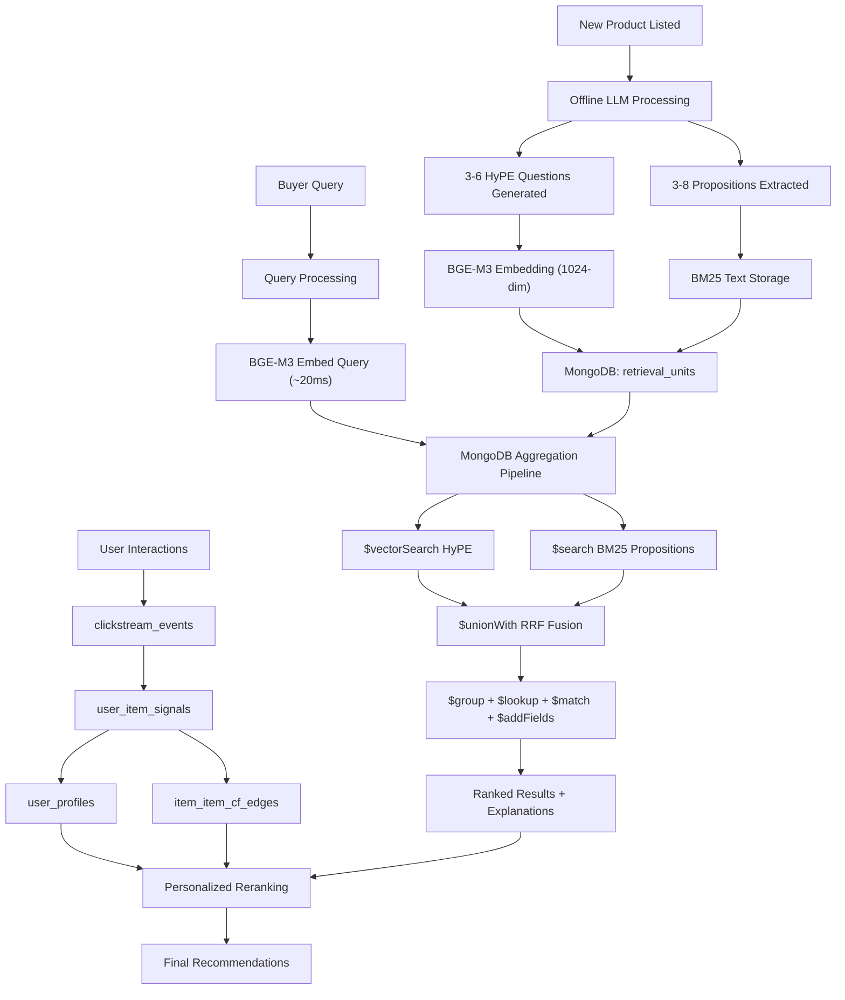

# ColdStart Killer

**Dual-Space Semantic Recommendation Engine for Zero-Interaction Products**

> *Solving the item cold-start problem in e-commerce using MongoDB Atlas as the unified computational engine for hybrid vector + BM25 retrieval, behavior-attributed personalization, and item-item collaborative filtering.*

**Hackathon:** MongoDB Atlas Hackathon  
**Theme Alignment:** MongoDB Aggregation Pipeline · Atlas Vector Search · Atlas Search  
**Stack:** MongoDB Atlas · Python · FastAPI · React + Vite · BAAI/bge-m3 · Qwen3:8B  
**Repository:** ColdStart_Killer

---

## Abstract

The item cold-start problem — the inability of Collaborative Filtering to surface newly listed products with zero interaction history — is a persistent architectural gap in production e-commerce recommendation systems. Cold-start is also continuous: a product is cold on Day 1, a new user is cold on first visit, and a returning user behaves cold whenever category, budget, occasion, or persona shifts outside their established history [14]. This paper presents **ColdStart Killer**, a three-pillar recommendation engine built natively on MongoDB Atlas.

**Pillar 1 — Indexing-time semantic representation (HyPE).** Rather than embedding each product as a single vector, the system generates 3 to 6 buyer-intent queries per product at indexing time — offline, once per product, with zero query-time LLM cost for product representation. These Hypothetical Prompt Embeddings [1], stratified by semantic aspect (function, persona, occasion, compatibility, style, spec, constraint, gift), are embedded with BAAI/bge-m3 (1024-dim) and stored as dense retrieval units. Atomic proposition facts are stored in parallel as sparse BM25 units. Every zero-interaction product therefore has multiple semantic and factual entry points from the moment it enters the catalog.

**Pillar 2 — MongoDB Aggregation Pipeline as the unified computational engine.** Both retrieval channels are executed and fused through Reciprocal Rank Fusion (k=60) [21] inside a single MongoDB Aggregation Pipeline — using `$vectorSearch`, `$search`, `$unionWith`, `$group`, `$lookup`, `$addFields`, `$sort`, and `$project` [7][19][20] — with no Python reranking between retrieval branches. MongoDB Atlas is not a passive datastore for this system; it is the retrieval, fusion, scoring, filtering, and explanation-metadata projection engine.

**Pillar 3 — Behavior-attributed Collaborative Filtering.** A behavior layer co-located in MongoDB (`clickstream_events`, `user_item_signals`, `user_profiles`, `item_item_cf_edges`) accumulates implicit interaction signals and derives item-item CF edges strictly from multi-user co-interaction data — never from semantic similarity. This enables a principled, attributable transition from cold-start content retrieval to warm personalized recommendation as user and item signals mature.

Empirical evaluation on 3,000 products across 50 retrieval queries with 2,119 relevance judgments yields a hybrid NDCG@10 of **0.7715** (raw delta **+39.5%** vs title-only baseline), a Vietnamese diacritic-slice NDCG@10 of **0.8462** (+72.2%), and a MongoDB search P95 latency of **183.8ms** against a 400ms production target. Zero pipeline failures were observed across **2,428** live evaluation results. End-to-end total pipeline P95 is **956.2ms**; query processing, Vietnamese translation, and embedding caching remain required before claiming full serving-path latency readiness. Under the stricter evidence gate, the raw hybrid-vs-title metric win remains directional because paired Recall@10 evidence is incomplete in the current run.

**Keywords:** item cold-start, recommendation systems, Hypothetical Prompt Embeddings, MongoDB Atlas Vector Search, Aggregation Pipeline, Reciprocal Rank Fusion, collaborative filtering, cross-lingual retrieval, e-commerce personalization

### Judge Readiness Snapshot

| Dimension | Submission Snapshot |
|---|---|
| **Problem** | Item cold-start and continuous cold-start in e-commerce: new products, new users, and shifted returning-user intents lack reliable behavior evidence. |
| **Solution** | Indexing-time HyPE buyer-intent units + proposition fact units create multiple semantic and factual entry points per product. |
| **MongoDB role** | Vector Search + Atlas Search + Aggregation Pipeline + co-located behavior data execute retrieval, fusion, scoring, joins, filtering, explanation-metadata projection, and attribution storage. |
| **Evidence** | Hybrid NDCG@10 **0.7715**; raw delta **+39.5%** vs title-only; Vietnamese diacritic-slice NDCG@10 **0.8462**; MongoDB search P95 **183.8ms**; **0/2,428** pipeline failures. |
| **Caveat** | MongoDB search latency meets target, but total path P95 is **956.2ms** and still needs query/embedding caching. The stricter evidence gate keeps the hybrid-vs-title baseline claim at `needs_more_evidence` because paired Recall@10 evidence is directional in the current run. |

> **Core Thesis:** ColdStart Killer turns a zero-interaction product from one unrankable catalog row into several searchable buyer-intent and factual retrieval units, then lets MongoDB Atlas perform the serving-time recommendation computation.

---

## 1. Executive Summary

### 1.1 The Problem

Every e-commerce platform faces the same bootstrapping failure for new products: New product listed → zero interactions → CF cannot recommend → no exposure → no interactions accumulated.

This "reinforcement loop of obscurity" means that even high-quality products from new sellers are mathematically invisible to recommendation algorithms that depend on co-interaction signals. The result is a platform that systematically favors established products (head-item bias) while starving new listings of discovery opportunities.

Cold-start is not a one-time launch condition. In e-commerce, it recurs whenever a new product is listed, a new user arrives, or a returning user changes category, budget, occasion, or shopping persona. This "continuous cold-start" pattern makes behavior-only recommendation brittle even for platforms with large historical datasets [14].

### 1.2 Why It Matters Now

Vietnam's four major e-commerce platforms — Shopee, TikTok Shop, Lazada, and Tiki — generated approximately **429.7 trillion VND in GMV in 2025**, up **34.75% year over year** [12]. At the same time, The Investor reported, also based on Metric.vn data, that active online sellers declined **7.43%** to about **601,800 sellers**, down nearly **48,000 sellers** from 2024 [13]. This creates a market paradox: online sales are growing rapidly, but seller participation is consolidating. Cold-start bias does not fully explain seller attrition, but poor early product visibility can plausibly contribute to pressure on new and smaller sellers because products that receive little exposure struggle to generate the behavioral evidence required by traditional recommendation systems.

Beyond the Vietnamese context, the core problem is universal:

- E-commerce platforms worldwide are scaling their catalogs faster than their recommendation systems can handle.
- CF-only engines may require a business-specific interaction warm-up period before a new item becomes recommendable, leaving launch visibility dependent on first impressions, clicks, carts, or purchases [15].
- Vocabulary mismatch between buyer queries and seller descriptions (especially across languages) makes keyword-only search insufficient.
- Modern shoppers increasingly express intent as natural-language, multi-constraint requests; Bloomreach reported that 41.4% of surveyed respondents use natural language when searching and 61.3% are interested in a conversational search bar [17].

### 1.3 The Solution

ColdStart Killer introduces a **Dual-Space Multi-Aspect Retrieval** architecture:

1. **HyPE (Hypothetical Prompt Embeddings):** At indexing time, an LLM generates 3–6 buyer-intent questions per product, covering function, persona, occasion, and optional aspects. These are embedded with BAAI/bge-m3 (1024-dim) and stored for vector search — converting the asymmetric question-to-document retrieval problem into a symmetric question-to-question matching problem.

2. **Proposition Chunking:** Atomic product facts (specs, benefits, target users) are extracted and stored for BM25 text search — handling spec-heavy factual queries that dense retrieval handles poorly.

3. **MongoDB as Computational Engine:** The full hybrid retrieval pipeline — vector search, BM25 search, RRF fusion [21], scoring, filtering, and explanation-metadata projection — executes in a single MongoDB Aggregation Pipeline with no Python reranking between retrieval branches.

4. **Behavior-Attributed Personalization:** As users interact, implicit signals are aggregated into user profiles and item-item CF edges — creating a clean transition path from cold-start content retrieval to warm behavioral recommendation.

### 1.4 Key Results

| Metric | Measured Value | Comparison |
|---|---|---|
| NDCG@10 (Hybrid) | **0.7715** | raw delta +39.5% vs title-only (0.5530) |
| Vietnamese diacritic-slice NDCG@10 | **0.8462** | +72.2% vs title-only (0.4913) |
| MRR@10 (Hybrid) | **0.6817** | +36.6% vs title-only (0.4992) |
| Recall@10 (Hybrid) | **0.4525** | +43.5% vs title-only (0.3154) |
| HitRate@10 (Hybrid) | **0.78** | — |
| ColdRelevantRate@10 | **0.3940** | Cold items appearing relevantly |
| Search P95 Latency | **183.8ms** | Below 400ms target |
| Evaluation Failures | **0 / 2,428** | Zero pipeline failures |

### 1.5 MongoDB as the Core Recommendation Engine

MongoDB Atlas is not used as a passive datastore. The entire retrieval and ranking computation — dual-space search, RRF fusion [21], metadata joins, hard filtering, scoring bonuses, cold-start boost, and explainable output projection — happens inside a single MongoDB Aggregation Pipeline. No vectors are downloaded to Python for ranking. No external search engine is required. **MongoDB IS the recommendation engine.**

### 1.6 Why This Is Not Just RAG/Search

ColdStart Killer shares surface similarity with Retrieval-Augmented Generation pipelines — it uses vector search and embedding models — but differs fundamentally in architecture, objective, and design constraints:

| Dimension | Standard RAG/Search | ColdStart Killer |
|---|---|---|
| **Retrieval unit** | The document itself is the retrieval unit | Product ≠ retrieval unit; each product generates N semantic entry points |
| **Cold-start coverage** | New documents have no semantic advantage until indexed | Every cold item has multiple HyPE entry points before any user interaction |
| **Explainability** | Relevance score is a black-box similarity distance | Result schema exposes `matched_intent` and `matched_fact`; latest live coverage is measured explicitly rather than assumed complete |
| **Collaborative Filtering** | Not present | Behavioral CF edges derived strictly from multi-user co-interaction; explicitly separated from semantic similarity to avoid fake-CF claims |
| **LLM at query time** | Often present in LLM-augmented generation flows | Product-representation LLM work is amortized at indexing time; Vietnamese translation currently uses Qwen3 on the online path unless cached |
| **Database role** | Storage + retrieval only | MongoDB executes retrieval, RRF fusion [21], scoring, filtering, join, and explanation-metadata projection natively |

The result is a system that targets the cold-start problem — which standard RAG/search does not address — with a production-oriented design that removes query-time LLM generation for product representation. End-to-end latency optimization remains roadmap work, especially for Vietnamese query translation and embedding.

---

## 2. Problem Background

### 2.1 The Item Cold-Start Problem

In recommendation systems, new items with zero interaction history cannot be placed confidently in the user-item co-interaction matrix that Collaborative Filtering depends on. This is not merely a data sparsity issue — it is a fundamental architectural gap where new products are invisible to the most common recommendation paradigm. Research on cold-start item promotion highlights that new items need careful exposure strategies because naive popularity- or activity-based promotion does not reliably solve the launch problem [15].

### 2.2 Pain Points by Stakeholder

| Stakeholder | Pain Point |
|---|---|
| **New Sellers** | Products may fail at launch not because they are irrelevant, but because the platform has no behavioral evidence yet. |
| **Buyers** | Natural-language requests such as "gift for oily skin under 300k" or "minimal phone case for office workers" often mismatch seller metadata. |
| **Platform Operators** | Popularity bias can concentrate impressions on established products, leaving cold and long-tail inventory underexposed [16]. |
| **Engineering Teams** | Separate vector, keyword, event, and ranking systems create operational complexity and make attribution joins harder. |

### 2.3 Continuous Cold-Start and Launch Visibility

Cold-start in e-commerce is continuous, not episodic. A product can be cold when it is newly listed, a user can be cold when they have little history, and even a returning user can behave like a cold-start user when shopping for a new category, budget, occasion, or persona [14]. Behavior-only recommenders therefore struggle whenever a user's observed history does not match the current intent.

For sellers, the issue appears as a **launch visibility gap**. Newly listed products may be overlooked before they can collect clicks, carts, purchases, or ratings. The product may be relevant, but the system has no co-interaction evidence to place it in recommendation lists [15].

For platforms, the launch gap interacts with **popularity bias**: popular products receive more impressions, more impressions create more interactions, and more interactions make those products easier to recommend. Cold and long-tail products remain underexposed, reducing catalog diversity and weakening the marketplace value of newly listed inventory [16].

For buyers, the pain is poor intent matching. Modern e-commerce search is moving toward conversational, multi-constraint language: persona, occasion, budget, compatibility, exclusions, and style can appear in the same query. Keyword-only search struggles when seller metadata uses technical product language while buyer intent uses use-case language [17].

### 2.4 Why Existing Approaches Fall Short

| Approach | Limitation |
|---|---|
| **Collaborative Filtering** | Requires co-interaction history. Zero-interaction items are mathematically invisible. |
| **Lexical BM25 Search** | Fails on vocabulary mismatch — buyers search "sunscreen for oily office workers" but sellers describe "SPF50+ PA++++ milk texture oil control". |
| **Dense Retrieval (1 vector/item)** | A single embedding cannot capture diverse buyer intents for the same product. |
| **Query-time LLM generation** | Can improve semantic alignment, but places synchronous LLM latency on the online serving path, limiting production viability. |
| **Popularity Ranking** | Reinforces head-item bias; new products remain dependent on early exposure to become recommendable [16]. |

### 2.5 Why Now

The convergence of market pressure and technology maturity makes this solution both urgent and viable:

**Market Pressure:**
- E-commerce catalog growth is outpacing recommendation system capabilities.
- New seller attrition is a measurable platform health problem; cold-start bias can plausibly contribute to seller pressure by reducing early visibility for newly listed products.
- Cross-lingual commerce (Vietnamese queries ↔ English product metadata) is a growing reality that pure keyword search cannot address.
- Cross-category behavioral sparsity is increasingly visible in multi-vertical marketplaces: users may have rich history in one vertical and sparse behavior in another, as also discussed in industry engineering work on behavioral silos [18].

**Technology Enablers:**
1. **MongoDB Atlas Vector Search** enables semantic search with filter fields inside an Aggregation Pipeline [19].
2. **MongoDB hybrid search patterns** combine full-text and vector search results using rank fusion techniques [7].
3. **Local LLMs** (Qwen3:8B via Ollama) make offline HyPE generation cost-effective at scale — no API costs per product.
4. **Multilingual embedding models** (BAAI/bge-m3) handle cross-lingual query-product matching natively across many languages [4].
5. **LLM-era cold-start research** confirms that textual and generated representations are a viable path when interaction history is limited [11] — this project applies that direction at indexing time, not query time.

---

## 3. Problem Scope

This project scopes the **item cold-start** and **user cold-start** problems in e-commerce recommendation, with a focus on content-based retrieval that does not depend on prior behavioral signals. The MVP is intentionally bounded to demonstrate the core architecture; production-readiness items are deferred to the roadmap.

| Dimension | In-Scope (MVP) | Out-of-Scope | Rationale for Exclusion |
|---|---|---|---|
| **Retrieval** | Hybrid vector + BM25 via MongoDB Aggregation Pipeline | Cross-encoder reranking, multimodal (image) retrieval | Requires additional model serving infrastructure beyond the MVP stack |
| **Cold-start** | Item cold-start (zero-interaction products), user cold-start (new users with onboarding) | Cross-category behavioral transfer learning | Requires multi-vertical interaction data not available in the MVP dataset |
| **Behavior** | Clickstream logging, implicit signal aggregation, item-item CF from multi-user interactions | Real-time event streaming, production SLO monitoring | Out of scope for a hackathon MVP; instrumentation is planned |
| **Personalization** | Multi-interest user profiles, state-aware homepage feed, search reranking | Production-hardened seller UI, OAuth/SSO identity management | Identity and auth are platform integration concerns, not core recommendation concerns |
| **Explainability** | `matched_intent`, `matched_fact`, `cold_start_note` fields in the result schema, with coverage measured separately | LLM-as-Judge automated evaluation | LLM-as-Judge is roadmap; current metrics are deterministic IR metrics |
| **Evaluation** | Offline IR evaluation (NDCG, MRR, Recall, Precision, HitRate, ColdRelevantRate) | Online A/B testing, seller retention measurement | Requires live traffic and seller cohort tracking beyond the MVP scope |

**Target deployment context:** Mid-size e-commerce platforms that list new products faster than behavioral signals can accumulate. The MVP is evaluated on the Amazon Reviews 2023 dataset (All_Beauty + Cell_Phones_and_Accessories, 3,000 items) as a representative catalog with realistic vocabulary mismatch between buyer queries and seller metadata.

---


## 4. Project Objectives and Requirements

### 4.1 Functional Requirements

| Requirement | Specification | Empirical Validation |
|---|---|---|
| Dual-space hybrid retrieval | Candidates SHALL be retrieved via simultaneous dense vector search over HyPE intent representations and sparse BM25 search over proposition fact units, fused via RRF [21] within a single MongoDB Aggregation Pipeline. | Hybrid NDCG@10 = **0.7715**; exceeds both single-channel variants (vector-only: 0.7191, BM25-only: 0.6003). |
| Zero-interaction item discoverability | Products with `cold_start.interaction_count = 0` SHALL appear in retrieval results immediately after indexing, without prior behavioral signal. | All 3,000 items have `cold_start.is_cold_item = true`; ColdRelevantRate@10 = **0.3940**. |
| User-state-aware homepage feed | The feed generation pipeline SHALL adapt candidate sourcing and scoring weights based on user profile maturity (cold / warming / warm). | Verified across 8 synthetic persona archetypes with profile state transition logging. |
| Query-adaptive personalized search | Profile-based reranking weight SHALL scale inversely with query specificity to preserve query-intent primacy. | Specific queries: `query_hybrid` weight = 0.82; exploratory: 0.50. |
| Attributable behavioral signal collection | Every interaction event SHALL be linkable to the recommendation context that generated it via a stable `request_id` snapshot. | Schema/code support `request_id` linkage; live snapshot contains 2,862 `clickstream_events`, 2,554 `recommendation_logs`, and 514 CF edges. |
| Behavior-derived Collaborative Filtering | CF edges SHALL be derived exclusively from multi-user implicit co-interaction signals, not from semantic similarity. | 514 `item_item_cf_edges`; avg. support = 2.51; semantic neighbors served separately. |
| Attribution-backed explainability | Recommendation outputs SHALL expose traceable `matched_intent`, `matched_fact`, `matched_channels` fields from retrieval metadata; no LLM explanation generation is used at query time. | Live run: 1,378/2,428 results had `matched_intent`, 864/2,428 had `matched_fact`, 304/2,428 had both; explanation coverage remains a hardening item. |
| Reproducible offline evaluation | The system SHALL support deterministic IR metric computation across ablation variants against a fixed query-judgment corpus. | 50 queries × 2,119 judgments × 5 variants; 0 pipeline failures. |

### 4.2 Non-Functional Requirements

| Requirement | Target | Current Status | Notes |
|---|---|---|---|
| Search P95 latency | < 400ms | **183.8ms** ✅ | MongoDB aggregation pipeline only; within target |
| Total pipeline P95 latency | < 400ms | **956.2ms** ⏳ | Includes query processing, Vietnamese translation, and embedding; query/embedding caching planned |
| Atlas Free Tier (M0) compatible | Required | ✅ | Uses `$unionWith` manual RRF; native `$rankFusion` retained as upgrade path |
| Zero evaluation pipeline failures | Required | **0/2,428** ✅ | Across 50 queries × 5 variants |

### 4.3 MongoDB Hackathon Alignment

| Hackathon Criterion | Project Evidence |
|---|---|
| **Aggregation Pipeline** | 10 logical-stage design using `$vectorSearch`, `$search`, `$unionWith`, `$group`, `$lookup`, `$match`, `$addFields`, `$setWindowFields`, `$sort`, `$project` |
| **Atlas Vector Search** | 1024-dim cosine HNSW on HyPE retrieval units; 7 pre-filter fields (`unit_type`, `category_id`, `price_bucket`, `in_stock`, `is_cold_item`, `aspect`, `language`); `numCandidates=400` |
| **Atlas Search** | BM25 full-text search on proposition units with `lucene.standard` analyzer; executed as a first-class `$search` stage inside `$unionWith` |
| **Collaborative Filtering** | 514 item-item CF edges derived from multi-user implicit co-interaction signals (co-view, co-click, co-cart, co-purchase); cosine-normalized scoring with 45-day recency decay |
| **Creative MongoDB Usage** | MongoDB as the retrieval-path computational engine — retrieval, RRF fusion, scoring, filtering, metadata join, and explanation projection all execute inside one Aggregation Pipeline |

---


## 5. Solution Overview

### 5.1 Core Innovation — Paradigm Inversion

A common approach to zero-shot dense retrieval generates a hypothetical answer document at query time using an LLM and embeds it as a proxy for retrieval. While this can improve semantic alignment, it places synchronous LLM generation on the online serving path — an irreducible latency cost that scales linearly with query volume and is architecturally incompatible with high-throughput e-commerce serving.

ColdStart Killer inverts this paradigm. Adapting the indexing-time prompt-generation principle from the Hypothetical Prompt Embeddings approach [1], this project applies it to product discovery: the system generates hypothetical *buyer-intent queries* at **indexing time** — offline, once per product, fully amortized across all future queries for that product. At query time, English queries require query processing, one BGE-M3 embedding call, and the MongoDB retrieval pipeline; Vietnamese queries currently add a Qwen3 translation step unless cached [4].

| Pattern | Serving-Time Flow | Query-Time Cost |
| --- | --- | --- |
| Query-time LLM generation | Query → synchronous LLM (~500ms+) → embedding → search | LLM latency on the critical path |
| ColdStart Killer (HyPE) | Product → offline LLM (amortized) → buyer-intent queries → embedding → MongoDB; query uses pre-indexed HyPE vectors | Zero product-representation LLM cost at query time; Vietnamese translation remains online today |

This inversion also resolves a distributional mismatch present in query-time generation approaches. When hypothetical *documents* are generated and searched against real *documents*, the query-side and document-side representations occupy different distributional spaces — an asymmetric matching problem. HyPE instead embeds *buyer queries* and searches against *stored buyer queries* — a symmetric question-to-question matching problem that achieves tighter semantic alignment without cross-distribution drift.

Each product receives 3 to 6 HyPE units stratified by semantic aspect (function, persona, occasion, constraint, compatibility, style, gift, spec), all stored in MongoDB `retrieval_units` and indexed for `$vectorSearch`. This multi-aspect representation ensures that a zero-interaction product can be retrieved from multiple semantic directions simultaneously, without any behavioral signal.

> **Evidence Gate:** HyPE's research provenance comes from RAG retrieval [1]. The e-commerce adaptation, the dual-space product representation, and the reported recommendation metrics are project-specific evaluation results, not claims made by the HyPE paper.

### 5.2 Dual-Space Design

> "The product is not the retrieval unit. The product is the business entity. The retrieval unit is a semantic entry point."

Instead of embedding each product as a single vector, ColdStart Killer generates **N semantic access points** per product at indexing time. Each access point targets a different buyer intent or product fact, creating multiple paths through which a new item can be discovered.

| Retrieval Unit | Captures | Retrieval Channel |
| --- | --- | --- |
| HyPE questions | Buyer intent language | Dense vector search |
| Propositions | Product facts and constraints | BM25 text search |

These two modalities are **complementary, not overlapping**:
- **HyPE** is optimized for exploratory, persona-driven, and occasion-driven queries where buyer intent cannot be captured by surface-level keyword overlap.
- **Propositions** are optimized for specification-exact and attribute-precise queries where numeric identifiers, model numbers, and technical values must match exactly, following the retrieval-granularity intuition behind proposition-level retrieval [2] and BM25-style sparse matching [10].

This maps directly to the marketplace pain points:
- Conversational intent ("gift for oily skin under 300k") is represented by HyPE buyer-intent units.
- Factual constraints (ingredients, compatibility, model numbers, brand, price) are represented by proposition units.
- Continuous cold-start is handled by content-first retrieval, then gradually by behavior-attributed personalization and CF as signals accumulate.

### 5.3 Recommendation Lifecycle



---

## 6. Business Value

### 6.1 Value by Stakeholder

| Stakeholder | Business Pain | ColdStart Killer Value | MongoDB-Enabled Mechanism |
|---|---|---|---|
| **New sellers** | Launch visibility gap before first clicks, carts, or purchases | Faster initial discoverability for relevant zero-interaction products | HyPE and proposition units stored in `retrieval_units`; `$vectorSearch` + `$search` surface products without CF history |
| **Buyers** | Persona, occasion, budget, and constraint-rich queries mismatch seller metadata | Better matching for natural-language shopping intent | Multi-aspect HyPE vectors and BM25 proposition facts are fused in one Aggregation Pipeline |
| **Marketplace operators** | Head-item overdependence and weak long-tail discovery | More diverse catalog exposure and a path from cold to warm recommendation | Cold-start boost, RRF fusion [21], behavior logs, user profiles, and item-item CF edges remain co-located |
| **Engineering/product teams** | Separate vector DB, search engine, ranking service, and event store increase complexity | Fewer infrastructure components and traceable recommendation lineage | MongoDB handles operational data, vector search, text search, ranking pipeline, and behavior attribution in one platform |

The business claim is intentionally scoped: the MVP shows improved retrieval quality and low MongoDB search latency. Production seller-retention and marketplace-diversity impact require live traffic, exposure logging, and seller cohort analysis.

### 6.2 Business KPI Mapping

| Business Objective | KPI | Status |
|---|---|---|
| Seller/product launch visibility | ColdRelevantRate@10 | Measured: **0.3940** |
| Seller/product launch visibility | Cold-start window | Planned: needs `indexed_at` and `first_seen_in_top_k_at` |
| Buyer discovery quality | NDCG@10, Recall@10, MRR@10 | Measured in current offline evaluation |
| Platform diversity | Catalog coverage, seller exposure distribution | Production KPI / planned instrumentation |
| Performance | MongoDB search P95, end-to-end P95 | Search measured; end-to-end needs optimization |
| Trust/explainability | `matched_intent`, `matched_fact`, `matched_channels` coverage | Measured in output attribution checks; coverage expansion planned |

> **What Is Measured vs. What Is Planned:** NDCG@10, Recall@10, MRR@10, ColdRelevantRate@10, MongoDB search latency, and pipeline failures are current project evaluation metrics. Cold-start window, seller exposure fairness, production catalog coverage, and retention impact are production KPIs requiring additional instrumentation.

### 6.3 Value vs Alternatives

| Capability | Keyword Search | Popularity Ranking | CF-Only | ColdStart Killer |
|---|---|---|---|---|
| Zero-interaction item discovery | ✗ | ✗ | ✗ | ✅ |
| Multi-aspect intent matching | ✗ | ✗ | ✗ | ✅ |
| Cross-lingual query support | ✗ | ✗ | ✗ | ✅ |
| No query-time LLM for product representation | ✅ | ✅ | ✅ | ✅ |
| Explainable results | ✗ | ✗ | ✗ | ✅ |
| Behavioral personalization | ✗ | ✗ | ✅ | ✅ |
| Atlas Free Tier compatible | ✅ | ✅ | ✅ | ✅ |

### 6.4 Why MongoDB Is Central

A key design decision distinguishing this system from conventional recommendation architectures is the consolidation of retrieval, ranking, and behavior attribution within MongoDB Atlas. This is not simply convenient storage; it is the mechanism that makes the submission architecture inspectable end to end.

1. **Storage model.** MongoDB stores the business entity (`items`), polymorphic retrieval units (`retrieval_units`), recommendation snapshots (`recommendation_logs`), clickstream events (`clickstream_events`), aggregated signals (`user_item_signals`), multi-interest profiles (`user_profiles`), and behavior-derived CF edges (`item_item_cf_edges`). HyPE units carry embeddings; proposition units carry BM25 text fields.

2. **Retrieval engine.** `$vectorSearch` retrieves dense HyPE intent units with filter fields such as `unit_type`, `category_id`, `price_bucket`, and `in_stock` [19]. `$search` retrieves proposition facts for BM25-style factual matching. MongoDB's hybrid search guidance explicitly supports combining vector/semantic and full-text results through rank fusion patterns [7].

3. **Ranking/fusion engine.** The M0-compatible path uses `$unionWith` to merge vector and BM25 branches [20]. `$group`, `$lookup`, `$addFields`, `$sort`, and `$project` perform RRF fusion [21], metadata joins, hard filtering, scoring bonuses, and explanation projection. Native `$rankFusion` is retained as an upgrade path for deployments where `$rankFusion` is available; the MVP path uses `$unionWith` manual RRF.

4. **Behavior attribution engine.** Recommendation logs and clickstream events are co-located, so attribution joins can connect displayed recommendations to later user behavior. This supports user profiles and true item-item CF edges without labeling semantic similarity as collaborative filtering.

> **Why MongoDB Is Central:** If vector search, BM25 search, recommendation logs, and behavior events lived in separate systems, ColdStart Killer would need an external ranking service and cross-system attribution joins. In this design, MongoDB Atlas is the retrieval, fusion, ranking, filtering, and attribution engine.

### 6.5 Competitive Positioning

| Capability | CF Traditional | Dense Retrieval | Query-time LLM | ColdStart Killer |
| --- | --- | --- | --- | --- |
| Zero-interaction items | ✗ | ✗ | ✗ | ✅ |
| No query-time product-representation LLM | ✅ | ✅ | ✗ | ✅ |
| Vietnamese query support | ✗ | △ | △ | ✅ |
| Explainable results | ✗ | ✗ | ✗ | ✅ |
| Atlas Free Tier ready | ✅ | △ | ✗ | ✅ |
| Aspect-tagged semantics | ✗ | ✗ | ✗ | ✅ |

The estimated indexing-to-discovery path is a design expectation, not a measured benchmark. Formal cold-start window measurement requires `indexed_at` and `first_seen_in_top_k_at` instrumentation and is listed in the roadmap.

---

## 7. Data Strategy

### 7.1 Data Sources

| Source | Type | Volume (MVP) | Role in System |
|---|---|---|---|
| Amazon Reviews 2023 Metadata (BLaIR) [9] | Public benchmark dataset | 3,000 items selected from All_Beauty and Cell_Phones_and_Accessories | Product catalog: title, brand, category, price, features, description |
| LLM-Generated HyPE Queries | Derived / offline-generated | 13,580 buyer-intent queries (avg. 4.5 per item) | Dense retrieval units for `$vectorSearch` intent channel |
| LLM-Extracted Propositions | Derived / offline-generated | 16,173 atomic fact units (avg. 5.4 per item) | Sparse retrieval units for `$search` BM25 factual channel |
| User Clickstream Events | Logged / synthetic (MVP) | Synthetic behavior for 8 persona archetypes | Implicit behavioral signals: impressions, clicks, detail views, carts, purchases |

> **Note on clickstream data:** The MVP uses synthetically generated behavioral signals for demonstration and CF-edge derivation. Production CF quality requires real multi-user interaction data.

### 7.2 Data Entities and Volume

| Entity | MongoDB Collection | MVP Count | Derived Metric |
|---|---|---|---|
| Products | `items` | 3,000 | — |
| HyPE Retrieval Units | `retrieval_units` (`unit_type: hype_question`) | 13,580 | avg. **4.53 HyPE units / product** |
| Proposition Retrieval Units | `retrieval_units` (`unit_type: proposition`) | 16,173 | avg. **5.39 propositions / product** |
| **Total Retrieval Units** | `retrieval_units` | **29,753** | avg. **9.92 retrieval entry points / product** |
| CF Edges | `item_item_cf_edges` | 514 | avg. support = 2.51 |
| Source Dataset Categories | — | 2 | All_Beauty, Cell_Phones_and_Accessories |
| Normalized Catalog Category IDs | `items.category_id` | 20 | Selected catalog spans 20 normalized category IDs derived from metadata |

Every product is represented by **nearly 10 retrieval entry points** on average — 4–5 covering buyer intent (dense) and 5–6 covering product facts (sparse). This multi-entry-point representation is the mechanism by which zero-interaction products become discoverable without behavioral history.

### 7.3 Data Pipeline

The following pipeline transforms raw product metadata into indexed retrieval units:

```
Raw product metadata (CSV / seller input)
  │
  ├─ Content sufficiency check
  │     < 30 words → [Optional] Tavily web enrichment → LLM synthesis
  │     ≥ 30 words → proceed
  │
  ├─ Proposition extraction (Qwen3:8B, confidence ≥ 0.60)
  │     Output: 3–8 atomic fact units per product
  │     Types: spec | benefit | target_user | usage | constraint
  │     Storage field: text_search (BM25 only, no embedding)
  │
  ├─ HyPE generation (Qwen3:8B, 3–6 queries/item)
  │     Required aspects: function + persona + occasion
  │     Optional aspects: compatibility | style | spec | constraint | gift
  │     Header: "[Category: X | Brand: Y | Price: Z] {hype_query}"
  │
  ├─ BGE-M3 embedding (1024-dim vectors; 688 texts/sec on RTX 5060 8GB)
  │     Applied to: HyPE units only (propositions are BM25-only)
  │
  └─ MongoDB upsert
        items collection → product metadata
        retrieval_units collection → HyPE vectors + proposition text units
```

### 7.4 MVP Dataset Selection Policy

Products are drawn from Amazon Reviews 2023 metadata [9] using the following quality filters, applied in priority order:

| Filter | Threshold | Rationale |
|---|---|---|
| Required fields | `parent_asin`, title, store, category, price | Minimum fields for display and retrieval |
| Price validity | Non-zero, parseable numeric | Required for price-filter query support |
| Content richness | Combined text words ≥ 150 (fallback: 120 → 100 → 80) | Ensures sufficient context for LLM proposition and HyPE generation; below 80 words, generation quality degrades noticeably |
| Uniqueness | Unique `parent_asin` | Prevents duplicate catalog entries |
| Image coverage | Target ≥ 95% of selected items have an image URL; current live snapshot is 3,000/3,000 items (100%) | Required for product card display in the frontend |

The fallback word-count ladder (150 → 120 → 100 → 80) is used sequentially until the overall 3,000-item MVP target is reached across the two source categories, preserving diversity while relaxing quality constraints only as needed.

### 7.5 Privacy and Data Governance

| Category | Policy |
|---|---|
| **User identity** | User identities are one-way hashed (`user_id_hash`); no names, emails, phone numbers, IP addresses, or physical addresses are stored |
| **Behavioral data** | Clickstream events are opt-in per user (`allow_clickstream_logging`); personalization is separately configurable (`allow_personalization`) |
| **Product data** | Amazon Reviews 2023 dataset is used under its academic license for hackathon evaluation purposes |
| **Secrets** | Environment secrets (MongoDB URI, API keys) are never logged, returned in API responses, or committed to source control |
| **Debug access** | Internal debug and admin endpoints are protected by `AUTH_MODE` guard; `PRIVACY_MASK_DEBUG_DATA=true` is the default |

---


## 8. System Architecture

### 8.1 Overall Architecture

ColdStart Killer separates concerns into three independent layers, each with a distinct MongoDB role:

| Layer | Input | Processing | MongoDB Role | Output |
|---|---|---|---|---|
| **Seller / Indexing Path** | Product metadata (CSV / seller draft) | Enrichment → proposition extraction → HyPE generation → BGE-M3 embedding | `items` write + `retrieval_units` upsert | Indexed product with dense + sparse retrieval units |
| **Buyer / Online Path** | Natural-language query (VN or EN) | Language detection → query transform → BGE-M3 embed → Aggregation Pipeline | Aggregation Pipeline executes retrieval, RRF fusion, scoring, filtering, join, and explanation-metadata projection | Ranked results with `matched_intent`, `matched_fact`, score breakdown |
| **Behavior Layer** | User interactions (impressions, clicks, carts, purchases) | Clickstream logging → signal aggregation → profile update → CF edge derivation | `clickstream_events` → `user_item_signals` → `user_profiles` → `item_item_cf_edges` | Multi-interest user profiles + behavioral CF graph |

**Key architectural decisions:**

- **MongoDB as retrieval/search store and compute engine.** Vector search, BM25 search, RRF fusion, scoring, and explanation projection all execute inside the Aggregation Pipeline. No external search engine, vector database, or ranking microservice is required for the online retrieval path.
- **Offline product-representation LLM.** HyPE and proposition Qwen3:8B calls happen at indexing time. Query time still may invoke Qwen3 for Vietnamese-to-English translation before the BGE-M3 embedding and MongoDB pipeline; caching this path is roadmap work.
- **Polymorphic `retrieval_units` collection.** HyPE units (embedding field present) and proposition units (embedding field absent, `text_search` present) co-reside in one collection with a `unit_type` discriminator — enabling `$vectorSearch` and `$search` to target the correct unit type via filter fields.

### 8.2 Backend Architecture

**Framework:** FastAPI (Python) with PyMongo

**Service modules** (each independent, injected via FastAPI dependency):

| Module | File(s) | Responsibility |
|---|---|---|
| Retrieval | `src/search_pipeline.py` | Hybrid Aggregation Pipeline construction and execution |
| Personalization | `src/recommendation/` | Homepage feed, similar products, user profile scoring |
| Behavior logging | `src/behavior/` | Clickstream event write, signal aggregation, CF edge derivation |
| Seller tools | `src/seller/` | Product draft management, indexing preview, enrichment requests |
| Evaluation | `src/evaluation/` | IR metric computation, ablation run management |
| LLM / Indexing | `src/llm_hype.py`, `src/indexing.py` | HyPE generation, proposition extraction, BGE-M3 embedding |
| MongoDB client | `src/mongodb.py` | Centralized collection access; 19 registered collections |

**API surface** (key endpoint groups):

| Endpoint Group | Path Prefix | Purpose |
|---|---|---|
| Search | `/api/search` | Hybrid query with optional profile reranking |
| Homepage Feed | `/api/feed` | State-aware personalized feed |
| Product Detail | `/api/items/{id}` | Item metadata + semantic + CF similar products |
| Onboarding | `/api/onboarding` | Preference capture for new users |
| Seller Staging | `/api/seller` | Draft submission, enrichment, indexing preview |
| Evaluation | `/api/evaluation` | Run management, metric retrieval, ablation comparison |
| Debug / Admin | `/api/debug`, `/api/admin` | Auth-gated internal lineage and scoring inspection |
| Behavior | `/api/events` | Clickstream event ingestion |

### 8.3 Frontend Architecture

**Framework:** React + Vite + TypeScript

| Surface | Route | Purpose |
|---|---|---|
| Homepage Feed | `/` | Personalized product discovery; state-aware cold/warm/warming rendering |
| Search Experience | `/search` | Natural-language query with explanation cards and score breakdowns |
| Product Detail | `/items/:id` | Product page with semantic neighbors and CF similar items |
| Onboarding | `/onboarding` | Preference wizard for new users (category, budget, seed items) |
| Seller Staging | `/seller` | Draft enrichment panel and indexing preview |
| Shopper Login | `/login` | Anonymous session management |
| Debug / Admin | `/debug`, `/admin` | Internal scoring lineage, attribution inspection, evaluation dashboard |

**Behavior attribution flow:** Every product card impression generates a `recommendation_log` with a stable `request_id`. When a user clicks, the click event in `clickstream_events` references the same `request_id`, enabling downstream attribution joins that link displayed recommendations to user behavior — which feeds CF edge derivation.

---


## 9. MongoDB Implementation

> This section is the technical core of the submission. MongoDB Atlas operates as the
> **active computational engine** — not a passive datastore — executing retrieval, rank
> fusion, filtering, scoring, metadata join, and explanation-metadata projection natively within
> a single Aggregation Pipeline. Three platform capabilities make this possible and are
> unavailable when vector search and keyword search are delegated to separate systems:
> (1) `$vectorSearch` with filter fields for scoped semantic retrieval [19]; (2) `$search`
> (Atlas BM25) as a first-class Aggregation Pipeline stage in the hybrid retrieval pattern
> [7]; and (3) `$unionWith` enabling multi-branch result merge within one pipeline execution
> context [20] — with zero application-layer round-trips in the ranking loop.

### 9.1 Database Design

**Database:** `coldstart_killer`

The system uses **19 collections**:

| Collection | Purpose | Category |
|---|---|---|
| `items` | Product catalog metadata | Core |
| `retrieval_units` | HyPE vectors + Proposition text units | Core |
| `users` | Anonymous MVP user identity | Behavior |
| `sessions` | Session context | Behavior |
| `recommendation_logs` | What was shown and why (attribution) | Behavior |
| `clickstream_events` | Raw user interactions | Behavior |
| `user_item_signals` | Aggregated implicit feedback per (user, item) | Personalization |
| `user_profiles` | Multi-interest user profiles | Personalization |
| `item_hype_profiles` | Item-level semantic centroid from HyPE units | Personalization |
| `item_semantic_neighbors` | Semantic similarity graph | Personalization |
| `item_item_cf_edges` | True behavioral CF graph | Personalization |
| `item_stats` | Item-level behavioral aggregates | Personalization |
| `seller_product_drafts` | Seller staging area | Seller Tools |
| `seller_indexing_previews` | Preview bundles before catalog commit | Seller Tools |
| `web_enrichment_requests` | Tavily enrichment records | Enrichment |
| `query_embedding_cache` | Cache for hot query embeddings | Performance |
| `evaluation_runs` | Reserved for persisted evaluation summaries | Evaluation |
| `synthetic_personas` | Synthetic persona generation | Evaluation |
| `job_runs` | Lightweight job tracking | Operations |

### 9.2 Core Schema: `items`

| Field Group | Actual Fields | Purpose |
| --- | --- | --- |
| Identity | `_id` (ObjectId), `parent_asin`, `title`, `brand`, `store`, `category`, `category_id` | Product identity and catalog grouping |
| Commerce metadata | `price_usd`, `price_vnd`, `price_bucket`, `in_stock`, `image_url`, `quality_score`, `content_richness` | Filtering, ranking, and display |
| Enrichment | `description_enriched.enriched_description`, `description_enriched.enrichment_quality`, `description_enriched.seller_confirmed` | Improves sparse catalog entries via Tavily + LLM synthesis |
| Cold-start state | `cold_start.is_cold_item` (bool), `cold_start.interaction_count` (int) | Controls cold-start boost and CF eligibility |
| Governance | `source_dataset`, `source_category`, `created_at`, `updated_at` | Lineage and maintenance |

### 9.3 Core Schema: `retrieval_units`

| Unit Type | Key Fields | Purpose |
| --- | --- | --- |
| HyPE question | aspect, raw text, embedding text, 1024-dim embedding, confidence | Dense intent retrieval through `$vectorSearch` |
| Proposition | proposition type, raw text, text search field, denormalized title/brand, confidence | Sparse factual retrieval through `$search` |
| Shared filters | category, price bucket, stock status, cold-start flag | Query-time filtering and scoped retrieval |

**Design Rationale:** Separating retrieval units from items avoids BSON 16MB limits (6+ vectors × 1024 × 4 bytes = ~24KB per item just for vectors) and enables `$vectorSearch` filtering by `unit_type`, `aspect`, and `language` as part of the vector search stage [19]. This scopes candidate retrieval at query time, while recall/latency still need tuning through `numCandidates`, filters, and Atlas tier sizing.

### 9.4 Atlas Indexes

**Vector Search Index** (`vector_index` on `retrieval_units`):

| Index Component | Field / Setting | Purpose |
| --- | --- | --- |
| Vector field | `embedding`, 1024 dimensions, cosine similarity | Dense HyPE retrieval |
| Unit filters | `unit_type`, `aspect`, `language` | Restrict retrieval unit type and semantic aspect |
| Commerce filters | `category_id`, `price_bucket`, `in_stock`, `is_cold_item` | Scope product candidates before ranking |

**Atlas Search Text Index** (`text_index` on `retrieval_units`):

| Indexed Field Group | Fields | Purpose |
| --- | --- | --- |
| Text fields | `text_search`, `embedding_text`, `raw_text`, `item_title_en` | BM25-style lexical retrieval |
| Metadata fields | `item_brand`, `unit_type`, `language`, `category_id` | Filtering and attribution |
| Numeric/boolean fields | `confidence`, `in_stock`, `is_cold_item` | Quality filtering and availability logic |
| Type fields | `proposition_type`, `aspect` | Explanation and retrieval diagnostics |

### 9.5 The Aggregation Pipeline — MongoDB as Computational Engine

The hybrid search pipeline executes entirely inside a MongoDB Aggregation Pipeline. The default mode is `$unionWith` with manual RRF [21] (Atlas M0/Free Tier compatible). The pipeline has **10 logical stages**:

| Stage | MongoDB Operator | Purpose |
|---|---|---|
| 1 | `$vectorSearch` | Search HyPE units (numCandidates=400, limit=20, cosine similarity) |
| 2 | `$setWindowFields` | Compute per-document rank within vector results |
| 3 | `$addFields` | Assign channel="vector", compute RRF fusion contribution [21]: `0.60 / (60 + rank)` |
| 4 | `$unionWith` | Merge with BM25 branch: `$search` on propositions → `$match` unit_type=proposition → `$limit 20` → `$setWindowFields` rank → `$addFields` channel="bm25", fusion: `0.40 / (60 + rank)` |
| 5 | `$group` | Group by `item_id`, aggregate RRF scores, collect `matched_channels`, preserve `best_vector` and `best_bm25` via `$sortArray` |
| 6 | `$lookup` | Join `items` collection for product metadata |
| 7 | `$match` | Apply hard filters: `in_stock`, `price_vnd ≤ max`, category exclusions |
| 8 | `$addFields` | Compute `multi_channel_bonus` (+0.05 if both channels matched), `cold_start_boost` (+0.03 for cold items), `content_richness_bonus` |
| 9 | `$sort` + `$limit` | Sort by final score, return top-K |
| 10 | `$project` | Clean output with `matched_intent`, `matched_fact`, score fields, and full `debug` object; service-layer formatting derives `cold_start_note` from projected metadata |

**Key Parameters (current configuration):**
- `VECTOR_NUM_CANDIDATES = 400`
- `VECTOR_CHANNEL_LIMIT = 20`
- `BM25_CHANNEL_LIMIT = 20`
- `RRF_K = 60` [21]
- `DEFAULT_WEIGHTS = {"vector": 0.60, "bm25": 0.40}`
- `MULTI_CHANNEL_BONUS = 0.05`
- `COLD_START_BOOST = 0.03`
- `CONTENT_RICHNESS_WEIGHT = 0.02`

**RRF Formula:** `score(d) = Σ w_channel / (k + rank_channel(d))`, where k=60 follows the Reciprocal Rank Fusion formulation [21] and reduces scale variance between cosine similarity (bounded 0–1) and BM25 scores (unbounded). MongoDB's native `$rankFusion` documentation describes the same rank-based fusion principle [8].

Native `$rankFusion` [8] is retained as a zero-migration upgrade path: when available on the deployment tier, switching from `$unionWith` manual RRF to `$rankFusion` requires only a configuration flag change — no schema rebuild, no index change, and no change to the scoring or personalization layers downstream.

### 9.6 MongoDB as the Recommendation Engine

The architecture's core claim — that a complete recommendation pipeline can be expressed without external search engines, vector databases, or ranking microservices — is contingent on six MongoDB Atlas capabilities:

1. **`$vectorSearch` with filter fields.** Filter fields (`unit_type`, `category_id`, `in_stock`, `price_bucket`) are part of the Atlas Vector Search stage configuration and query-time filter expression [19]. At MVP scale, category and stock filters reduce the candidate scope before downstream ranking; large-scale recall and latency still require validation beyond 29,753 retrieval units.

2. **`$search` as a first-class pipeline stage.** BM25 retrieval over proposition units executes as a named stage inside the same Aggregation Pipeline pattern as vector search — not as a separate query to a separate system [7].

3. **`$unionWith` for in-pipeline multi-branch merge.** Dense and sparse results are merged and RRF-fused [21] within the pipeline context. No intermediate Python merge. No serialization round-trip. MongoDB documents `$unionWith` as a way to combine aggregation results and supports `$search` inside the `$unionWith` pipeline when `$search` is first [20].

4. **In-engine scoring and projection.** Score bonus computation (`$addFields`), metadata join (`$lookup`), hard filtering (`$match`), and output projection (`$project`) execute in the MongoDB C++ engine. The Python application receives only the final ranked output.

5. **Document model flexibility for polymorphic units.** HyPE units (embedding field present) and proposition units (embedding field absent, `text_search` present) co-reside in `retrieval_units` without schema divergence or separate index management.

6. **M0-compatible upgrade continuity.** The `$unionWith` RRF pipeline [21] runs on Atlas Free Tier (M0). Deployments where native `$rankFusion` is available can use a cleaner rank-fusion pipeline via a single configuration flag — no schema or index rebuild is required by this design.

---

## 10. Recommendation Methodology

### 10.1 Candidate Generation

The system uses five candidate sources, each contributing to different recommendation surfaces:

| Source | Type | Used For | Notes |
|---|---|---|---|
| HyPE Vector Search | Content/Semantic | Search, Similar Products, Homepage Feed | Dense intent retrieval via `$vectorSearch`; also drives profile-similarity matching for the feed |
| BM25 Proposition Search | Content/Factual | Search | Factual retrieval via `$search`; complements dense channel for spec-heavy queries |
| User Profile Similarity | Semantic Personalization | Homepage Feed, Search Rerank | Multi-interest profile vector matched against `item_hype_profiles` centroids |
| Item-Item CF Edges | Behavioral CF | Homepage Feed, Similar Products | Behavior-derived co-interaction graph from `item_item_cf_edges` |
| Item Semantic Neighbors | Semantic Similarity | Homepage Feed, Similar Products | Pre-computed semantic similarity from `item_semantic_neighbors` |

### 10.2 Scoring and Ranking

Query type is classified at request time using rule-based heuristics on query length, presence of constraint tokens (brand names, model numbers, price mentions, exclusion keywords), and specificity signals. Five types are recognized: `specific`, `constraint_rich`, `normal`, `broad`, and `exploratory`.

The scoring system applies **dynamic weights** based on this classification. Weights are heuristically tuned to preserve query-intent primacy for specific queries (high `query_hybrid` weight) while giving personalization signals more influence for exploratory queries (high `profile` and `cold_explore` weights). All weight rows sum to 1.0:

| Query Type | query_hybrid | profile | cf | metadata | cold_explore |
|---|---|---|---|---|---|
| specific | 0.82 | 0.06 | 0.04 | 0.05 | 0.03 |
| constraint_rich | 0.76 | 0.08 | 0.05 | 0.07 | 0.04 |
| normal | 0.70 | 0.12 | 0.08 | 0.05 | 0.05 |
| broad | 0.58 | 0.20 | 0.10 | 0.07 | 0.05 |
| exploratory | 0.50 | 0.25 | 0.10 | 0.05 | 0.10 |

The homepage feed uses state-aware weights: new users get exploration-heavy weights (cold_explore: 0.45), warming users get balanced weights, and warm users get profile-heavy weights (profile: 0.40).

### 10.3 Item-Item Collaborative Filtering

Item-item Collaborative Filtering uses behavior-derived co-interaction signals:

- **Input:** `user_item_signals` with positive implicit scores
- **Algorithm:** For each user, take top-30 positive items, generate all pairs, compute co-interaction support
- **CF Score:** `pair_score / sqrt(popularity_i × popularity_j)` with recency decay (half-life: 45 days)
- **Minimum Support:** 2 (MVP), configurable for production
- **Output:** Directional edges stored in `item_item_cf_edges` with full derivation lineage
- **Safety:** CF writes are gated by runtime policy; partial builds are non-destructive

**Honesty Statement:** CF edges are built strictly from multi-user implicit interaction signals — not from semantic similarity. The system explicitly separates "semantic neighbors" (content-based) from "CF neighbors" (behavior-based) in explanations and UI display. The current synthetic-behavior CF graph is derived from synthetic behavior data; production CF quality requires real multi-user traffic.

### 10.4 Cold-Start Handling

**Item Cold-Start:**
- Products enter with `cold_start.is_cold_item = true`, `cold_start.interaction_count = 0`
- Discoverable immediately via HyPE vector search and proposition BM25 search
- Receive a small `cold_start_boost` (+0.03) in the aggregation pipeline to encourage exploration
- As interactions accumulate, CF edges form naturally through the behavior pipeline

**User Cold-Start:**
- New users receive exploration-heavy homepage feeds (quality + cold exploration candidates dominate)
- Optional onboarding captures category, price, and seed-item preferences
- Onboarding writes only `users.onboarding` metadata and onboarding events — not direct profile insertion
- Profile quality increases as implicit signals accumulate across sessions

**Cross-Category Sparsity:**
- A user can be warm in one category and effectively cold in another; this behavioral-silo problem appears in multi-vertical recommendation systems as well [18]
- ColdStart Killer uses semantic product representations first, then blends profile and CF signals as category-specific evidence accumulates

---

## 11. Core Workflows

### 11.1 Indexing Pipeline

| Step | Action | Output |
| --- | --- | --- |
| 1 | Product metadata ingestion | Candidate product record |
| 2 | Content sufficiency check and optional enrichment | Richer product context |
| 3 | Proposition extraction | 3–8 atomic factual units |
| 4 | HyPE generation | 3–6 buyer-intent queries |
| 5 | Contextual header construction inspired by contextual retrieval patterns [5] | Anchored embedding text |
| 6 | BGE-M3 embedding | 1024-dimensional HyPE vectors |
| 7 | MongoDB upsert | `items` and `retrieval_units` updated |

**HyPE Aspect Distribution (from 3,000 items → 13,580 HyPE units):**

| Aspect | Count | Example |
|---|---|---|
| `function` | 3,000 | "sunscreen with oil control SPF50" |
| `persona` | 3,000 | "office worker with oily combination skin" |
| `occasion` | 3,000 | "outdoor summer beach trip protection" |
| `compatibility` | 1,693 | "compatible with Samsung Galaxy S22" |
| `style` | 1,165 | "minimalist matte finish phone case" |
| `spec` | 1,143 | "65W GaN fast charger USB-C PD" |
| `constraint` | 349 | "lightweight non-greasy daily use" |
| `gift` | 83 | "gift for girlfriend skincare lover" |
| `problem` | 147 | "solution for oily skin irritation" |
| **Total** | **13,580** | **avg. 4.5 entry points per product** |

Every product has a minimum of **3 semantic entry points** (function + persona + occasion), with an average of **4.5 per product** — creating multiple discovery paths for buyers with different intents.

### 11.2 Buyer Search Workflow

1. User enters query (Vietnamese or English)
2. System detects language, translates if needed, extracts price filters, constructs HyPE and BM25 queries, then embeds the HyPE query
3. MongoDB Aggregation Pipeline executes dual-space retrieval and fusion
4. Optional light profile reranking for warm users
5. Return ranked results with `matched_intent`, `matched_fact`, and explainable debug info

### 11.3 Homepage Feed Workflow

1. Load user profile and recent signals
2. Classify user state (new / warming / warm)
3. Build candidates from 5 sources with state-appropriate quotas
4. Score candidates with state-appropriate weights
5. Apply diversity reranking
6. Log recommendation snapshot for attribution
7. Return personalized feed cards

### 11.4 Evaluation Workflow

The evaluation workflow compares five retrieval variants over a fixed query set and relevance-judgment corpus. It measures ranking quality, recall, first-result quality, cold-item exposure quality, and latency. This allows the project to separate measured evidence from planned production KPIs such as cold-start window and seller exposure fairness.

---

## 12. Product Capabilities and Surfaces

### 12.1 Product Capabilities

| Capability Area | Purpose |
|---|---|
| Hybrid Search | Query-first recommendation using vector + BM25 retrieval |
| Personalized Feed | State-aware homepage recommendations |
| Product Detail + Similar Items | Similar product discovery with semantic and behavior-derived sources |
| Event Logging | Captures attributed clickstream behavior |
| User Onboarding | Captures initial preferences for cold users |
| Seller Staging | Supports product draft enrichment and indexing preview |
| Evaluation Management | Stores and compares offline evaluation runs |
| Debug/Admin Views | Controlled visibility into lineage, scoring, and attribution |

### 12.2 Product Surfaces

See Section 8.3 for the full frontend surface-to-route mapping. Key surfaces: Homepage Feed, Search Experience, Product Detail, Onboarding, Seller Staging, and Debug/Admin Panel — each backed by a dedicated backend endpoint group documented in Section 8.2.

---

## 13. Representative Product Scenarios

### 13.1 Scenario Walkthroughs

**Scenario 1 — Complex Vietnamese Query:**
> *"quà sinh nhật cho bạn gái da dầu dưới 300k không mua kem chống nắng"*
> → Query transform: price_max=300,000 VND; exclude=sunscreen; persona=oily_skin_gift
> → HyPE match: "gift for girlfriend oily skin skincare budget"
> → Result: relevant Beauty items surfaced; cold-start items included with explanations

**Scenario 2 — Ablation Comparison:**
> Same query run against title-only → vector-only → full hybrid
> → Visual: multi-variant comparison with NDCG improvement visible
> → Confirms that dual-space modalities are genuinely complementary

**Scenario 3 — Explainable Similar Products:**
> Product detail page shows two recommendation sources:
> - **Semantic neighbors:** backed by matched HyPE aspect tags and unit IDs
> - **CF neighbors:** backed by co-interaction support count, co-click/co-cart counts, and cf_score
> → Score components and source lineage are inspectable; full intent + fact explanation coverage remains a hardening item

**Scenario 4 — Score Breakdown Transparency:**
> Every recommendation card can expand to show:
> `query_hybrid_score`, `profile_score`, `cf_score`, `cold_start_boost`, `exploration_score`
> → Judges can inspect exactly which signal drove each recommendation

---

## 14. Evaluation Strategy and KPIs

### 14.1 Evaluation Setup

| Parameter | Value |
|---|---|
| Retrieval queries | 50 (structured by type: specific, constraint-rich, normal, broad, exploratory, and Vietnamese) |
| Diagnostic probes | 20 |
| Relevance judgment method | AI-assisted labels in `evaluation/judgments/retrieval_judgments_seed.json`; relevance threshold = 2 on the 0–3 scale |
| AI-assisted relevance judgments | 2,119 query-item pairs |
| Retrieval variants tested | 5 (`title_only`, `vector_only`, `bm25_only`, `hybrid_union`, `hybrid_no_cold_boost`) |
| Live retrieval results | 2,428 |
| Evaluation failures | 0 |

### 14.2 Ablation Study Results

| Variant | NDCG@10 | Recall@10 | MRR@10 | Precision@5 | HitRate@10 | ColdRelevantRate@10 |
|---|---|---|---|---|---|---|
| `title_only` (baseline) | 0.5530 | 0.3154 | 0.4992 | 0.316 | 0.74 | 0.3020 |
| `vector_only` | 0.7191 | 0.4005 | 0.5537 | 0.428 | 0.74 | 0.3727 |
| `bm25_only` | 0.6003 | 0.3257 | 0.5571 | 0.344 | 0.76 | 0.3342 |
| **`hybrid_union`** | **0.7715** | **0.4525** | **0.6817** | **0.480** | **0.78** | **0.3940** |
| `hybrid_no_cold_boost` | 0.7715 | 0.4525 | 0.6817 | 0.480 | 0.78 | 0.3940 |

> **Note on `hybrid_no_cold_boost`:** The `cold_start_boost` (+0.03 additive score) is intentionally small relative to the RRF fusion scores. At MVP scale (3,000 items, all cold), it affects tie-breaking among cold items but does not change which items enter the top-10 pool — hence identical aggregate IR metrics. At production scale with a mixed cold/warm catalog, the boost would create a measurable cold-vs-warm lift separating the two variants.

### 14.3 Key Improvements (Hybrid vs Title-Only Baseline)

| Metric | Delta | Improvement |
|---|---|---|
| NDCG@10 | +0.2185 | **+39.5%** |
| MRR@10 | +0.1825 | **+36.6%** |
| Recall@10 | +0.1371 | **+43.5%** |

### 14.4 Vietnamese Query Robustness

| Query Type | Count | Hybrid NDCG@10 | Title-Only NDCG@10 | Improvement |
|---|---|---|---|---|
| Vietnamese slice (with diacritics) | **13** of 50 | **0.8462** | 0.4913 | **+72.2%** |
| Vietnamese no-diacritic slice | **5** of 50 | 0.6910 | 0.3401 | +103.2% |
| All `language=vi` queries | **18** of 50 | 0.8031 | 0.4493 | +78.7% |

BGE-M3's cross-lingual capabilities allow Vietnamese user queries to map into the same semantic space as English-indexed HyPE units, effectively bridging the vocabulary gap that causes pure keyword search to fail. This is a critical result for the Vietnamese e-commerce context, where buyers naturally search in Vietnamese while product metadata is predominantly in English. The no-diacritic slice is reported separately because it has only 5 queries and lower claim confidence in the current evidence gate.

> **Note:** Vietnamese query metrics are from the current project evaluation runs with AI-assisted relevance labels. Human audit is recommended before using these numbers in external publications.


### 14.5 Latency Profile

| Component | P50 | P95 | Target |
|---|---|---|---|
| MongoDB search aggregation | 89.3ms | **183.8ms** | < 400ms ✅ |
| Total pipeline (incl. query processing) | 861.6ms | **956.2ms** | Needs optimization |

> **What Is Measured vs. What Is Planned:** MongoDB search aggregation P95 is **183.8ms**, which meets the 400ms target for the database retrieval/ranking stage. Total pipeline P95 is **956.2ms**, which does **not** yet meet the target because it includes query processing, Vietnamese translation, embedding, and request processing. Query translation caching, hot embedding caching, and Vietnamese fast paths are planned optimizations.

### 14.6 Evidence-Gated Claims

| Claim | Status | Evidence |
|---|---|---|
| Hybrid beats title-only baseline | ⚠️ Needs more evidence | Raw deltas are positive (NDCG@10 +39.5%; MRR@10 +36.6%; Recall@10 +43.5%), but paired Recall@10 evidence is directional in the current run |
| Hybrid beats single-channel baselines | ✅ Supported | Hybrid NDCG@10 = 0.7715 > vector-only 0.7191 and BM25-only 0.6003; paired NDCG evidence is positive |
| Vietnamese query robustness | ✅ Supported | Hybrid Vietnamese diacritic-slice NDCG@10 = 0.8462 vs title-only 0.4913; no-diacritic slice is directional due to small n |
| MongoDB search latency under 400ms | ✅ Supported | Search P95 = 183.8ms |
| End-to-end latency under 400ms | ⏳ Not yet met | Total pipeline P95 = 956.2ms; caching planned |
| Cold-start window measurement | ⏳ Not yet instrumented | `indexed_at` / `first_seen_in_top_k_at` not tracked |
| Aspect-aware CF | ⏳ Roadmap | CF edges are not yet enriched with claim-grade matched HyPE aspect coverage; evidence gate not passed |

### 14.7 Evidence Boundaries

- Relevance labels are AI-assisted conservative judgments (LLM-scored with conservative thresholds). Human audit is recommended before publication-grade claims.
- The dataset is cold-dominant (100% cold items), so `ColdRelevantRate` measures exposure quality, not cold-vs-warm lift.
- The MVP shows that retrieval units can be generated and embedded during the offline indexing process, but true time-to-first-discovery requires dedicated `indexed_at` and `first_seen_in_top_k_at` instrumentation.
- CF edges are behavior-derived rather than semantic, but the current evaluation evidence comes from synthetic behavior data. Production CF quality requires real multi-user traffic.
- Large-scale vector recall and latency beyond the 3,000-item MVP are design expectations, not measured production results.

### 14.8 Proposed KPIs for Production

| KPI | Category | Measurement Method |
|---|---|---|
| NDCG@10 | Ranking Quality | Offline evaluation with relevance judgments |
| MRR@10 | First-Rank Quality | Mean reciprocal rank of first relevant result |
| Recall@10 | Coverage | Fraction of relevant items retrieved in top-10 |
| ColdRelevantRate@10 | Cold-Start Effectiveness | Fraction of cold items that are relevant in top-10 |
| Cold-Start Window (seconds) | Time-to-Discovery | `first_seen_in_top_k_at - indexed_at` |
| Search P95 Latency | Performance | MongoDB aggregation execution time |
| Catalog Coverage | Discovery Breadth | Fraction of catalog surfaced in recommendations |
| Seller Exposure Fairness | Platform Health | Distribution of impressions across sellers |

---

## 15. Feasibility Analysis

### 15.1 Storage Scalability

The storage estimate is derived from the MVP measurement: 29,753 retrieval units across 3,000 products ≈ **9.9 retrieval units per product**. HyPE vectors are generated by a 1024-dimensional BGE-M3 model and stored as MongoDB float lists, so the on-disk footprint is closer to float32 plus BSON overhead than raw fp16. The MVP estimate allocates approximately 55MB to vectors, 25MB to proposition text + metadata, and 10MB to product catalog metadata — totalling ~90MB.

| Scale | Items | Retrieval Units | Est. Storage | Atlas Tier |
|---|---|---|---|---|
| **MVP submission** | 3,000 | **29,753** (actual) | ~90MB | ✅ M0 Free (512MB) |
| Small Marketplace | 100,000 | ~990,000 | ~3GB | M10-class or equivalent |
| Medium Marketplace | 1,000,000 | ~9,900,000 | ~30GB | M30+ |
| Large Marketplace | 10,000,000+ | ~99M+ | ~300GB+ | Dedicated / Sharded |

> Scaling projection assumes ~9.9 retrieval units/item (actual MVP ratio). The Aggregation Pipeline, vector index definition, and collection schemas are identical across Atlas tiers — scaling is a cluster configuration operation, not an architectural change.

### 15.2 Compute Efficiency

| Operation | Type | Throughput / Latency | Notes |
|---|---|---|---|
| BGE-M3 encoding | Offline (indexing) | **688 texts/sec** on RTX 5060 8GB | One-time per product; amortized across all future queries |
| LLM HyPE generation | Offline (indexing) | ~3–8 sec/item (Qwen3:8B via Ollama) | Includes 3–6 queries + propositions; parallelizable |
| Bulk indexing 3,000 items | Offline (one-time) | ~2.5–4 hours | CPU/GPU bound; scales linearly with catalog size |
| BGE-M3 query embedding | Online (per query) | ~20ms estimate | Embedding cost only; latest total-latency run includes query processing and Vietnamese translation overhead |
| MongoDB search aggregation P95 | Online (per query) | **183.8ms** | Includes dual-channel retrieval, RRF fusion, scoring, join, projection |
| Total pipeline P95 | Online (per query) | **956.2ms** | Bottleneck: query processing, Vietnamese translation, and embedding; caching planned |

### 15.3 Technical Feasibility

- ✅ **Proven:** MongoDB Atlas Vector Search + Aggregation Pipeline handles hybrid retrieval at MVP scale (3,000 items, 29,753 retrieval units)
- ✅ **Proven:** BAAI/bge-m3 provides effective cross-lingual VN/EN embeddings — Vietnamese diacritic-slice NDCG@10 = 0.8462 vs title-only 0.4913
- ✅ **Proven:** `$unionWith` manual RRF [21] supports hybrid retrieval on the M0-compatible path without native `$rankFusion`
- ✅ **Proven:** Offline indexing pipeline generates valid HyPE and proposition units; measured BGE-M3 embedding throughput is 688 texts/sec
- ⚠️ **To Validate:** Total pipeline latency under 400ms — requires query/translation/embedding caching (current P95 = 956.2ms)
- ⚠️ **To Validate:** Vector search recall and latency at 1M+ retrieval units scale

---


## 16. Risk Governance

### 16.1 Technical Risks

| Risk | Severity | Mitigation |
|---|---|---|
| **LLM hallucination in HyPE/Propositions** | Medium | Two-stage pipeline: propositions from source text first, then HyPE from product context + propositions. Confidence threshold ≥ 0.60 gates unit storage. |
| **Total latency exceeds 400ms target** | Medium | MongoDB search P95 = **183.8ms** (within target). Total path bottleneck is query processing, Vietnamese translation, and embedding (P95 = **956.2ms**) — mitigated by translation caching, hot embedding caching, and rule-based Vietnamese fast paths. |
| **Embedding drift (VN↔EN)** | Low | BGE-M3 trained on 100+ languages with cross-lingual alignment. Contextual Chunk Headers anchor each HyPE unit's semantic neighborhood to the product's category and brand. |
| **Atlas Free Tier limitations** | Low | `$unionWith` manual RRF [21] is the M0-compatible default. Native `$rankFusion` is retained as a zero-migration upgrade path where available. |
| **CF evidence sparsity in MVP** | Medium | CF edges are labeled as synthetic-behavior-derived in UI and report. Production CF quality requires real multi-user traffic. |
| **Category distribution shift** | Medium | Evaluation covers 2 categories (All_Beauty, Cell_Phones_and_Accessories). HyPE aspect taxonomy and BM25 proposition schema are category-agnostic, but recall and relevance quality for new vertical categories must be validated with category-specific queries and judgments. |

### 16.2 Evaluation Risks

| Risk | Impact | Mitigation |
|---|---|---|
| **AI-assisted relevance label noise** | Metrics may overstate performance vs. human judgment | Conservative positive-label threshold (`relevance >= 2` on the 0-3 scale); human audit recommended before publication-grade claims |
| **100% cold dataset** | Cannot measure cold-vs-warm lift; `ColdRelevantRate` measures exposure quality only | Noted explicitly in evidence boundaries; warm-catalog evaluation requires a time-windowed dataset with mixed cold/warm items |
| **Small query set (50 queries)** | Aggregate metrics may be sensitive to individual query outliers | Diagnostic probes (20 additional) help identify outliers; query set expansion is a roadmap item |

### 16.3 Data Privacy and Dataset Compliance

| Dimension | Policy |
|---|---|
| **User identity** | One-way hashed `user_id_hash`; no PII stored |
| **Behavioral data** | Opt-in clickstream logging (`allow_clickstream_logging`); personalization separately configurable |
| **Dataset license** | Amazon Reviews 2023 dataset used under its academic license for hackathon evaluation purposes only; not for commercial redistribution |
| **Debug/admin access** | Auth-gated endpoints; privacy masking enabled by default (`PRIVACY_MASK_DEBUG_DATA=true`) |

---

## 17. Project Timeline

| Phase Group | Scope | Key Deliverable | Status |
|---|---|---|---|
| **Foundation (Phases 1–5)** | Dataset building, MongoDB indexing, HyPE/Proposition pipeline, hybrid search, CLI evaluation | 29,753 retrieval units indexed; 10 logical-stage Aggregation Pipeline design; offline evaluation CLI | ✅ Complete |
| **Personalization (Phases 6–10)** | Behavior logging, user profiles, item-item CF, homepage feed, similar products | `clickstream_events` → `user_item_signals` → `user_profiles` → `item_item_cf_edges` (514 edges) | ✅ Complete |
| **Frontend & Evaluation (Phases 11–12)** | React + Vite frontend, clickstream integration, score breakdown UI, evaluation framework, ablation testing | Full product UI; 50-query ablation study; 2,119 relevance judgments | ✅ Complete |
| **Hardening (Phases 13–14)** | MVP reset/recovery, auth guards, seller staging, web enrichment, bundle hygiene, final validated state | Protected endpoints; seller staging; enrichment pipeline; submission-ready MVP | ✅ Complete |
| **Short-term roadmap** | Query/embedding caching; cold-start window instrumentation; human relevance audit | Total pipeline latency < 400ms; `first_seen_in_top_k_at` metric | Planned |
| **Medium-term roadmap** | Native `$rankFusion` migration; aspect-aware CF; CRAG reliability layer | Cleaner pipeline syntax; CF edges enriched with HyPE aspect tags | Planned |
| **Long-term vision** | Cross-encoder reranking; multimodal retrieval (CLIP); graph expansion via `$graphLookup` | Production-grade ranking; image-based retrieval channel | Planned |

---

## 18. Current Implementation Status

| Feature | Status | Evidence Type |
|---|---|---|
| HyPE indexing pipeline | ✅ Implemented | 3,000 indexed products; 13,580 HyPE units |
| Proposition extraction | ✅ Implemented | 16,173 proposition units |
| Atlas Vector Search | ✅ Implemented | HyPE retrieval channel in MongoDB |
| Atlas BM25 Search | ✅ Implemented | Proposition factual retrieval channel |
| Hybrid retrieval + manual RRF | ✅ Implemented | 10 logical-stage Aggregation Pipeline design; hybrid NDCG@10 = **0.7715** |
| Query transformation VN→EN | ✅ Implemented | Vietnamese diacritic-slice NDCG@10 = **0.8462** |
| Evaluation framework | ✅ Implemented | 50 queries; 2,119 relevance judgments; 5 retrieval variants |
| Recommendation attribution | ✅ Implemented | Recommendation logs linked to clickstream events |
| User profile builder | ✅ Implemented | Multi-interest user profiles from implicit signals |
| Item-item CF | ✅ Implemented | 514 behavior-derived CF edges |
| Seller staging and enrichment | ✅ Implemented | Protected product staging and enrichment workflow |
| Cold-start window measurement | ⬜ Planned | Requires `indexed_at` and `first_seen_in_top_k_at` instrumentation |
| CRAG reliability layer | ⬜ Planned | Roadmap item |
| Cross-encoder reranking | ⬜ Planned | Roadmap item |

---

## 19. Scalability Pathway

### 19.1 Atlas Tier Scaling

The Aggregation Pipeline, vector index definition, and collection schemas are identical across Atlas tiers. Scaling is a cluster configuration operation, not an architectural change.

| Catalog Scale | Items | Retrieval Units | Storage | Atlas Tier |
|---|---|---|---|---|
| **MVP** | 3,000 | **29,753** (actual) | ~90MB | M0 Free |
| Small platform | 100K | ~990K | ~3GB | M10-class or equivalent |
| Medium platform | 1M | ~9.9M | ~30GB | M30+ |
| Enterprise | 10M+ | ~99M+ | ~300GB+ | Dedicated / Sharded |

### 19.2 Vector Index Scalability

The architecture is designed to scale through Atlas tier upgrades, query-time filter fields, and tuned `numCandidates` rather than through application-layer reranking. The vector index includes filter fields (`category_id`, `in_stock`, `price_bucket`) so category- and availability-scoped queries can reduce the candidate scope before downstream fusion. Large-scale recall and latency at 1M+ items or ~9.9M+ retrieval units must be validated with production-sized indexes; the MVP does not claim measured sub-200ms latency at that scale.

### 19.3 Native `$rankFusion` Migration Path

The system includes a native `$rankFusion` migration path for deployments where the operator is available. Migration requires no schema or index rebuilds; only the retrieval configuration changes. The retrieval unit schema, scoring logic, and downstream personalization pipeline are unaffected.

### 19.4 Behavior Pipeline Scalability

`item_item_cf_edges` are computed incrementally via a batch job that processes only events with `processed = false`. Idempotency is enforced at the event level. At production scale, this job maps directly to a MongoDB Atlas Scheduled Trigger — no external scheduler or workflow orchestrator required.

---

## 20. Roadmap

### 20.1 Short-Term (Next Phase)

| Item | Priority | Description |
|---|---|---|
| Query/embedding caching | **P0** | Reduce total pipeline P95 from ~956.2ms to target < 400ms; hot query embeddings cached in `query_embedding_cache` collection (collection exists; live snapshot currently has 0 cached documents) |
| Cold-start window instrumentation | **P0** | Track `indexed_at` and `first_seen_in_top_k_at` to measure the time-to-first-discovery flagship metric |
| Human audit of relevance labels | **P1** | Validate AI-assisted judgments for publication-grade metric claims; current results use conservative LLM scoring |

### 20.2 Medium-Term

| Item | Priority | Description |
|---|---|---|
| Native `$rankFusion` migration | **P1** | Zero-migration upgrade: replace `$unionWith` manual RRF with `$rankFusion` where available; no schema or index rebuild required |
| Aspect-aware CF | **P2** | Extend `item_item_cf_edges` with matched HyPE aspect tags once matched-unit attribution coverage is instrumented and exceeds 50% of live retrieval results |
| CRAG reliability layer | **P2** | Heuristic accept/correct/fallback gates for result quality assurance, inspired by corrective retrieval patterns [3] |

### 20.3 Long-Term Production Vision

| Item | Description |
|---|---|
| Cross-encoder reranking | Add ViRanker or similar lightweight reranker for early-rank precision improvement |
| Multimodal retrieval | CLIP image embeddings as an additional retrieval channel via `$rankFusion` |
| Cold-to-warm transition | Automatically blend CF signals as `cold_start.interaction_count` increases, reducing `cold_start_boost` dynamically |
| Graph expansion | `$graphLookup` for category → brand → similar_items relationship traversal |

---

## 21. Limitations

### MVP Limitations

| Limitation | Detail |
|---|---|
| **Total pipeline latency** | P95 = **956.2ms** exceeds 400ms target; bottleneck is query processing, Vietnamese translation, and embedding. MongoDB search aggregation alone is **183.8ms P95**. Caching is the planned mitigation. |
| **Dataset scope** | 2 categories (All_Beauty, Cell_Phones_and_Accessories), 3,000 items. Category distribution shift to other verticals is unvalidated. |
| **CF evidence** | 514 CF edges derived from synthetic behavior data, not real multi-user interactions. Production CF quality requires live traffic. |
| **Cold-start window** | `indexed_at` and `first_seen_in_top_k_at` not yet instrumented; time-to-first-discovery cannot be precisely reported. |
| **Seller retention impact** | A plausible business hypothesis; no measured outcome in the MVP. Requires live seller cohort tracking. |

### Evaluation Limitations

| Limitation | Detail |
|---|---|
| **Small query set** | 50 retrieval queries; aggregate metrics may be sensitive to individual query outliers. Expansion is a roadmap item. |
| **AI-assisted relevance labels** | Not fully human-audited. Conservative positive-label threshold (`relevance >= 2` on the 0-3 scale) minimizes false positives but human audit is recommended for publication-grade claims. |
| **100% cold dataset** | Cold-vs-warm lift cannot be measured; `ColdRelevantRate` measures cold exposure quality only. |
| **IR metrics only** | LLM-as-Judge evaluation is roadmap; current metrics are deterministic NDCG, Recall, MRR, Precision, HitRate, ColdRelevantRate. |
| **Scale ceiling** | Vector recall and latency beyond 3,000 items / 29,753 retrieval units are design projections, not measured results. |

### Production-Readiness Limitations

| Limitation | Detail |
|---|---|
| **Identity management** | No OAuth/SSO; current auth is `AUTH_MODE` guard for internal endpoints only. |
| **`$rankFusion` availability** | Depends on Atlas deployment tier; MVP uses `$unionWith` manual RRF [21] as the M0-compatible path. |
| **Observability** | No production SLO monitoring, alerting, or distributed tracing infrastructure. |
| **Seller UI** | Staging-only; protected but not production-hardened or rate-limited. |

---

## 22. Conclusion

ColdStart Killer addresses one of the most persistent architectural gaps in e-commerce recommendation: the inability of Collaborative Filtering to surface newly listed products before behavioral signals accumulate. The system's core contribution is a **paradigm inversion** — moving expensive LLM computation from query time to indexing time, so that every zero-interaction product gains multiple semantic and factual retrieval entry points from the moment it enters the catalog.

The architecture rests on three mutually reinforcing pillars. **Pillar 1 (HyPE semantic representation)** generates 3–6 buyer-intent queries per product at indexing time, stratified by aspect (function, persona, occasion, compatibility, style, spec, constraint, gift), embedded with BAAI/bge-m3, and stored as dense retrieval units alongside atomic BM25 proposition units. **Pillar 2 (MongoDB as the unified computational engine)** executes hybrid retrieval, RRF fusion, scoring, filtering, metadata joins, and explanation-metadata projection entirely inside a single Aggregation Pipeline — eliminating the need for external vector databases, search engines, or ranking microservices. **Pillar 3 (behavior-attributed CF)** accumulates implicit interaction signals in co-located MongoDB collections and derives item-item CF edges strictly from multi-user co-interaction data, providing a principled and attributable transition from cold-start content retrieval to warm personalized recommendation.

Empirical evaluation on 3,000 products and 50 retrieval queries demonstrates measurable raw retrieval-quality improvements: hybrid NDCG@10 = **0.7715** (+39.5% vs title-only baseline), MRR@10 = **0.6817** (+36.6%), and Recall@10 = **0.4525** (+43.5%). The stricter claim gate keeps the hybrid-vs-title baseline claim at `needs_more_evidence` because paired Recall@10 evidence is directional, but the raw metric lift remains positive. Cross-lingual robustness is a particular strength: the Vietnamese diacritic slice achieves NDCG@10 = **0.8462** (+72.2% vs title-only), confirming that BGE-M3's multilingual alignment bridges the query-document vocabulary gap without a separate translation index. MongoDB search aggregation P95 is **183.8ms**, well within the 400ms target for the database retrieval stage.

Two limitations require continued work before production deployment. Total pipeline P95 (956.2ms) exceeds the end-to-end latency target because query processing, Vietnamese translation, and embedding are not yet cached; this is the primary short-term engineering priority. The item-item CF graph is currently derived from synthetic behavior data; production-quality CF requires real multi-user interaction volume.

The core thesis is confirmed at MVP scale: a zero-interaction product can be turned from one unrankable catalog row into several searchable buyer-intent and factual retrieval units, and MongoDB Atlas can serve as the retrieval/ranking engine plus co-located behavioral data substrate for personalization and attribution — with a clear scaling path from a single Free Tier cluster to dedicated production infrastructure.


---

## Appendix A — Tech Stack Summary

| Layer | Technology | Notes |
|---|---|---|
| Database / Search / Compute | **MongoDB Atlas** | Vector Search + BM25 + Aggregation Pipeline |
| Embedding Model | **BAAI/bge-m3** (1024-dim) | Cross-lingual VN/EN; local model uses fp16 where available; MongoDB stores list-float vectors; 688 texts/sec on RTX 5060 8GB |
| LLM | **Qwen3:8B** via Ollama | HyPE + proposition generation at indexing time; Vietnamese query translation may run online unless cached |
| Backend | **Python + FastAPI + PyMongo** | Service modules separated from HTTP routes |
| Frontend | **React + Vite + TypeScript** | TailwindCSS; clickstream logging; score breakdown UI |
| Evaluation | **Custom IR metrics** | NDCG, Recall, MRR, Precision, HitRate, ColdRelevantRate |

## Appendix B — Technique Provenance and Adaptation

| Technique | Original Source | Adaptation in ColdStart Killer | Status |
|---|---|---|---|
| **HyPE** (Hypothetical Prompt Embeddings) | Vake et al. (2025) [1] | Repurposed for e-commerce cold-start instead of document QA; indexing-time precompute; 3–6 aspect-tagged queries per item | ✅ Deployed |
| **Proposition Chunking** | Chen et al. (2023) [2] | Stored for BM25 text search rather than vector retrieval; added `proposition_type` classification | ✅ Deployed |
| **Contextual Chunk Headers** | Anthropic Contextual Retrieval (2024) [5] | Prepend `[Category: X \| Brand: Y \| Price: Z]` to HyPE text before embedding to prevent semantic drift | ✅ Deployed |
| **BGE-M3** | Chen et al. (2024) [4] | Cross-lingual Vietnamese/English matching; 1024-dim model; list-float vector storage; 688 texts/sec local GPU | ✅ Deployed |
| **RRF (k=60)** | Cormack et al. (2009) [21] | Manual `$unionWith` RRF for Atlas Free Tier M0 compatibility; native `$rankFusion` retained as an upgrade path where available | ✅ Deployed |
| **CRAG-inspired reliability** | Yan et al. (2024) [3] | Heuristic matched-channel flags implemented; full accept/correct/fallback loop is roadmap | ⚙ Partial |
| **Explainable Retrieval** | Custom retrieval metadata design | `matched_intent` + `matched_fact` + `cold_start_note` computed from metadata — no LLM explanation generation at query time | ✅ Deployed |
| **Multi-Interest Profiles** | Custom behavior-derived design | Up to 8 weighted interest vectors per user, each anchored to a specific shopping intent; updated via cosine similarity clustering | ✅ Deployed |

## Appendix C — Hackathon Scoring Criteria Mapping

| Criterion | Key Sections | Evidence |
|---|---|---|
| **Innovation / Originality** | 1, 5, Appendix B | Product-representation LLM work shifted from query time to indexing-time HyPE; dual-space modality separation; 8 technique adaptations with paper citations |
| **MongoDB Technical Implementation** | 9, 10, 11 | 19 MongoDB collections; 10 logical-stage Aggregation Pipeline design; Vector + BM25 index config; `$vectorSearch`, `$search`, `$unionWith`, `$group`, `$lookup`, `$match`, `$addFields`, `$setWindowFields`, `$sort`, `$project` |
| **Atlas Vector Search Usage** | 9.4, 9.5 | 1024-dim cosine HNSW with 7 pre-filter fields; numCandidates=400; dual-index architecture |
| **Atlas Search / BM25 Usage** | 9.4, 9.5 | `lucene.standard` analyzer; BM25-only channel for factual retrieval |
| **Collaborative Filtering** | 10.3 | True item-item CF from multi-user implicit signals; co-view/co-click/co-cart/co-purchase counts; cosine-normalized scoring with recency decay |
| **Business Impact / Potential** | 1, 2, 6, 13 | Vietnamese market context; +72.2% Vietnamese diacritic-slice query improvement; 4 stakeholder value props; clear scalability path |
| **Product Completeness** | 12, 13, 18 | Search, feed, similar-products, and debug/admin product surfaces; end-to-end recommendation flow |
| **Evaluation Rigor** | 14 | 50 queries, 2,119 judgments, 5 variants, 0 failures; ablation study with raw deltas and evidence-gated claims |
| **Technical Documentation** | 9, 14, Appendix A–C | Full schema for 19 collections; pipeline stages; index configuration; dataset + evaluation snapshots; technique provenance |

---

*ColdStart Killer — MongoDB Atlas Hackathon Submission*

## 23. References

| # | Citation |
|---|---|
| [1] | Vake, D., Vičič, J., & Tošić, A. (2025). "Bridging the Question-Answer Gap in Retrieval-Augmented Generation: Hypothetical Prompt Embeddings." SSRN 5139335. https://ssrn.com/abstract=5139335 |
| [2] | Chen et al. (2023). "Dense X Retrieval: What Retrieval Granularity Should We Use?" arXiv:2312.06648. https://arxiv.org/abs/2312.06648 |
| [3] | Yan et al. (2024). "Corrective Retrieval Augmented Generation." arXiv:2401.15884. https://arxiv.org/abs/2401.15884 |
| [4] | Chen et al. (2024). "M3-Embedding: Multi-Linguality, Multi-Functionality, Multi-Granularity." arXiv:2402.03216. https://arxiv.org/abs/2402.03216 |
| [5] | Anthropic. (2024). "Contextual Retrieval." https://www.anthropic.com/news/contextual-retrieval |
| [6] | Gao et al. (2022). "Precise Zero-Shot Dense Retrieval without Relevance Labels." arXiv:2212.10496. https://arxiv.org/abs/2212.10496 |
| [7] | MongoDB. "How to Perform Hybrid Search." MongoDB Vector Search Docs. https://www.mongodb.com/docs/vector-search/hybrid-search/hybrid-search/ |
| [8] | MongoDB. "$rankFusion (aggregation)." MongoDB Manual. https://www.mongodb.com/docs/manual/reference/operator/aggregation/rankFusion/ |
| [9] | Hou et al. (2024). "Bridging Language and Items for Retrieval and Recommendation." arXiv:2403.03952. https://arxiv.org/abs/2403.03952 |
| [10] | Robertson, S., & Zaragoza, H. (2009). "The Probabilistic Relevance Framework: BM25 and Beyond." Foundations and Trends in Information Retrieval, 3(4), 333–389. https://doi.org/10.1561/1500000019 |
| [11] | Zhang et al. (2025). "Cold-Start Recommendation towards the Era of Large Language Models: A Comprehensive Survey and Roadmap." arXiv:2501.01945. https://arxiv.org/abs/2501.01945 |
| [12] | Lao Động. "Doanh thu thương mại điện tử Việt Nam tăng trưởng hơn 34% năm 2025." January 14, 2026. https://news.laodong.vn/cong-nghe/doanh-thu-thuong-mai-dien-tu-viet-nam-tang-truong-hon-34-nam-2025-1640668.ldo |
| [13] | The Investor. "Online retail sales in Vietnam jump 35% to over $16 bln in 2025: report." January 16, 2026. https://theinvestor.vn/online-retail-sales-in-vietnam-jump-35-to-over-16-bln-in-2025-report-d18140.html |
| [14] | Bernardi, L., Kamps, J., Kiseleva, J., & Müller, M. J. I. (2015). "The Continuous Cold Start Problem in e-Commerce Recommender Systems." arXiv:1508.01177. https://arxiv.org/abs/1508.01177 |
| [15] | Liu, J.-H., Zhou, T., Zhang, Z.-K., Yang, Z., Liu, C., & Li, W.-M. (2014). "Promoting Cold-Start Items in Recommender Systems." arXiv:1404.4936. https://arxiv.org/abs/1404.4936 |
| [16] | Klimashevskaia, A., Jannach, D., Elahi, M., & Trattner, C. (2024). "A Survey on Popularity Bias in Recommender Systems." User Modeling and User-Adapted Interaction, 34, 1777–1834. https://doi.org/10.1007/s11257-024-09406-0 |
| [17] | Bloomreach. (2025). "From Keywords to Conversations: New Research From Bloomreach Reveals How AI Is Teaching Online Consumers To Shop Like Humans Again." https://www.bloomreach.com/en/news/2025/bloomreach-releases-new-conversational-ai-report/ |
| [18] | DoorDash Engineering. (2025). "Mind the Gap: Using LLMs to Bridge Behavioral Silos in Multi-Vertical Recommendations." https://careersatdoordash.com/blog/doordash-llms-bridge-behavioral-silos-in-multi-vertical-recommendations/ |
| [19] | MongoDB. "Run Vector Search Queries: `$vectorSearch` Stage." MongoDB Vector Search Docs. https://www.mongodb.com/docs/vector-search/query/aggregation-stages/vector-search-stage/ |
| [20] | MongoDB. "$unionWith (aggregation stage)." MongoDB Manual. https://www.mongodb.com/docs/manual/reference/operator/aggregation/unionwith/ |
| [21] | Cormack, G. V., Clarke, C. L. A., & Büttcher, S. (2009). "Reciprocal rank fusion outperforms Condorcet and individual rank learning methods." SIGIR 2009. https://doi.org/10.1145/1571941.1572114 |
