# 📋 Implementation Status Report
**Last updated:** May 2026  
**Based on:** Actual codebase as implemented

## Status Update - 2026-05-25

This v3.4 report should now be read as a baseline snapshot, not the latest closeout summary.

Important current-state notes:

- The repo now includes the shipped API, React frontend, Phase 12 evaluation flow, and Phase 13 demo reset/recovery flow.
- Bundle A personalization hygiene has been implemented and validated; Bundle B correctness for negative suppression and search seed eligibility has been applied, while the qualified-CF evidence gate remains open.
- Bundle C contribution-faithful explanation is implemented: primary reasons and card badges are backed by material score contributions, and cold-start/diversity exposure no longer claims unsupported retrieval evidence.
- Bundle D freshness safety/evidence tooling is implemented: pending behavior can refresh complete affected aggregates incrementally, CF freshness is reported separately, and qualified CF is evaluated through runtime-parity computation.
- An explicitly approved controlled rebuild wrote `1157` `signal_v4_boundary_hygiene` signals, `43` `profile_v4_negative_guard` profiles, and `514` current-policy CF edges sourced from signal v4.
- Bundle C changes explanation/output attribution only (`explain_v3_contribution_faithful`), so no additional Mongo rebuild is required; the read-only `phuc_demo` sample reported `0` primary attribution mismatches on top `10`.
- Bundle D does not promote or rebuild CF: runtime policy remains `current_supported`, while `qualified_deliberate` remains an evidence-gated dry-run option.
- `.runtime/evaluation/` outputs are local ignored artifacts and must be regenerated from documented read-only commands rather than treated as shared canonical proof.
- The backlog table below has been normalized so delivered items are marked as historical completions and remaining gaps stay visible as open backlog.

For current personalization status and a reproducible read-only comparison, prefer:

- `RECOMMENDATION_ENHANCEMENT_PLAN_AFTER_AUDIT.md`
- `python scripts/run_personalization_evaluation.py --dry-run --write-artifacts --out .runtime/evaluation/bundle_b_cf_gate_<timestamp> --print-json-summary`
- `python scripts/report_personalization_baseline.py --user-id u_api_5ea7eb5ac87d4abe --top-k 10`
- `python scripts/process_pending_behavior.py --dry-run --max-events 100`

Read-only gate evidence on 2026-05-25: `profile_plus_cf` reported `HitRate@10=0.166667`, `Recall@20=0.086508`, `MAP@20=0.019393` and `278` train directional CF edges; `profile_plus_qualified_cf` reported `0.119048`, `0.078571`, `0.010767` with `0` qualified edges. Gate decision is `needs_more_evidence`; the approved derived-data rebuild retained current CF policy and made no qualified-CF runtime change.

Bundle D read-only parity evidence on 2026-05-25: after replacing the evaluator's independent CF approximation with runtime computation, current CF reports `Recall@20=0.069841`, `MAP@20=0.023210`, `NDCG@20=0.047865` and `268` train directional edges; qualified CF remains at `0` edges and negative re-exposure is `0`. The changed comparison numbers are evaluator correction only, not new Mongo state.

> ⚠️ Note: The original spec below (v3.3) represents the 
> initial target architecture. This section documents what 
> was actually built and any deviations from the original plan.

---

## ✅ Implemented (matches spec)

| Component | Spec | Actual | Notes |
|-----------|------|--------|-------|
| MongoDB collections (items, retrieval_units) | Two collections: `items` and `retrieval_units` | Implemented | Match |
| Retrieval schema (HyPE + Proposition units) | HyPE vector units and Proposition BM25 units | Implemented | Match |
| Proposition generation (Qwen3:8B, 3-8 facts) | Qwen3:8B generates 3-8 atomic facts | Implemented | Match |
| HyPE generation (Qwen3:8B, 3-6 queries) | Qwen3:8B generates 3-6 buyer-intent queries | Implemented | Match |
| Embedding model (BAAI/bge-m3, 1024-dim, normalized) | BAAI/bge-m3 1024-dimensional normalized embeddings | Implemented | Match |
| Hybrid retrieval (`$unionWith` default + optional `$rankFusion`) | Native `$rankFusion` plus `$unionWith` fallback | `$unionWith` is the stable default; `$rankFusion` builder is retained for higher Atlas tiers | Free-tier compatible |
| RRF scoring (k=60) | Reciprocal Rank Fusion with k=60 | Implemented | Match |
| Vector search (`numCandidates=400`, channel `limit=20`) | `$vectorSearch` over HyPE units | Implemented | `VECTOR_NUM_CANDIDATES = 400`, `VECTOR_CHANNEL_LIMIT = 20` (20x ratio per MongoDB ANN recommendations) |
| Evaluation framework | 30-50 queries, ablation A0-A6 | Implemented and populated | 50 retrieval queries, 20 diagnostic probes, 2,119 AI-assisted conservative relevance judgments, 5 retrieval variants, automated diagnostics (Layer 1), IR metrics computation (Layer 2), claim verification (Layer 3), coverage/confidence gates, and hackathon impact reporting. Latest live run produced 2,425 results with 0 failures. |

---

## 🔄 Implemented with differences

| Component | Spec Said | Actually Built | Reason |
|-----------|-----------|----------------|--------|
| Dataset | 3,000-item MVP / broader category-diverse slice | 3,000 items / 2 categories (All_Beauty + Cell_Phones_and_Accessories) | Scope adjusted for hackathon timeline |
| Indexed items / retrieval units | Full MVP indexing target | 3,000 items / 29,753 retrieval_units actual | Matches current MVP dataset |
| Atlas index names | `retrieval_units_vector_idx` / `retrieval_units_text_idx` | `vector_index` / `text_index` | Simplified naming during Atlas setup |
| BM25 target | Proposition-only | Proposition-only (`unit_type = proposition`) | Match |
| Fusion weights | Dynamic by query type | Fixed 0.60 vector / 0.40 BM25 | Query type detection not implemented |
| Cold-start boost | Gated by `fused_score >= 0.65` | Unconditional 0.03 boost | Simplified for demo |
| Contextual headers | Full semantic prefix | Category + brand + `price_bucket` prefix | Sufficient for embedding quality |
| Web enrichment | Multi-query Tavily search for sparse items | Optional/offline only; core 3K dataset does not require live enrichment | Dataset is already content-rich |
| Item schema | Includes `proposition_quality`, `key_facts[]` | Simplified `DescriptionEnriched` without `key_facts[]` | Not required for retrieval quality |

---

## Backlog And Historical Gaps

| Component | Spec Said | Status | Priority |
|-----------|-----------|--------|----------|
| CRAG reliability layer | `accept` / `corrected` / `fallback_broad` | Open backlog | Medium |
| Query negation detection | `exclude_categories` from query | Open backlog | Medium |
| Dynamic fusion weights | By `query_type` | Open backlog | Low |
| Diversity cap | 3 items/category | Open backlog | Low |
| Recency/seller/metadata scoring | Additional score signals | Open backlog | Low |
| Buyer UI | Query inspector + result cards | Shipped later in Phase 11 React frontend work | Done |
| Additional categories beyond All_Beauty + Cell_Phones_and_Accessories | Broader multi-category dataset | Open backlog | Low |

---

## 🆕 Built but not in original spec

| Component | Description |
|-----------|-------------|
| `src/query_processor.py` | Real user query processing: language detect, translate VI→EN, price filter extraction, HyPE/BM25 text generation, BGE-M3 embedding |
| `scripts/run_search.py` | CLI for fixture-based search testing |
| `notebooks/03_buyer_search_pipeline_test.ipynb` | Integration health test notebook |
| `notebooks/04_demo_buyer_search.ipynb` | End-to-end demo notebook for video recording |
| `TESTING.md` | Complete testing guide |
| `.gitignore` | Repository hygiene |
| Python 3.14 crash safety | Lazy imports in `embeddings.py` |
| Unit tests | `tests/test_pipeline.py` + existing suite |
| Evaluation runner script | `scripts/run_evaluation.py` runs the 3-layer evaluation pipeline and computes metrics |
| Evaluation diagnostics script | `scripts/run_eval_diagnostics.py` runs diagnostic probes (Layer 1) |
| Judgment import utility | `scripts/import_eval_judgments.py` imports labeled CSV judgments to JSON |
| Evaluation pool builder | `scripts/build_eval_pool.py` builds the evaluation pool for human labeling |
| Evaluation summary utility | `scripts/summarize_evaluation.py` generates quick statistics and summaries |
| Evaluation hackathon report | `src/evaluation/hackathon_report.py` writes `hackathon_impact_report.md` with business impact, baseline deltas, qualitative examples, Vietnamese/price-filter notes, and caveats |
| Explanation coverage check | `src/evaluation/explanation_check.py` measures `matched_intent`, `matched_fact`, and combined explanation coverage in retrieval results |
| Evaluation notebook | `notebooks/05_evaluation_retrieval_quality.ipynb` for running and visualizing the evaluation |
| Evaluation README | `evaluation/README.md` documents structure, labeling rules, and metrics |
| Evaluation tracking docs | `PLAN_EVALUATION.md` and `task.md` track completed evaluation-plan work and remaining caveats |
| Evaluation test suite | Multiple test files under `tests/` covering dataset, diagnostics, metrics, reporting, hackathon output, import validation, and variants |

---

## 📊 Current Data Snapshot

| Metric | Value |
|--------|-------|
| items | 3,000 |
| retrieval_units | 29,753 |
| HyPE units | 13,580 |
| proposition units | 16,173 |
| cold items | 3,000 (100% cold — interaction_count=0) |
| categories | All_Beauty, Cell_Phones_and_Accessories |
| source dataset | ~3,000 rows (fully indexed) |

**Vector search setting:** `VECTOR_NUM_CANDIDATES = 400`, `VECTOR_CHANNEL_LIMIT = 20` (20x ratio per MongoDB ANN recommendations).

**Category filter setting:** `category_id` is NOT a hard filter — category intent is handled by BGE-M3 embedding semantics in `$vectorSearch`. `hard_filters` only supports: `in_stock`, `price_max`, `price_min`.

---

## 📈 Current Evaluation Snapshot (May 2026)

Latest live evaluation command:

```bash
python scripts/run_evaluation.py \
  --queries evaluation/queries/retrieval_queries_seed.json \
  --judgments evaluation/judgments/retrieval_judgments_seed.json \
  --out .runtime/evaluation/plan_review_live
```

| Field | Current value |
|-------|---------------|
| Retrieval queries | 50 |
| Diagnostic probes | 20 |
| AI-assisted conservative judgments | 2,119 |
| Judged queries | 50 |
| Seed queries with relevance >= 2 | 43 |
| Positive judged queries in latest live report | 37 |
| Live retrieval results | 2,425 |
| Evaluation failures | 0 |
| Report status | `sufficient` |
| MongoDB source | Live |
| Fixture source | Fresh |
| Search P95 latency | 116.5ms |
| Total P95 latency | 1173.0ms |
| Cold/warm distribution | 300 cold items, 0 warm items, 0 unknown |

Main live Layer-2 metrics:

| Variant | NDCG@10 | Recall@10 | MRR@10 | Precision@5 | HitRate@10 | ColdRelevantRate@10 |
|---------|--------:|----------:|-------:|------------:|-----------:|--------------------:|
| `title_only` | 0.5537 | 0.3154 | 0.4992 | 0.312 | 0.74 | 0.3020 |
| `vector_only` | 0.7195 | 0.4005 | 0.5537 | 0.428 | 0.74 | 0.3727 |
| `bm25_only` | 0.6042 | 0.3303 | 0.5546 | 0.340 | 0.76 | 0.3363 |
| `hybrid_union` | 0.7735 | 0.4478 | 0.6817 | 0.480 | 0.78 | 0.3920 |
| `hybrid_no_cold_boost` | 0.7735 | 0.4478 | 0.6817 | 0.480 | 0.78 | 0.3920 |

Current claim status:

| Claim | Status | Evidence / caveat |
|-------|--------|-------------------|
| Hybrid beats title baseline | Supported | Hybrid beats title-only on NDCG@10, Recall@10, and MRR@10. |
| Hybrid beats single-channel baselines | Supported | Hybrid NDCG@10 beats both vector-only and BM25-only. |
| Cold-start exposure quality | Supported | ColdRelevantRate@10 is positive, but the dataset is cold-dominant, so this is not cold-vs-warm lift. |
| Cold-start window was measured | Needs more evidence | `indexed_at` and `first_seen_in_top_k_at` are not available in the current source data. |
| Vietnamese robustness | Supported | Hybrid Vietnamese NDCG@10 = 0.856 vs title-only = 0.4913. |
| Live end-to-end latency | Supported as measured | 250 live samples exist. Search P95 is 116.5ms; total P95 is 1173.0ms, so the full path is not yet under the 400ms demo target. |

Evaluation caveats:

- Current relevance labels are AI-assisted conservative judgments. They pass the local evidence gates, but a human audit is recommended before publication-grade claims.
- Latest live results are cold-dominant (`warm_items = 0`), so report wording should use **Cold-start exposure quality** instead of claiming cold-vs-warm lift.
- `hybrid_no_cold_boost` is now a true pipeline-level ablation: cold boost is disabled before sorting/ranking, not subtracted after final ranking.
- Search latency is already below the 400ms target, but total latency needs query-processing optimization and/or caching before it should be pitched as sub-400ms end-to-end.

---

## 🖥️ Machine Setup (Actual)

| Responsibility | Teammate Machine | Search Machine |
|---------------|-----------------|----------------|
| Dataset loading | ✅ | ❌ |
| LLM generation (propositions/HyPE) | ✅ | ❌ |
| BGE-M3 embedding | ✅ | ❌ |
| MongoDB indexing | ✅ | ❌ |
| Notebook-based indexing flow | ✅ | ❌ |
| Query processing + embedding | ✅ | ❌ |
| Hybrid search pipeline | ✅ | ✅ |
| MongoDB aggregation | ✅ | ✅ |
| Demo notebooks | ✅ | ❌ (RAM limit) |

---

# ColdStart Killer — Project Master Report (Final)

**Project:** MongoDB Hackathon — Item Cold-Start Recommendation Engine
**Stack:** MongoDB Atlas Vector Search + Atlas Search + Aggregation Pipeline + RAG-style retrieval + CRAG-inspired reliability roadmap
**Version:** v3.4 report update (canonical technical baseline remains v3.3)
**Embedder:** BAAI/bge-m3 (1024-dim, fp16, local GPU — RTX 5060 8GB)
**LLM:** Qwen3:8B via Ollama (local, `think=False` top-level param)
**Dataset:** Amazon Reviews 2023 — `mvp_3000_items_diverse.csv` (3,000-item, 20-category diverse MVP slice, English canonical retrieval)

---

# 1. EXECUTIVE SUMMARY

## 1.1. Bối Cảnh Bài Toán Cold-Start Trong E-Commerce

Bài toán **Item Cold-Start** — tình trạng sản phẩm mới không thể xuất hiện trong danh sách gợi ý do thiếu dữ liệu tương tác lịch sử — là một trong những nút thắt kỹ thuật nan giải và có tác động thương mại lớn nhất đối với các nền tảng thương mại điện tử quy mô lớn. Kiến trúc Collaborative Filtering (CF) truyền thống hoạt động dựa trên ma trận tương tác user-item; khi một sản phẩm mới được đăng tải với `interaction_count = 0`, nó trở thành **vô hình về mặt toán học** đối với thuật toán: không có view, không có click, không có cart-add, không có purchase — hệ thống không có cơ sở để định vị item này trong không gian vector tương quan, và kết quả tất yếu là **vòng lặp cô lập vĩnh cửu (reinforcement loop of obscurity)**:

```
Sản phẩm mới → 0 tương tác → CF không thể recommend → không có exposure
     ↑                                                         ↓
     └──────────────── không bao giờ có tương tác ←───────────┘
```

Tại thị trường thương mại điện tử Việt Nam — nơi GMV năm 2025 đạt ~429.7 nghìn tỷ VNĐ (+34.75% YoY), nhưng đồng thời số lượng gian hàng hoạt động đã suy giảm ~7.43% (mất ~48,000 cửa hàng) — vấn đề này mang tính sống còn đặc biệt đối với các nhà bán hàng mới và các mặt hàng ngách. Khi hệ thống gợi ý liên tục thiên vị những item phổ biến đã có doanh số cao (**head-item bias**), mọi sản phẩm mới dù chất lượng tốt đến đâu cũng gần như bị loại khỏi cuộc chơi ngay từ ngày đầu tiên ra mắt.

Các giải pháp truyền thống đều có những hạn chế căn bản:

- **Lexical Search (BM25/TF-IDF):** Thất bại với vocabulary mismatch — người dùng tìm "kem chống nắng cho dân văn phòng da dầu" nhưng seller chỉ mô tả "SPF50+ PA++++ milk texture oil control".
- **Vanilla Dense Retrieval (Two-Tower):** Embedding item được khởi tạo random hoặc suboptimal khi không có interaction gradient, không bắt được buyer intent phức tạp.
- **HyDE (Hypothetical Document Embeddings):** Sinh hypothetical document tại query-time bằng LLM — hiệu quả về mặt semantic nhưng tạo ra latency không thể chấp nhận (500ms+) cho production e-commerce.

## 1.2. Tuyên Bố Giải Pháp Độc Đáo của Nhóm

**ColdStart Killer** giải quyết bài toán này thông qua một kiến trúc **Dual-Space Multi-Aspect Retrieval** hoàn toàn mới về mặt ứng dụng trong e-commerce, tích hợp ba công nghệ cốt lõi:

**① HyPE (Hypothetical Prompt Embeddings) — Đảo ngược paradigm HyDE:**
Thay vì sinh hypothetical document ở query-time (tốn kém), hệ thống **tiền tính toán (precompute)** hàng loạt câu hỏi người mua giả định (3–6 queries/item) ngay tại **indexing time**. Một sản phẩm như "Anessa SPF50+ PA++++, milk texture, oil control" sẽ được biểu diễn bởi nhiều entry points ngữ nghĩa: *"sunscreen for office workers with oily skin"*, *"beach-proof lightweight sun protection"*, *"oil-control SPF for combination skin"*... Retrieval task được chuyển hóa từ bài toán bất đối xứng **question-to-document** → thành **question-to-question matching** đồng nhất về văn phong, cải thiện semantic alignment triệt để.

**② Proposition Chunking — Dual-Space Factual Grounding:**
Song song với HyPE (intent space), hệ thống trích xuất các **mệnh đề nguyên tử (atomic propositions)** từ mô tả sản phẩm — ví dụ: *"Product has SPF50+ and PA++++ sun protection"*, *"Suitable for oily and combination skin"*, *"60ml volume"*. Các propositions này được lưu trữ cho **BM25 full-text search** (Atlas Search), không embed, tạo ra một không gian truy xuất riêng biệt xử lý các truy vấn spec-heavy và fact-exact.

**③ MongoDB làm Computational Engine cốt lõi:**
Toàn bộ logic retrieval, scoring, filtering, ranking và explanation được xử lý **bên trong MongoDB Aggregation Pipeline** — hiện dùng `$unionWith` + manual RRF as the Atlas M0/free-tier compatible default, đồng thời giữ `$rankFusion` path cho cluster tier hỗ trợ. Pipeline kết hợp `$vectorSearch`, `$search` (Atlas BM25), `$group`, `$lookup`, `$addFields` — không cần xử lý Python ở giữa ranking pipeline. MongoDB không chỉ là storage; nó là **active computational engine** của hệ thống.

**④ Explainable Retrieval + CRAG Roadmap:**
Phiên bản hiện tại trả về `matched_intent`, `matched_fact`, `matched_channels`, rank theo từng channel, score contribution và `cold_start_note` để giải thích tại sao sản phẩm được surfaced. CRAG reliability layer đầy đủ (`accept` / `corrected` / `fallback_broad`, HIGH/MEDIUM/LOW confidence) là phần roadmap tiếp theo, chưa phải core path hiện tại.

## 1.3. Giá Trị Mang Lại

| Đối tượng | Giá trị cụ thể |
|:---|:---|
| **Nhà bán hàng mới** | Kiến trúc cho phép sản phẩm zero-interaction có semantic access points ngay sau khi indexing hoàn tất. `cold_start_window_seconds` chưa được đo trong latest live evaluation vì source data thiếu `indexed_at` và `first_seen_in_top_k_at`. |
| **Người mua** | Nhận gợi ý chính xác hơn cho truy vấn phức tạp (gift/occasion/persona/spec), kèm giải thích rõ ràng "Tại sao sản phẩm này?" |
| **Nền tảng e-commerce** | Tăng tính đa dạng danh mục (long-tail discovery), giảm head-item monopoly, giữ chân nhà bán hàng mới |
| **Kỹ thuật** | Retrieval/ranking path chạy trong MongoDB Aggregation Pipeline. Latest live run đo search P95 = 116.5ms, total P95 = 1173.0ms; query processing/embedding/translation cần cache hoặc fast path trước khi pitch end-to-end dưới 400ms. |

---

# 2. TECHNICAL ARCHITECTURE & DEEP-DIVE

## 2.1. Nguyên Lý Thiết Kế Cốt Lõi

> **"The product is not the retrieval unit. The product is the business entity. The retrieval unit is a semantic entry point."**

Đây là triết lý kiến trúc căn bản phân biệt ColdStart Killer với các hệ thống RAG thông thường. Thay vì nhúng (embed) sản phẩm như một vector duy nhất, hệ thống tạo ra **N điểm truy cập ngữ nghĩa** (semantic access points) cho mỗi sản phẩm ngay tại thời điểm indexing:

```
1 sản phẩm → N retrieval units → N cách được tìm thấy

HyPE questions    → bắt buyer INTENT language  → dense vector search
Propositions      → bắt product FACTS          → BM25 keyword search
```

Hai modalities này **bổ sung chứ không overlap** nhau vì chúng xử lý hai loại truy vấn khác nhau căn bản:
- **HyPE** mạnh ở: *"quà sinh nhật cho bạn gái thích skincare"*, *"kem chống nắng cho dân văn phòng"* (exploratory, persona, occasion)
- **Propositions** mạnh ở: *"SPF50 PA4plus không nhờn rít"*, *"60ml không cồn"*, *"tai nghe chống ồn pin lâu"* (spec-heavy, fact-exact)

## 2.2. Kiến Trúc Hệ Thống Tổng Quan

```
╔══════════════════════════════════════════════════════════════════╗
║  SELLER PATH (offline / near-realtime, LLM cho phép)             ║
╠══════════════════════════════════════════════════════════════════╣
║                                                                  ║
║  MVP input: mvp_3000_items_diverse.csv                           ║
║  Each row: title + brand + price + category + product_text_for_llm║
║         ↓                                                        ║
║  [1] Optional Tavily Web Enrichment (trigger: < 30 words)        ║
║       Tavily snippets → LLM synthesize → enriched description    ║
║         ↓                                                        ║
║  [2] Proposition Chunking (3–8 propositions, conf >= 0.60)       ║
║       → atomic English facts → text_search (NO embed)           ║
║         ↓                                                        ║
║  [3] Dynamic English HyPE Generation (3–6 queries/item)          ║
║       aspects: function | persona | occasion + optional extras   ║
║         ↓                                                        ║
║  [4] Contextual Chunk Headers + bge-m3 embed (HyPE only)         ║
║       [Category: ... | Brand: ...] + hype_query → 1024-dim       ║
║         ↓                                                        ║
║  MongoDB Atlas                                                   ║
║    items              — product metadata                         ║
║    retrieval_units    — hype_questions (vector 1024-dim)         ║
║                       — propositions   (text_search BM25 only)   ║
╚══════════════════════════════════════════════════════════════════╝

╔══════════════════════════════════════════════════════════════════╗
║  BUYER PATH (online, target P95 < 400ms)                         ║
╠══════════════════════════════════════════════════════════════════╣
║                                                                  ║
║  User query (Vietnamese / English / any language):               ║
║    "quà sinh nhật cho bạn gái da dầu dưới 300k,                  ║
║     không mua kem chống nắng"                                    ║
║         ↓                                                        ║
║  [1] Query Transformation → English canonical queries            ║
║       Detect VI/EN, Qwen translate if Vietnamese, regex filters  ║
║         ↓                                                        ║
║  [2] Build HyPE query + BM25 query                               ║
║         ↓                                                        ║
║  [3] bge-m3 encode hype_search_query_en (1 lần, ~20ms)           ║
║         ↓                                                        ║
║  [4] MongoDB Aggregation Pipeline                                ║
║       $unionWith manual RRF default ($rankFusion optional)       ║
║         ├── intentPipeline: $vectorSearch HyPE (cosine 1024-dim) ║
║         └── factPipeline:   $search BM25 English propositions    ║
║       $group → $lookup → $match → $addFields scores              ║
║       score bonuses → $sort → $project                           ║
║         ↓                                                        ║
║  [5] Explainable output                                          ║
║       matched_intent / matched_fact / debug / cold_start_note    ║
║         ↓                                                        ║
║  Top-10 products + explanation/debug fields                      ║
╚══════════════════════════════════════════════════════════════════╝
```

## 2.3. MongoDB Collections & Schema

### Collection: `items`

```
coldstart_killer database
  └── items
        _id (parent_asin)
        title_en, brand, category_id, category_path[]
        price_vnd, price_usd, in_stock
        content_richness, proposition_quality
        description_enriched {
          source, enriched_description, key_facts[],
          enrichment_quality: "high|medium|low",
          seller_confirmed: bool
        }
        cold_start { is_cold_item: true, interaction_count: 0 }
        text_stats { title_words, combined_words, ... }
        source_dataset, source_category
        created_at, updated_at
```

### Collection: `retrieval_units`

```
  └── retrieval_units
        _id, item_id, unit_type, language
        ├── unit_type = "hype_question"
        │     aspect: function|persona|occasion|constraint|...
        │     raw_text, embedding_text
        │     embedding[1024]  ← vector
        │     confidence, source: "llm_generated"
        │
        └── unit_type = "proposition"
              proposition_type: spec|benefit|target_user|usage|...
              raw_text, text_search  ← BM25 only, NO vector
              item_title_en, item_brand  (denormalized)
              source_field, confidence, source
              [Denormalized filter fields cho pre-filter sớm:]
              category_id, price_vnd, price_bucket, in_stock,
              is_cold_item, seller_confirmed
```

**Lý do tách hai collections (không nhúng embedding vào items):**
Nếu nhúng array embedding vào items document, mỗi item có thể chứa 6+ vectors × 1024 float × 4 bytes = ~24KB chỉ riêng phần vector — nhanh chóng vượt BSON 16MB limit với metadata phong phú. Hơn nữa, tách collections cho phép query `$vectorSearch` trực tiếp trên `retrieval_units` với pre-filter theo `unit_type`, `aspect`, `language` **trước khi tính similarity** — tối ưu HNSW traversal đáng kể.

## 2.4. MongoDB Indexes

### Vector Index (cho HyPE units)

```json
{
  "fields": [
    { "type": "vector",  "path": "embedding",
      "numDimensions": 1024, "similarity": "cosine" },
    { "type": "filter",  "path": "unit_type" },
    { "type": "filter",  "path": "aspect" },
    { "type": "filter",  "path": "language" },
    { "type": "filter",  "path": "category_id" },
    { "type": "filter",  "path": "in_stock" },
    { "type": "filter",  "path": "is_cold_item" },
    { "type": "filter",  "path": "price_bucket" }
  ]
}
```

### Atlas Search Text Index (cho proposition units)

```json
{
  "mappings": {
    "dynamic": false,
    "fields": {
      "text_search":   { "type": "string", "analyzer": "lucene.standard" },
      "item_title_en": { "type": "string", "analyzer": "lucene.standard" },
      "item_brand":    { "type": "string" },
      "unit_type":     { "type": "string" },
      "proposition_type": { "type": "string" },
      "confidence":    { "type": "number" }
    }
  }
}
```

### B-Tree Indexes cho `items`

```javascript
db.items.createIndex({ category_id: 1, price_vnd: 1, in_stock: 1 })
db.items.createIndex({ "cold_start.is_cold_item": 1, created_at: -1 })
db.items.createIndex({ brand: 1 })
```

## 2.5. Language Strategy — English Canonical Retrieval

MVP sử dụng **English canonical retrieval** cho cả hai kênh:

```
Indexing:
  Amazon metadata / seller text (English)
      ↓
  English enriched product text
      ↓
  English propositions  → text_search (BM25)
  English HyPE queries  → bge-m3 embeddings

Query-time:
  User query (Vietnamese / English / any language)
      ↓
  Query Transformation
      ↓
  hype_search_query_en  → $vectorSearch
  bm25_search_query_en  → $search (Atlas BM25)
```

**Lý do:** bge-m3 hỗ trợ cross-lingual retrieval — user query tiếng Việt vẫn map được vào cùng semantic space với English embeddings. BM25 là lexical, nên cần nhận English query khi index propositions là English. Vietnamese segmentation (`underthesea`) được giữ như legacy option nếu sau này index Vietnamese propositions.

## 2.6. Kỹ Thuật Embedding: BGE-M3

| Thuộc tính | Giá trị |
|:---|:---|
| Model | BAAI/bge-m3|
| Dimensions | 1024 (dense), fp16 |
| Languages | 100+ (bao gồm Vietnamese, English, cross-lingual) |
| Max tokens | 8192 |
| VRAM (fp16) | ~1.19 GB |
| Throughput | **688 texts/sec** trên RTX 5060 8GB |
| Similarity | Cosine |

**Tại sao BGE-M3 là lựa chọn tối ưu cho bài toán này:**
- Multi-linguality: supports cross-lingual vector matching; current query processor still translates Vietnamese to English so BM25 and metadata filters stay canonical
- Multi-functionality: hỗ trợ dense (dùng), sparse (tương lai khi MongoDB native support), multi-vector ColBERT
- Long-context: 8192 tokens cho phép embed full product page nếu cần enrichment phức tạp
- Đã được validate trên Vietnamese retrieval benchmarks (aclanthology.org/2026.findings-eacl.110)

## 2.7. Technique Mapping — Nguồn Gốc Kỹ Thuật

| Technique trong project | Origin Paper | Adaptation cho ColdStart Killer |
|:---|:---|:---|
| **Multi-aspect HyPE** | Vake et al. (2025), SSRN 5139335 | E-commerce cold-start thay vì document QA; dynamic multi-aspect (function/persona/occasion/constraint/...); English canonical 3–6 queries/item; thêm Contextual Chunk Headers prefix |
| **Proposition Chunking** | Chen et al. (2023), arXiv:2312.06648 | Store cho BM25 text search thay vì vector (propositions là atomic facts, keyword-rich); thêm proposition_type classification |
| **Contextual Chunk Headers** | Anthropic Contextual Retrieval (2024) | Prepend product metadata (`category`, `brand`, `price_bucket`) vào HyPE text trước khi embed; ngăn semantic drift |
| **Query Transformations** | LangChain Multi-Query Retriever inspiration | Current: language detect, Qwen VI→EN translation when needed, regex price filters, HyPE/BM25 query text, BGE-M3 embedding. Future: synonym expansion, negation, dynamic query type |
| **Fusion Retrieval (`$unionWith` RRF default, `$rankFusion` optional)** | Manual RRF on M0/free tier; native `$rankFusion` as upgrade path | Dual-space: HyPE intent (dense) × Proposition facts (BM25) — 2 modalities khác nhau căn bản, không phải 2 searches trên cùng document |
| **CRAG-inspired reliability** | Yan et al. (2024), arXiv:2401.15884 | Roadmap: current implementation exposes matched channels and debug fields; full heuristic accept/correct/fallback layer is not yet in the core path |
| **Explainable Retrieval** | NirDiamant/RAG_Techniques | Explanation từ metadata retrieval units, không cần LLM; tính trong $project stage |
| **RAGAS / LLM-as-Judge Evaluation** | Es et al. (2023), arXiv:2309.15217 | Roadmap for optional audit; current evaluation uses deterministic IR metrics over relevance judgments |

---

# 3. SYSTEM PIPELINE & DATA FLOW

## 3.1. Sơ Đồ Luồng Dữ Liệu End-to-End (Mermaid.js)

```mermaid
flowchart TD
    subgraph OFFLINE["🏭 SELLER PATH — Offline/Near-Realtime (LLM allowed)"]
        direction TB
        S1["Seller Input\ntitle, brand, price, category"] --> S2
        S2{"combined_words\n< 30?"} -- Yes --> S3["Optional Tavily Web Enrichment\nTavily snippets → LLM synthesize\n→ enriched_description + key_facts[]"]
        S2 -- No --> S4
        S3 --> S4["Proposition Chunking\n3–8 English atomic facts\nconf >= 0.60\nNO embedding → text_search"]
        S4 --> S5["Dynamic HyPE Generation\n3–6 English queries/item\nRequired: function + persona + occasion\nOptional: constraint, compatibility, gift, spec, style"]
        S5 --> S6["Contextual Chunk Headers\n[Category: X | Brand: Y | Skin: Z]\n+ hype_query → embedding_text"]
        S6 --> S7["bge-m3 Encode\n1024-dim fp16 dense vector\n688 texts/sec on RTX 5060"]
        S7 --> DB1[("MongoDB Atlas\nitems collection\nretrieval_units collection\nVector Index + Atlas Search Index")]
    end

    subgraph ONLINE["⚡ BUYER PATH — Online (target P95 < 400ms)"]
        direction TB
        Q1["User Query\n(Vietnamese / English / any language)"] --> Q2
        Q2{"Vietnamese query?"} -- No --> Q3["English query\nkept as-is"]
        Q2 -- Yes --> Q4["Qwen3:8B translate to English\npreserve brand, model, price"]
        Q3 --> Q5
        Q4 --> Q5["Regex hard filters\nprice_min / price_max / in_stock\nBuild HyPE + BM25 query text"]
        Q5 --> Q6["bge-m3 Encode\nhype_search_query_en → 1024-dim\n(1 lần duy nhất)"]
        Q6 --> AGG
    end

    DB1 --> AGG

    subgraph AGG["🔄 MongoDB Aggregation Pipeline (10 Stages)"]
        direction TB
        AG1["Stage 1: $unionWith manual RRF default\n├── vector branch: $vectorSearch HyPE\n│   numCandidates=400, limit=20\n│   filter: unit_type=hype_question, lang=en\n└── BM25 branch: $search propositions\n    text_search/raw_text/title/brand"]
        AG1 --> AG2["Stage 2: $group by item_id\nmanual RRF contribution, best_vector, best_bm25\nmatched_channels addToSet"]
        AG2 --> AG3["Stage 3: $lookup → items collection\nJoin product metadata"]
        AG3 --> AG4["Stage 4: $match Hard Filters\nin_stock, price_vnd ≤ max, category_id ∉ exclude"]
        AG4 --> AG5["Stage 5–6: $addFields Scoring\nvector/BM25 RRF contributions\nmulti_channel_bonus (0.05)\ncontent_richness_bonus"]
        AG5 --> AG6["Stage 7: $addFields score\n= fusion_score + multi_channel_bonus\n+ cold_start_boost + content_richness_bonus"]
        AG6 --> AG8["Stage 8: Sort + top_k\ncurrent code does not apply category diversity cap"]
        AG8 --> AG9["Stage 9: $project\nclean output + debug object\nmatched_intent, matched_fact, cold_start_note"]
    end

    AGG --> OUT

    OUT["📦 Final Output\nTop-10 products\n+ matched intent/fact\n+ cold_start_note\n+ debug info\n(CRAG reliability is roadmap)"]
```



## 3.2. Seller Path — Indexing Pipeline Chi Tiết

### Bước 1: Agentic Web Search Enrichment

**Trigger:** `combined_words < 30` (title + features + description + details)

Thay vì single-query extraction (chỉ lấy 1 góc nhìn), Agent dùng Tavily search với nhiều query từ các góc độ khác nhau, rồi LLM **synthesize** (không phải extract thô) thành enriched description coherent:

```python
ENRICH_AGENT_QUERIES = [
    "{title} technical specifications",
    "{title} {category} who should use review",
    "{title} {category} usage occasions",
    "{brand} {title} ingredients materials"
]
# → Tavily Search → LLM tổng hợp → enriched_description + key_facts[]
```

**Kết quả so sánh:**
```
Raw extraction (cũ):
  ["SPF50+ PA++++", "milk texture", "oily skin"]
  → Rời rạc, mất context

Agentic synthesis (mới):
  "Lightweight milk sunscreen with SPF50+ PA++++, designed for oily
   and combination skin. Controls shine all day, 60ml, contains
   Aqua Booster technology for enhanced water/sweat resistance."
  → Cohesive, rich, sẵn sàng cho Proposition Chunking
```

**⚠️ Lưu ý triển khai Hackathon:** Web enrichment live có rủi ro: chậm, nguồn không đồng nhất, hallucination. Với 3,000 items của `mvp_3000_items_diverse.csv` (đã được lọc content-rich), enrichment không cần thiết trong core insert path. Chỉ trigger Tavily enrichment cho items mới có `combined_words < 30` — và với demo, nên **pre-compute** enrichment offline cho 50–100 sản phẩm demo, không chạy live.

### Bước 2: Proposition Chunking

Mỗi proposition phải là **mệnh đề nguyên tử, tự-đầy-đủ, bằng tiếng Anh** — không embed, lưu cho BM25:

```python
# Dynamic caps:
min_propositions = 3,  max_propositions = 8,  confidence_threshold = 0.60

# Proposition types: spec | benefit | target_user | usage | constraint | package
# Example output:
{
  "text": "The product is suitable for oily and combination skin.",
  "type": "target_user",
  "confidence": 0.93,
  "source": "amazon_metadata"
}
```

**Tại sao BM25 cho propositions thay vì vector:**
Propositions là atomic facts, keyword-rich — BM25 match "SPF50+ PA++++" chính xác hơn dense vector. Vector thường làm mờ ranh giới giữa "SPF50" và "SPF30", "60ml" và "50ml" — những điểm khác biệt có ý nghĩa lớn trong e-commerce.

### Bước 3: Dynamic English HyPE Generation

```python
# Required aspects (bắt buộc):
# - 1 function query
# - 1 persona query
# - 1 occasion/use-case query

# Optional aspects (nếu product đủ thông tin):
# constraint | compatibility | style | gift | spec | problem

# Ví dụ output cho Anessa SPF50+:
[
  {"aspect": "function",    "query": "sunscreen with oil control and non-greasy SPF50"},
  {"aspect": "persona",     "query": "sunscreen for office workers with oily combination skin"},
  {"aspect": "occasion",    "query": "summer sunscreen for outdoor use and beach trips"},
  {"aspect": "constraint",  "query": "lightweight sunscreen that does not clog pores"}
]
```

### Bước 4: Contextual Chunk Headers + Embedding

```python
embedding_text = "[Category: Beauty > Skincare > Sunscreen | Brand: Anessa | Skin: Oily] " + hype_query
# → bge-m3.encode(embedding_text) → 1024-dim vector

# Tại sao cần CCH:
# "Good for a tropical beach trip" → generic, có thể map sang swimsuit, beach towel, portable speaker
# "[Category: Sunscreen | Brand: Anessa]" prefix anchors vector đúng vào semantic neighborhood
```

### Storage Estimate

```
3–6 HyPE units × ~4KB (vector 1024-dim fp16 + metadata) = ~12–24KB
3–8 proposition units × ~0.5KB (text_search only)         = ~1.5–4KB
1 item document                                           = ~2KB
                                                          ─────────
Total per item                                            ~15.5–30KB

3,000 items × ~30KB max = ~90MB  ✅ trong Atlas M0 free tier (512MB limit)
```

## 3.3. Buyer Path — Query Pipeline Chi Tiết

### Bước 1: Query Transformation

**Current implementation (`src/query_processor.py`):**
```python
# 1. Detect Vietnamese vs English.
# 2. If Vietnamese, translate to English with Qwen3 via Ollama.
# 3. Extract explicit price filters with regex.
# 4. Build:
#    - hype_search_query_en: semantic buyer-intent phrase
#    - bm25_search_query_en: keyword-focused product query
# 5. Embed hype_search_query_en once with BGE-M3.
{
  "original_query": "ốp điện thoại samsung galaxy a14 dưới 500k",
  "language_detected": "vi",
  "english_query": "samsung galaxy a14 phone case under 500k",
  "hype_search_query_en": "user looking for samsung galaxy a14 phone case under 500k for everyday use",
  "bm25_search_query_en": "samsung galaxy a14 phone case under 500k",
  "hard_filters": { "in_stock": true, "price_max": 500000 },
  "query_embedding": [/* 1024 floats */]
}
```

**Note:** Search aggregation receives an already-built fixture and does not call LLM. Query-time Qwen is currently used only by the query processor for Vietnamese translation; caching or a rule-based Vietnamese fast path is a future latency optimization.

### Bước 2: Synonym Expansion (Roadmap)

```python
SYNONYM_MAP = {
    "da dầu":     ["kiểm soát dầu", "kiềm dầu", "oily skin"],
    "pin trâu":   ["pin lâu", "long battery", "battery life"],
    "chống nắng": ["kem nắng", "sunscreen", "SPF"],
    "quà tặng":   ["gift", "tặng bạn", "birthday present"],
    # ...
}
# "quà sinh nhật cho bạn gái da dầu" → thêm "oily skin, kiềm dầu, gift, tặng bạn"
```

### Bước 3: Dynamic Fusion Weights (Roadmap)

```python
weights = {
    "gift":        {"intent": 0.65, "fact": 0.35},  # occasion/persona quan trọng hơn
    "spec_heavy":  {"intent": 0.35, "fact": 0.65},  # exact specs quan trọng hơn
    "brand_exact": {"intent": 0.30, "fact": 0.70},  # brand/model matching
    "vague_intent":{"intent": 0.60, "fact": 0.40},
}.get(query_type, {"intent": 0.55, "fact": 0.45})
```

Current implementation uses fixed weights: `0.60` vector / `0.40` BM25.

## 3.4. MongoDB Aggregation Pipeline — Core Implementation

### ⚠️ $rankFusion Version Requirements

```
$rankFusion native:               MongoDB 8.1+  (Atlas M10+ = $57/mo)
Atlas M0 (free tier):             KHÔNG support $rankFusion native
Fallback ($unionWith workaround): Atlas M0 compatible. Fallback quality is comparable for demo, but should be validated against $rankFusion.

Confirm version: db.runCommand({ buildInfo: 1 }).version
```

### Stage 1: Hybrid Dual-Space Search

**Current implementation:** `src/search_pipeline.py` uses `$unionWith` + manual RRF as the default because it works on Atlas free tier/M0 and preserves clear multi-channel debug fields. A `$rankFusion` builder remains in code for higher Atlas tiers, but it is not the default demo path.

```javascript
// Default Atlas M0-compatible shape, simplified:
[
  { $vectorSearch: {
      index: "vector_index",
      path: "embedding",
      queryVector: queryEmbedding,
      numCandidates: 400,
      limit: 20,
      filter: { unit_type: "hype_question", language: "en", in_stock: true }
  }},
  { $setWindowFields: { sortBy: { raw_vector_score: -1 }, output: { rank_vector: { $documentNumber: {} }}}},
  { $addFields: { channel: "vector", fusion_score: 0.60 / (60 + "$rank_vector") }},
  { $unionWith: {
      coll: "retrieval_units",
      pipeline: [
        { $search: { index: "text_index", compound: { should: [/* text_search/raw_text/title/brand */] }}},
        { $match: { unit_type: "proposition", language: "en", in_stock: true }},
        { $limit: 20 },
        { $setWindowFields: { sortBy: { raw_bm25_score: -1 }, output: { rank_bm25: { $documentNumber: {} }}}},
        { $addFields: { channel: "bm25", fusion_score: 0.40 / (60 + "$rank_bm25") }}
      ]
  }}
]
```

Optional `$rankFusion` production-tier shape:

```javascript
{
  $rankFusion: {
    input: {
      pipelines: {
        intentPipeline: [  // Dense: HyPE buyer intent
          { $vectorSearch: {
              index: "vector_index",
              path: "embedding",
              queryVector: queryEmbedding,  // 1024-dim từ bge-m3
              numCandidates: 400, limit: 20,
              filter: { unit_type: "hype_question", language: "en" }
          }},
          { $addFields: { channel: "hype", matched_text: "$raw_text", matched_aspect: "$aspect" }}
        ],
        factPipeline: [  // BM25: Proposition facts
          { $search: {
              index: "text_index",
              compound: {
                should: [
                  { text: { query: bm25QueryEn, path: "text_search",
                            score: { boost: { value: 1.5 }} }},
                  { text: { query: bm25QueryEn, path: ["item_title_en", "item_brand"],
                            fuzzy: { maxEdits: 1 }}}
                ],
              }
          }},
          { $match: { unit_type: "proposition", language: "en", in_stock: true }},
          { $limit: 20 },
          { $addFields: { channel: "proposition", matched_text: "$raw_text" }}
        ]
      }
    },
    combination: {
      weights: { intentPipeline: 0.60, factPipeline: 0.40 }  // dynamic theo query_type
    }
  }
}
```

**Toán học của RRF:**
$$RRF\_Score(d) = \sum_{r \in R} \frac{1}{k + rank_r(d)}$$

Với $k=60$ (smoothing constant), công thức này **bỏ qua scale variance** giữa cosine similarity score (bounded 0–1) và BM25 score (unbounded), chỉ dùng ordinal ranking — kết quả ổn định hơn weighted sum trực tiếp.

### Stages 2–9: Group → Lookup → Filter → Score → Project

Toàn bộ logic sau hybrid branch merge được xử lý inline trong pipeline:

- **Stage 2 ($group):** Gom nhiều retrieval units về cùng `item_id`, tính RRF contribution, preserve `best_vector` và `best_bm25` cho explanation
- **Stage 3 ($lookup):** Join item metadata từ `items` collection
- **Stage 4 ($match):** Apply hard filters (price, stock, category exclusion)
- **Stage 5–7 ($addFields):** Tính `fusion_score`, `multi_channel_bonus` (+0.05 nếu match cả HyPE lẫn proposition), `cold_start_boost`, `content_richness_bonus`, và final `score`
- **Stage 8 ($sort + limit):** Sort by `score`, final `top_k`
- **Stage 9 ($project):** Output clean JSON với `matched_intent`, `matched_fact`, `cold_start_note`, and debug fields

## 3.5. Cold-Start Real-Time vs Batch Processing

| Scenario | Processing Mode | Latency | Pipeline |
|:---|:---|:---|:---|
| Seller đăng sản phẩm mới (content-rich) | Near-realtime target | ~12–16 giây design estimate; not measured in latest eval | Proposition Chunking + HyPE Gen + Embed |
| Seller đăng sản phẩm sparse (< 30 words) | Offline | ~30–60 giây | + Agentic Web Search Enrichment trước |
| Buyer search | Real-time | P95 target < 400ms | Query transform + encode + MongoDB hybrid aggregation + explainable output |
| Bulk indexing Amazon dataset | Batch | ~22–44 giây / 15K–30K HyPE vectors | bge-m3 batch encode 688 texts/sec |
| Ablation evaluation | Offline | N/A | Deterministic IR metrics over 50 retrieval queries and 2,119 relevance judgments; LLM-as-Judge is roadmap/supplementary only |

**Cold-Start Window (flagship metric):**
```
Traditional CF: sản phẩm mới phải chờ 5–7 NGÀY tích lũy tương tác
ColdStart Killer target: sản phẩm có thể được surfaced ngay sau khi indexing hoàn tất
Current measured status: cold_start_window_seconds = needs_more_evidence vì thiếu indexed_at / first_seen_in_top_k_at
```

---

# 4. TECHNICAL FEASIBILITY & VIABILITY

## 4.1. Scalability Analysis

### Storage Scalability

| Scale | Items | retrieval_units | Tổng storage | Fit Atlas tier? |
|:---|:---|:---|:---|:---|
| POC/Demo | 3,000 | ~30,000 docs | ~90MB | ✅ M0 Free (512MB) |
| Small marketplace | 100,000 | ~750,000 docs | ~3GB | ✅ M10 ($57/mo) |
| Medium marketplace | 1,000,000 | ~7,500,000 docs | ~30GB | ✅ M30+ |
| Large marketplace | 10,000,000+ | ~75M+ docs | ~300GB+ | Atlas Dedicated |

**Vector index scalability:** HNSW (Hierarchical Navigable Small World) — MongoDB Atlas Vector Search dùng HNSW với độ phức tạp tìm kiếm xấp xỉ O(log N), đảm bảo sub-linear growth khi scale. Pre-filter theo `unit_type`, `category_id`, `in_stock` **trước khi** HNSW traversal giảm effective search space từ hàng triệu xuống hàng nghìn vectors.

### Latency Budget Analysis

| Component | Latency | Notes |
|:---|:---|:---|
| Rule-based query transform | ~1ms | No I/O |
| Synonym expansion | ~0.1ms | Dict lookup |
| bge-m3 encode (1 query) | ~20ms | GPU local; cached hot queries |
| $vectorSearch (`numCandidates=400`) | To measure | Current 3K/M0-compatible demo setting |
| $search BM25 | ~10–20ms | Atlas Search |
| `$unionWith` manual RRF + `$group` + `$lookup` | ~30–80ms | Current M0-compatible aggregation path |
| $match + $addFields scoring | ~10ms | Compute in C++ layer |
| Network (Atlas → Backend) | ~20–40ms | Depends region |
| CRAG evaluation (heuristic) | Future | Not in current core path |
| **Design total P50 estimate** | **~140ms** | Retrieval-path estimate, before latest live timing |
| **Design total P95 estimate** | **~300ms** | Retrieval-path target, before latest live timing |
| **Latest measured search P50 / P95** | **83.6ms / 116.5ms** | Live MongoDB + fresh fixtures, 250 samples |
| **Latest measured total P50 / P95** | **1140.1ms / 1173.0ms** | Full reported path is not yet under 400ms |

**Optimization levers nếu vượt budget:**
- Cache `bge-m3` embeddings cho hot queries (Redis/in-memory LRU)
- Pre-warm Atlas cluster trước demo
- Giảm `numCandidates` từ 150 → 100 (trade recall for speed)
- Denormalize filter fields vào `retrieval_units` để pre-filter trước HNSW (đã thiết kế)

### Compute Efficiency — Indexing Time

```
9,000–18,000 HyPE vectors (3,000 items × 3–6 queries) × 1/688 sec = ~13–26 giây
Proposition extraction + HyPE gen (LLM, Qwen3:8B): ~3–8 sec/item
Total indexing for 3,000 items (with precomputed LLM): ~2.5–4 giờ offline
  → Acceptable for hackathon (1 lần, không cần real-time LLM trong demo)
```

## 4.2. Technical Viability Assessment

### Điểm mạnh kiến trúc

**① LLM Cost được kiểm soát:** LLM chủ yếu chạy **offline** tại indexing time. Với 3,000 items × ~10 LLM calls/item = ~30,000 LLM calls — có thể chạy trước 1 lần trên local GPU, không phát sinh chi phí API. Query-time LLM chỉ nên dùng cho translation/enrichment fallback hoặc demo query processing, không phải core ranking step.

**② MongoDB-native execution:** Toàn bộ retrieval + ranking + filtering + explanation trong 1 Aggregation Pipeline — không round-trip Python, không serialize/deserialize data lớn, tận dụng tối đa MongoDB C++ execution engine.

**③ Modality separation:** HyPE (intent) và propositions (facts) xử lý 2 kiểu truy vấn khác nhau hoàn toàn — không bị dilution effect khi nhúng chung vào 1 vector. Dual-space không chỉ là "2 searches" mà là **2 fundamentally different information modalities**.

**④ Graceful degradation:** Current demo path uses `$unionWith` manual RRF by default for Atlas M0/free-tier compatibility. `$rankFusion` remains an upgrade path for higher tiers; Tavily enrichment and CRAG-style reliability can be enabled later without changing the core retrieval schema.

### Giới hạn kỹ thuật được nhận diện

**① bge-m3 Vietnamese performance:** BGE-M3 được train trên 100+ ngôn ngữ nhưng chưa có fine-tuning trên Vietnamese e-commerce colloquial. Benchmark 30–50 Vietnamese queries thực tế trước khi lock model.

**② RRF score calibration:** RRF score không nhất thiết scale 0–1 ổn định cross-batch. Threshold `fused_score >= 0.65` cho cold_start boost cần được calibrate trên actual data, không hardcode.

**③ $rankFusion preview status:** Tại thời điểm v3.3, `$rankFusion`/`$scoreFusion` vẫn là **Preview features** trong MongoDB. Với hackathon POC, luôn giữ `$unionWith` backend fallback — không phụ thuộc cứng vào preview feature.

---

# 5. CRITICAL EVALUATION, PAIN POINTS & COUNTERMEASURES

## 5.1. Bảng Đánh Giá Phản Biện Toàn Diện

| # | Vấn đề / Pain Point | Phân Tích Kỹ Thuật Chuyên Sâu | Giải Pháp Khắc Phục (Countermeasures) & Trạng Thái |
|:---|:---|:---|:---|
| **P1** | **LLM Hallucination trong Proposition & HyPE** | LLM có thể "sáng tác" tính năng không tồn tại — ví dụ: basic 5W speaker được gắn query "perfect for large outdoor wedding". Propositions sai dẫn đến retrieval sai và mất trust người dùng. | **✅ ĐÃ GIẢM RỦI RO:** (1) Two-stage LLM pipeline: propositions are extracted first from `product_text_for_llm`, then HyPE uses product context + propositions. (2) `confidence` field per proposition (threshold 0.60). (3) `seller_confirmed` flag exists for future weighting. (4) Tavily enrichment prompt, when used, must be evidence-grounded. **🔄 NEXT:** full CRAG reliability flags. |
| **P2** | **Latency vượt P95 < 400ms** | Nhiều nguồn latency cộng dồn: bge-m3 encode, Atlas Vector Search, BM25 search, `$group` + `$lookup`, network. Vietnamese translation via Qwen can add latency when the user query is Vietnamese. | **🔄 PARTIALLY ADDRESSED:** Latest live run measured search P95 = 116.5ms, but total P95 = 1173.0ms. Search aggregation itself has no LLM calls, encodes once, pre-filters in `$vectorSearch`, and uses `$unionWith` on free tier. **NEXT:** cache translations/query embeddings and add a Vietnamese fast path before pitching sub-400ms end-to-end. |
| **P3** | **Vietnamese BM25 Token Mismatch** | `lucene.standard` tokenize theo space: "da dầu" → `["da", "dầu"]`. Token "dầu" match nhầm "dầu ăn", "dầu gội". Tương tự: "chống nắng" → `["chống", "nắng"]`. | **✅ AVOIDED IN CURRENT PATH:** MVP uses English canonical propositions and English BM25 queries, so Vietnamese BM25 segmentation is not active. `underthesea` segmentation remains a future option only if Vietnamese propositions are indexed later. |
| **P4** | **$rankFusion Compatibility Issue** | `$rankFusion` requires MongoDB 8.1+, Atlas M10+ ($57/mo). Atlas M0 (free tier) không support. Preview feature có thể thay đổi behavior. | **✅ ĐÃ XỬ LÝ:** `$unionWith` fallback pipeline hoàn chỉnh. Fallback quality is comparable for demo, but should be validated against $rankFusion. Thiết kế dual-mode: detect MongoDB version, auto-select implementation. Documentation rõ ràng cho cả hai mode. |
| **P5** | **Agentic Web Enrichment Instability** | Live Tavily web search trong demo: (1) chậm (network latency), (2) nguồn không đồng nhất (dữ liệu thay đổi), (3) hallucination từ LLM synthesis, (4) có thể gây demo fail. | **✅ ĐÃ XỬ LÝ (strategy adjustment):** MVP 3,000 items đã được lọc content-rich nên không cần enrichment trong core insert path. Demo có thể pre-compute Tavily enrichment offline cho 50–100 sản phẩm showcase, lưu với `source: "tavily_web_search"`, `seller_confirmed: false`. Live enrichment là **optional showcase**, không phải core path. |
| **P6** | **Seller Spam / Metadata Noise** | Nhà bán hàng nhồi từ khóa không liên quan vào description để "hack" HyPE generation, tạo ra vector rác ô nhiễm semantic space. | **🔄 PARTIALLY ADDRESSED:** `content_richness` contributes a small score bonus and generation is grounded in source text. **NEXT:** content quality gate, max retrieval_units per item, seller reputation signal, and gated cold-start boost threshold. |
| **P7** | **Diversity Collapse** | Top-10 results có thể đều là cùng một category (ví dụ: 10 phone cases). | **🔄 OPEN BACKLOG:** Current pipeline still sorts by score and returns `top_k`. Category diversity cap remains a later ranking improvement, not part of the current closeout bundle. |
| **P8** | **Cold-Start Boost gây Irrelevant Results** | Cold boost không có điều kiện → items mới nhưng không liên quan bị đẩy lên cao, gây friction với user. | **🔄 PARTIALLY ADDRESSED:** boost is small (`0.03`) and comes after vector/BM25 relevance. **NEXT:** gate boost by minimum `fusion_score` / quality threshold. |
| **P9** | **$vectorSearch Pipeline Placement** | MongoDB docs: `$vectorSearch` không được dùng trong `$facet` hoặc `$lookup`. Đặt sai position trong pipeline gây build failure. | **✅ ĐÃ XỬ LÝ:** `$vectorSearch` luôn ở stage đầu tiên của pipeline (hoặc trong sub-pipeline của `$rankFusion`). Không bao giờ nest trong `$facet`/`$lookup`. |
| **P10** | **LLM at Query Time (latency bomb)** | Bất kỳ LLM call đồng bộ nào trong query path — dù model nhỏ — thêm 200–1000ms, phá vỡ latency budget. | **🔄 PARTIALLY ADDRESSED:** `run_search()` itself has no LLM calls, but `process_query()` currently uses Qwen translation for Vietnamese queries. **NEXT:** cache translations and add a rule/dictionary fast path for common Vietnamese shopping queries. |
| **P11** | **Ground Truth cho Evaluation** | Không có user interaction history → không có ground truth tự nhiên → metric dễ bị nghi ngờ. | **✅ ADDRESSED FOR CURRENT SEED:** Evaluation now has 50 retrieval queries and 2,119 relevance judgments, plus coverage gates and per-variant metrics. **CAVEAT:** labels are AI-assisted conservative judgments; human audit is still recommended before publication-grade claims. |
| **P12** | **HyPE Quá Generic** | LLM có thể generate HyPE quá chung: "product for daily use", "good for everyone" — không có discriminative value, gây match sai. | **✅ ĐÃ XỬ LÝ:** HyPE prompt cứng: "Prefer specific buyer intent over generic category terms", "Write like real users typing into an e-commerce search bar", "Avoid duplicate or near-duplicate queries". Required aspect structure đảm bảo coverage tối thiểu. |
| **P13** | **best_hype Không Ổn Định Sau `$rankFusion`** | Sau `$rankFusion`, thứ tự documents trong output không đảm bảo "best per channel" khi dùng `$first`. | **✅ HANDLED IN DEFAULT PATH:** `$unionWith` mode computes per-channel ranks and uses `$sortArray` to select `best_vector` / `best_bm25`. `$rankFusion` remains optional and should be re-tested before production use. |
| **P14** | **Pitch Positioning — Nhầm thành Semantic Search** | Nguy cơ giám khảo hiểu đây là "semantic search tốt hơn" thay vì "recommendation system". | **✅ ĐÃ XỬ LÝ (communication):** Pitch rõ ràng là "**pure item cold-start recommendation candidate generator** for discovery surfaces and conversational shopping queries". Demo surfaces: "New for this intent", "Gift ideas", "For office workers", "For oily skin" — không phải search bar đơn thuần. |

## 5.2. Upgrade Architecture Notes — Từ Phiên Bản Cũ Đến v3.3

Các điểm phản biện ở bản cũ đã được xử lý trong v3.3:

| Phản biện từ bản cũ | Giải pháp trong v3.3 |
|:---|:---|
| Fixed bilingual 9 queries/item → vector storage inefficient | Dynamic English HyPE: 3–6 queries/item (simple product ít vector, complex product nhiều hơn) |
| Vietnamese segmentation active trong main retrieval path → fragile | English canonical retrieval cho cả HyPE và BM25; Vietnamese segmentation chỉ là legacy/future option |
| LLM query-time enrichment → latency | Search aggregation has no LLM; Vietnamese query translation currently uses Qwen and should be cached/optimized |
| text_segmented active BM25 field → Vietnamese dependency | text_search (English plain) là active BM25 field |
| Qwen2:7B → think mode issues | Qwen3:8B, `think=False` top-level param (CRITICAL fix documented) |
| Chưa có fallback cho $rankFusion | $unionWith workaround hoàn chỉnh; fallback quality comparable for demo, to be validated against $rankFusion |
| CRAG layer gây latency | CRAG is roadmap; current output exposes debug/matched channels for manual reliability inspection |

---

# 6. FINAL RECOMMENDATIONS & NEXT STEPS

## 6.1. Pre-Demo Checklist — Must Do

### Tuần 1: Data & Indexing

- [ ] **Verify `mvp_3000_items_diverse.csv`:** Join với raw Amazon metadata bằng `parent_asin` để lấy full `description`, `features`, `details`, and `product_text_for_llm`. CSV phải chứa đủ text để chạy Proposition + HyPE offline.
- [ ] **Pre-compute Propositions + HyPE offline:** Chạy Qwen3:8B local trên 500–1,000 items trước. Lưu JSON. Demo không phụ thuộc live LLM.
- [ ] **Tạo 50–100 "showcase items":** Chọn items đa dạng category (Beauty, Electronics, Cell Phones), đảm bảo propositions quality ≥ 0.70, seller_confirmed = false (để demo reliability flow).
- [ ] **Snapshot test segmentation:** Nếu có Vietnamese propositions, test 20 phrases: "da dầu" → "da_dầu", "chống nắng" → "chống_nắng", "pin trâu" → "pin_trâu". Index và query phải dùng cùng `segment_vi()`.

### Tuần 1–2: MongoDB Setup

- [ ] **Confirm cluster version:** `db.runCommand({ buildInfo: 1 }).version` → 8.1.x để dùng `$rankFusion`, hoặc chuẩn bị `$unionWith` fallback.
- [ ] **Tạo Atlas Search + Vector indexes với đầy đủ filter fields** (xem Section 2.4).
- [ ] **Denormalize key filter fields vào `retrieval_units`:** `category_id`, `price_vnd`, `price_bucket`, `in_stock`, `is_cold_item`. Cho phép pre-filter trong `$vectorSearch` mà không cần `$lookup` sớm.
- [ ] **Test pipeline dual-mode:** `$rankFusion` preferred + `$unionWith` fallback. Verify kết quả tương đương.

### Tuần 2: Query & Evaluation

- [ ] **Implement và test 10 negation cases:** "không mua kem chống nắng", "không mua điện thoại Samsung", v.v. Unit test parser.
- [x] **Tạo evaluation seed:** 50 retrieval queries với 2,119 relevance labels. Đã chạy 5 variants (`title_only`, `vector_only`, `bm25_only`, `hybrid_union`, `hybrid_no_cold_boost`) và ghi NDCG@10, Recall@10, MRR@10, Precision@5, HitRate@10, ColdRelevantRate@10, coverage/confidence, failure dashboard, latency, slice analysis. Labels hiện là AI-assisted; human audit vẫn là bước cần làm nếu muốn gọi đây là manual ground truth.
- [ ] **Calibrate thresholds:** RRF score threshold cho cold_start_boost, CRAG accept/corrected/fallback boundary. Trên actual data, không hardcode từ theory.
- [ ] **Implement `indexed_at` + `first_seen_in_top_k_at`:** Để đo `cold_start_window_seconds` — flagship demo metric.

### Tuần 2–3: Demo & Polish

- [ ] **Build demo UI với 3 panels:** Query inspector (parsed JSON + channels), result cards với reliability flag, ablation comparison table.
- [ ] **Chuẩn bị Demo Scenario 1 (Cold-start flagship):** Seller onboard sản phẩm mới, buyer search ngay, rồi ghi `cold_start_window_seconds` bằng `indexed_at` và `first_seen_in_top_k_at`. Không pitch số ~12s nếu chưa có timestamp thật.
- [ ] **Chuẩn bị Demo Scenario 5 (Ablation side-by-side):** Title-only vs HyPE-only vs Full. Bảng so sánh trực quan.
- [ ] **Video structure 10 phút:** Xem Section 6.3.

## 6.2. Evaluation Framework Hoàn Chỉnh

### Current Metrics (measured in latest live run)

| Metric | Định nghĩa | Current measured value | Interpretation |
|:---|:---|:---|:---|
| **Precision@5** | Relevant items / 5 trong top-5 | `hybrid_union` = 0.480 | Hybrid hiện tốt hơn `title_only` = 0.312, `vector_only` = 0.428, `bm25_only` = 0.340. |
| **ColdRelevantRate@10** | Relevant cold items / 10 trong top-10 | `hybrid_union` = 0.392 | Dùng làm **Cold-start exposure quality** vì latest live dataset có 300 cold items và 0 warm items. |
| **NDCG@10** | Ranking quality có xét graded relevance | `hybrid_union` = 0.7735 | Main ranking metric; hybrid beats title/vector/BM25 baselines. |
| **Recall@10** | Fraction of known relevant items found in top-10 | `hybrid_union` = 0.4478 | Hybrid improves recall versus all single baselines. |
| **MRR@10** | Reciprocal rank của relevant result đầu tiên | `hybrid_union` = 0.6817 | Hybrid improves first-good-result position versus baselines. |
| **Cold-start Window (sec)** | `first_appear_time - submit_time` | Not available | Requires `indexed_at` and `first_seen_in_top_k_at`; current claim status is `needs_more_evidence`. |
| **P95 search latency** | MongoDB search latency | 116.5ms | Search path is below 400ms in the latest live run. |
| **P95 total latency** | Total reported query/evaluation latency | 1173.0ms | Full path is not yet below 400ms; caching/optimization remains demo hardening work. |

### Ablation Study Results (measured live run: `.runtime/evaluation/plan_review_live`)

| Variant | NDCG@10 | Recall@10 | MRR@10 | Precision@5 | HitRate@10 | ColdRelevantRate@10 | Notes |
|:---|---:|---:|---:|---:|---:|---:|:---|
| `title_only` | 0.5537 | 0.3154 | 0.4992 | 0.312 | 0.74 | 0.3020 | Title baseline |
| `vector_only` | 0.7195 | 0.4005 | 0.5537 | 0.428 | 0.74 | 0.3727 | HyPE/vector-only intent matching |
| `bm25_only` | 0.6042 | 0.3303 | 0.5546 | 0.340 | 0.76 | 0.3363 | Proposition BM25-only fact matching; 1 empty-result query |
| **`hybrid_union`** | **0.7735** | **0.4478** | **0.6817** | **0.480** | **0.78** | **0.3920** | Current default hybrid pipeline |
| `hybrid_no_cold_boost` | 0.7735 | 0.4478 | 0.6817 | 0.480 | 0.78 | 0.3920 | Pipeline-level no-boost ablation; equal in latest cold-dominant run |

Measured ablation deltas:

| Comparison | Δ NDCG@10 | Δ MRR@10 | Δ ColdRelevantRate@10 | Interpretation |
|:---|---:|---:|---:|:---|
| Hybrid vs title-only | +0.2198 | +0.1825 | +0.0900 | Clear improvement |
| Hybrid vs vector-only | +0.0540 | +0.1280 | +0.0193 | Clear improvement |
| Hybrid vs BM25-only | +0.1693 | +0.1271 | +0.0557 | Clear improvement |
| Hybrid vs no cold boost | 0.0000 | 0.0000 | 0.0000 | No measured difference in latest run |

**Cold Coverage không dùng làm metric chính** — dễ misleading: nhiều cold items nhưng không relevant. Dùng **ColdRelevantRate@10 / Cold-start exposure quality** thay thế.

Generated evaluation artifacts:

- `.runtime/evaluation/plan_review_live/metrics_summary.md`
- `.runtime/evaluation/plan_review_live/hackathon_impact_report.md`
- `.runtime/evaluation/plan_review_live/layer2_metrics_summary.json`
- `.runtime/evaluation/plan_review_live/layer2_metrics_by_query.csv`
- `.runtime/evaluation/plan_review_live/layer2_raw_results.json`
- `.runtime/evaluation/plan_review_live/config.json`

### LLM-as-Judge (roadmap supplementary, not current metric)

Latest evaluation does **not** use LLM-as-Judge as a primary metric. Current claims use deterministic IR metrics over relevance judgments. The prompt below is only an optional future audit tool.

```python
JUDGE_PROMPT = """
Rate 1-5:
1. Product relevance to query
2. Matched intent quality (does HyPE explain why product matches?)
3. Matched fact grounding (is proposition accurate?)
4. Cold-start recommendation quality
Return JSON only: {relevance, intent_quality, fact_grounding, cold_start_quality, reason}
"""
# Optional future audit for 30–50 query samples. Không làm metric chính vì judge bias.
```

## 6.3. Demo Video Structure (10 phút)

| Thời lượng | Phase | Nội dung | Visual |
|:---|:---|:---|:---|
| 0:00–0:45 | **Problem** | Item cold-start loop, CF failure, 5–7 ngày chờ | Diagram: sản phẩm mới trapped 0 interactions |
| 0:45–1:20 | **Innovation** | HyPE vs HyDE paradigm flip, Dual-Space architecture | Side-by-side: raw description vs HyPE queries |
| 1:20–2:40 | **Seller Onboarding** | normalize → propositions → HyPE → embed → index | Backend logs streaming, timer ticking |
| 2:40–4:20 | **Demo 1: Cold-start flagship** | Seller submit → Buyer search → item appears after indexing if timestamp data is available | Show `cold_start_window_seconds` only after it is measured |
| 4:20–5:40 | **Demo 2: Multi-aspect** | Cùng 1 item, 3 queries → function/persona/occasion | Same item matched via 3 different aspects |
| 5:40–6:50 | **Demo 3: Proposition match** | "SPF50 PA4plus không nhờn rít" → factPipeline dominates | Score breakdown: fact_contribution 70% |
| 6:50–7:40 | **Demo 4: Complex query** | "quà sinh nhật bạn gái da dầu dưới 300k không sunscreen" | Query inspector panel, parsed JSON on screen |
| 7:40–8:40 | **Ablation** | Title-only fail → HyPE intent → Full pipeline win | 3-column table A0 vs A2 vs A5 |
| 8:40–9:20 | **MongoDB Architecture** | `$unionWith` RRF fallback, Vector Search, Atlas Search, Aggregation, optional `$rankFusion` upgrade path | MongoDB Compass/Atlas UI showing pipeline stages |
| 9:20–10:00 | **Metrics + Future** | P@5, Cold Relevance@10, latency, roadmap | Dashboard + roadmap slide |

## 6.4. Long-Term Roadmap

### Phase 2: Cold-to-Warm Transition (sau khi có interaction data)

Khi items tích lũy đủ interactions, CF signals được blend vào `$rankFusion` như một pipeline thứ 4:

```javascript
// Thêm vào $rankFusion:
cfPipeline: [
  // Collaborative Filtering signals from user interaction history
  // weight: 0.3 (tăng dần khi interaction_count tăng)
]
// cold_start_boost tự giảm khi interaction_count tăng
```

### Phase 3: Graph Expansion ($graphLookup)

Khai thác quan hệ `category → brand → similar_items` để cải thiện recall cho items trong danh mục ngách:

```javascript
{ $graphLookup: {
    from: "items",
    startWith: "$item.category_id",
    connectFromField: "related_categories",
    connectToField: "category_id",
    maxDepth: 2,
    as: "related_items"
}}
```

### Phase 4: Cross-Encoder Reranking

Thêm lightweight cross-encoder (ViRanker — BGE-M3 + Blockwise Parallel Transformer, tối ưu cho Vietnamese) ở stage cuối sau khi đã có top-30 candidates. Thêm ~150–300ms latency nhưng cải thiện early-rank precision đáng kể.

### Phase 5: Multimodal

CLIP image embeddings → thêm image-based retrieval channel trong `$rankFusion`. Cho phép: "tìm sản phẩm trông giống cái này" hoặc query bằng ảnh chụp.

### Phase 6: Personalization Layer

User cold-start (người dùng mới) + User profile vector (người dùng cũ). User embedding được inject vào query transformation để cá nhân hóa HyPE aspect weights.

---

# 7. TECHNIQUE SUMMARY & REFERENCES

## 7.1. Bảng Tổng Hợp Tất Cả Kỹ Thuật

| Technique | Vai trò | Phase | LLM? | Paper/Source |
|:---|:---|:---|:---|:---|
| Agentic Web Search Enrichment | Multi-query enrich + LLM synthesize cho sparse items | Indexing | ✅ (offline/optional) | NirDiamant; Tavily Search API |
| Proposition Chunking → BM25 | Extract atomic English facts | Indexing | ✅ (offline) | Chen et al. arXiv:2312.06648 |
| Dynamic English HyPE | Generate 3–6 buyer intent queries/item | Indexing | ✅ (offline) | Vake et al. SSRN 5139335 |
| Contextual Chunk Headers | Disambiguate embeddings với category/brand metadata | Indexing | ❌ | Anthropic Contextual Retrieval |
| English Canonical Query Transform | Parse multilingual query → English canonical | Query | Optional fallback | LangChain Multi-Query |
| Synonym Expansion | Expand Vietnamese/English query coverage | Query | ❌ | Custom SYNONYM_MAP |
| `$unionWith` RRF Hybrid Retrieval | Fuse HyPE vector + Proposition BM25 via manual RRF on Atlas free tier | Query | ❌ | MongoDB Aggregation |
| Optional `$rankFusion` Hybrid Retrieval | Native RRF upgrade path for supported Atlas tiers | Query | ❌ | MongoDB native operator (v8.1+) |
| Dynamic Fusion Weights | Adjust HyPE/fact weights theo query_type | Query | ❌ | Custom |
| Aggregation Pipeline | Score + filter + rank + explainable debug output | Query | ❌ | MongoDB |
| CRAG (heuristic roadmap) | Future result quality evaluation and fallback trigger | Query | ❌ | Yan et al. arXiv:2401.15884 |
| Reliability Scoring (4 signals) | Flag result confidence ✅⚠️🔴 | Query | ❌ | Custom adaptation |
| Explainable Retrieval | matched_intent + matched_fact + cold_start_note | Query | ❌ | NirDiamant |
| LLM-as-Judge / RAGAS | Offline evaluation faithfulness + relevance | Eval | 🔄 roadmap | Es et al. arXiv:2309.15217 |
| BGE-M3 | 1024-dim multilingual dense embeddings | Indexing + Query | ❌ | Chen et al. arXiv:2402.03216 |
| underthesea | Vietnamese word segmentation (legacy/future) | Indexing | ❌ | github.com/undertheseanlp |

## 7.2. One-Line Pitch

> **"ColdStart Killer là kiến trúc Dual-Space Multi-Aspect retrieval biến mỗi sản phẩm mới thành một tập semantic access points theo buyer intent và product facts, để SKU zero-interaction có thể được surfaced ngay sau khi indexing hoàn tất — và giải thích được lý do — trước khi có bất kỳ collaborative signal nào; retrieval/ranking được xử lý bởi MongoDB Aggregation Pipeline."**

## 7.3. References

| # | Citation |
|:---|:---|
| 1 | Vake et al. (2025). "Bridging the Question-Answer Gap in RAG: Hypothetical Prompt Embeddings." SSRN 5139335. https://ssrn.com/abstract=5139335 |
| 2 | Chen et al. (2023). "Dense X Retrieval: What Retrieval Granularity Should We Use?" arXiv:2312.06648. https://arxiv.org/abs/2312.06648 |
| 3 | Yan et al. (2024). "Corrective Retrieval Augmented Generation." arXiv:2401.15884. https://arxiv.org/abs/2401.15884 |
| 4 | Chen et al. (2024). "M3-Embedding: Multi-Linguality, Multi-Functionality, Multi-Granularity." arXiv:2402.03216. https://arxiv.org/abs/2402.03216 |
| 5 | Es et al. (2023). "RAGAS: Automated Evaluation of Retrieval Augmented Generation." arXiv:2309.15217. https://arxiv.org/abs/2309.15217 |
| 6 | Hou et al. (2024). "Bridging Language and Items for Retrieval and Recommendation." arXiv:2403.03952. https://arxiv.org/abs/2403.03952 (Amazon Reviews 2023) |
| 7 | Gao et al. (2022). "Precise Zero-Shot Dense Retrieval without Relevance Labels" (HyDE). arXiv:2212.10496. https://arxiv.org/abs/2212.10496 |
| 8 | Robertson & Zaragoza (2009). "The Probabilistic Relevance Framework: BM25 and Beyond." |
| 9 | MongoDB. "$rankFusion aggregation." https://www.mongodb.com/docs/manual/reference/operator/aggregation/rankFusion/ |
| 10 | MongoDB. "Atlas Vector Search Hybrid Search." https://www.mongodb.com/docs/atlas/atlas-vector-search/tutorials/reciprocal-rank-fusion/ |
| 11 | NirDiamant. "RAG_Techniques." https://github.com/NirDiamant/RAG_Techniques |
| 12 | underthesea. Vietnamese NLP Toolkit. https://github.com/undertheseanlp/underthesea |
| 13 | Anthropic. "Contextual Retrieval." https://www.anthropic.com/news/contextual-retrieval |
| 14 | Zhang et al. (2025). "Surveys on Cold-Start Recommendation." arXiv:2501.01945. https://arxiv.org/abs/2501.01945 |

---
