# ColdStart Killer — Project Master Report (Final)

**Project:** MongoDB Hackathon — Item Cold-Start Recommendation Engine
**Stack:** MongoDB Atlas Vector Search + Atlas Search + Aggregation Pipeline + RAG + CRAG
**Version:** v3.3 (Canonical Technical Baseline)
**Embedder:** BAAI/bge-m3 (1024-dim, fp16, local GPU — RTX 5060 8GB)
**LLM:** Qwen3:8B via Ollama (local, `think=False` top-level param)
**Dataset:** Amazon Reviews 2023 — `mvp_5000_items_diverse.csv` (Beauty + Cell Phones + Electronics + Fashion, 5,000 items, English canonical retrieval)

---

# 1. EXECUTIVE SUMMARY

## 1.1. Bối Cảnh Bài Toán Cold-Start Trong E-Commerce

Bài toán **Item Cold-Start** — tình trạng sản phẩm mới không thể xuất hiện trong danh sách gợi ý do thiếu dữ liệu tương tác lịch sử — là một trong những nút thắt kỹ thuật nan giải và có tác động thương mại lớn nhất đối với các nền tảng thương mại điện tử quy mô lớn. Kiến trúc Collaborative Filtering (CF) truyền thống hoạt động dựa trên ma trận tương tác user-item; khi một sản phẩm mới được đăng tải với `interaction_count = 0`, nó trở thành **vô hình về mặt toán học** đối với thuật toán: không có view, không có click, không có cart-add, không có purchase — hệ thống không có cơ sở để định vị item này trong không gian vector tương quan, và kết quả tất yếu là **vòng lặp cô lập vĩnh cửu (reinforcement loop of obscurity)**:

```
Sản phẩm mới → 0 tương tác → CF không thể recommend → không có exposure
     ↑                                                         ↓
     └──────────────── không bao giờ có tương tác ←───────────┘
```

Tại thị trường thương mại điện tử Việt Nam — nơi GMV năm 2025 đạt ~429.7 nghìn tỷ VNĐ (+34.75% YoY), nhưng đồng thời số lượng gian hàng hoạt động đã suy giảm ~7.43% (mất ~48,000 cửa hàng) — vấn đề này mang tính sống còn đặc biệt đối với các nhà bán hàng mới và các mặt hàng ngách. Khi hệ thống gợi ý liên tục thiên vị những item phổ biến đã có doanh số cao (**head-item bias**), mọi sản phẩm mới dù chất lượng tốt đến đâu cũng gần như bị loại khỏi cuộc chơi ngay từ ngày đầu tiên ra mắt.

Các giải pháp truyền thống đều có những hạn chế căn bản:

- **Lexical Search (BM25/TF-IDF):** Thất bại với vocabulary mismatch — người dùng tìm "kem chống nắng cho dân văn phòng da dầu" nhưng seller chỉ mô tả "SPF50+ PA++++ milk texture oil control".
- **Vanilla Dense Retrieval (Two-Tower):** Embedding item được khởi tạo random hoặc suboptimal khi không có interaction gradient, không bắt được buyer intent phức tạp.
- **HyDE (Hypothetical Document Embeddings):** Sinh hypothetical document tại query-time bằng LLM — hiệu quả về mặt semantic nhưng tạo ra latency không thể chấp nhận (500ms+) cho production e-commerce.

## 1.2. Tuyên Bố Giải Pháp Độc Đáo của Nhóm

**ColdStart Killer** giải quyết bài toán này thông qua một kiến trúc **Dual-Space Multi-Aspect Retrieval** hoàn toàn mới về mặt ứng dụng trong e-commerce, tích hợp ba công nghệ cốt lõi:

**① HyPE (Hypothetical Prompt Embeddings) — Đảo ngược paradigm HyDE:**
Thay vì sinh hypothetical document ở query-time (tốn kém), hệ thống **tiền tính toán (precompute)** hàng loạt câu hỏi người mua giả định (3–6 queries/item) ngay tại **indexing time**. Một sản phẩm như "Anessa SPF50+ PA++++, milk texture, oil control" sẽ được biểu diễn bởi nhiều entry points ngữ nghĩa: *"sunscreen for office workers with oily skin"*, *"beach-proof lightweight sun protection"*, *"oil-control SPF for combination skin"*... Retrieval task được chuyển hóa từ bài toán bất đối xứng **question-to-document** → thành **question-to-question matching** đồng nhất về văn phong, cải thiện semantic alignment triệt để.

**② Proposition Chunking — Dual-Space Factual Grounding:**
Song song với HyPE (intent space), hệ thống trích xuất các **mệnh đề nguyên tử (atomic propositions)** từ mô tả sản phẩm — ví dụ: *"Product has SPF50+ and PA++++ sun protection"*, *"Suitable for oily and combination skin"*, *"60ml volume"*. Các propositions này được lưu trữ cho **BM25 full-text search** (Atlas Search), không embed, tạo ra một không gian truy xuất riêng biệt xử lý các truy vấn spec-heavy và fact-exact.

**③ MongoDB làm Computational Engine cốt lõi:**
Toàn bộ logic retrieval, scoring, filtering, ranking và explanation được xử lý **bên trong MongoDB Aggregation Pipeline** — tận dụng `$rankFusion` (Reciprocal Rank Fusion native), `$vectorSearch`, `$search` (Atlas BM25), `$group`, `$lookup`, `$addFields` — không cần xử lý Python ở giữa pipeline. MongoDB không chỉ là storage; nó là **active computational engine** của hệ thống.

**④ CRAG Layer + Reliability Scoring:**
Lớp Corrective RAG heuristic (không dùng LLM ở query-time) đánh giá chất lượng từng result theo 4 tín hiệu: retrieval confidence, proposition grounding, enrichment quality, seller confirmation. Mỗi kết quả được gắn nhãn ✅ HIGH / ⚠️ MEDIUM / 🔴 LOW — hệ thống **biết khi nào nó không chắc**, thay vì black-box.

## 1.3. Giá Trị Mang Lại

| Đối tượng | Giá trị cụ thể |
|:---|:---|
| **Nhà bán hàng mới** | Sản phẩm xuất hiện trong top-K recommendation chỉ sau **~12–16 giây** kể từ lúc đăng, thay vì phải chờ 5–7 ngày tích lũy tương tác |
| **Người mua** | Nhận gợi ý chính xác hơn cho truy vấn phức tạp (gift/occasion/persona/spec), kèm giải thích rõ ràng "Tại sao sản phẩm này?" |
| **Nền tảng e-commerce** | Tăng tính đa dạng danh mục (long-tail discovery), giảm head-item monopoly, giữ chân nhà bán hàng mới |
| **Kỹ thuật** | Kiến trúc production-grade, Target P95 latency < 400ms (phải đo thực tế trên Atlas tier dùng cho demo), tất cả logic trong MongoDB Pipeline — không overhead Python, dễ scale |

---

# 2. TECHNICAL ARCHITECTURE & DEEP-DIVE

## 2.1. Nguyên Lý Thiết Kế Cốt Lõi

> **"The product is not the retrieval unit. The product is the business entity. The retrieval unit is a semantic entry point."**

Đây là triết lý kiến trúc căn bản phân biệt ColdStart Killer với các hệ thống RAG thông thường. Thay vì nhúng (embed) sản phẩm như một vector duy nhất, hệ thống tạo ra **N điểm truy cập ngữ nghĩa** (semantic access points) cho mỗi sản phẩm ngay tại thời điểm indexing:

```
1 sản phẩm → N retrieval units → N cách được tìm thấy

HyPE questions    → bắt buyer INTENT language  → dense vector search
Propositions      → bắt product FACTS          → BM25 keyword search
```

Hai modalities này **bổ sung chứ không overlap** nhau vì chúng xử lý hai loại truy vấn khác nhau căn bản:
- **HyPE** mạnh ở: *"quà sinh nhật cho bạn gái thích skincare"*, *"kem chống nắng cho dân văn phòng"* (exploratory, persona, occasion)
- **Propositions** mạnh ở: *"SPF50 PA4plus không nhờn rít"*, *"60ml không cồn"*, *"tai nghe chống ồn pin lâu"* (spec-heavy, fact-exact)

## 2.2. Kiến Trúc Hệ Thống Tổng Quan

```
╔══════════════════════════════════════════════════════════════════╗
║  SELLER PATH (offline / near-realtime, LLM cho phép)             ║
╠══════════════════════════════════════════════════════════════════╣
║                                                                  ║
║  Seller nhập: title + brand + price + category                   ║
║         ↓                                                        ║
║  [1] Agentic Web Search Enrichment (trigger: < 30 words)         ║
║       4 parallel queries → LLM synthesize → enriched description ║
║         ↓                                                        ║
║  [2] Proposition Chunking (3–8 propositions, conf >= 0.60)       ║
║       → atomic English facts → text_search (NO embed)           ║
║         ↓                                                        ║
║  [3] Dynamic English HyPE Generation (3–6 queries/item)          ║
║       aspects: function | persona | occasion + optional extras   ║
║         ↓                                                        ║
║  [4] Contextual Chunk Headers + bge-m3 embed (HyPE only)         ║
║       [Category: ... | Brand: ...] + hype_query → 1024-dim       ║
║         ↓                                                        ║
║  MongoDB Atlas                                                   ║
║    items              — product metadata                         ║
║    retrieval_units    — hype_questions (vector 1024-dim)         ║
║                       — propositions   (text_search BM25 only)   ║
╚══════════════════════════════════════════════════════════════════╝

╔══════════════════════════════════════════════════════════════════╗
║  BUYER PATH (online, target P95 < 400ms)                         ║
╠══════════════════════════════════════════════════════════════════╣
║                                                                  ║
║  User query (Vietnamese / English / any language):               ║
║    "quà sinh nhật cho bạn gái da dầu dưới 300k,                  ║
║     không mua kem chống nắng"                                    ║
║         ↓                                                        ║
║  [1] Query Transformation → English canonical queries            ║
║       Fast path (rule-based, ~1ms) hoặc                          ║
║       Slow path (LLM fallback, chỉ khi query > 18 words)         ║
║         ↓                                                        ║
║  [2] Synonym Expansion (SYNONYM_MAP dict lookup)                 ║
║         ↓                                                        ║
║  [3] bge-m3 encode hype_search_query_en (1 lần, ~20ms)           ║
║         ↓                                                        ║
║  [4] MongoDB Aggregation Pipeline (10 stages)                    ║
║       $rankFusion                                                ║
║         ├── intentPipeline: $vectorSearch HyPE (cosine 1024-dim) ║
║         └── factPipeline:   $search BM25 English propositions    ║
║       $group → $lookup → $match → $addFields scores              ║
║       $addFields RELIABILITY signals                             ║
║       diversity cap → $sort → $project                           ║
║         ↓                                                        ║
║  [5] CRAG Evaluation Layer                                       ║
║       accept / corrected / fallback_broad                        ║
║         ↓                                                        ║
║  Top-10 products + explanation + reliability flag                ║
╚══════════════════════════════════════════════════════════════════╝
```

## 2.3. MongoDB Collections & Schema

### Collection: `items`

```
coldstart_killer database
  └── items
        _id (parent_asin)
        title_en, brand, category_id, category_path[]
        price_vnd, price_usd, in_stock
        content_richness, proposition_quality
        description_enriched {
          source, enriched_description, key_facts[],
          enrichment_quality: "high|medium|low",
          seller_confirmed: bool
        }
        cold_start { is_cold_item: true, interaction_count: 0 }
        text_stats { title_words, combined_words, ... }
        source_dataset, source_category
        created_at, updated_at
```

### Collection: `retrieval_units`

```
  └── retrieval_units
        _id, item_id, unit_type, language
        ├── unit_type = "hype_question"
        │     aspect: function|persona|occasion|constraint|...
        │     raw_text, embedding_text
        │     embedding[1024]  ← vector
        │     confidence, source: "llm_generated"
        │
        └── unit_type = "proposition"
              proposition_type: spec|benefit|target_user|usage|...
              raw_text, text_search  ← BM25 only, NO vector
              item_title_en, item_brand  (denormalized)
              source_field, confidence, source
              [Denormalized filter fields cho pre-filter sớm:]
              category_id, price_vnd, price_bucket, in_stock,
              is_cold_item, seller_confirmed
```

**Lý do tách hai collections (không nhúng embedding vào items):**
Nếu nhúng array embedding vào items document, mỗi item có thể chứa 6+ vectors × 1024 float × 4 bytes = ~24KB chỉ riêng phần vector — nhanh chóng vượt BSON 16MB limit với metadata phong phú. Hơn nữa, tách collections cho phép query `$vectorSearch` trực tiếp trên `retrieval_units` với pre-filter theo `unit_type`, `aspect`, `language` **trước khi tính similarity** — tối ưu HNSW traversal đáng kể.

## 2.4. MongoDB Indexes

### Vector Index (cho HyPE units)

```json
{
  "fields": [
    { "type": "vector",  "path": "embedding",
      "numDimensions": 1024, "similarity": "cosine" },
    { "type": "filter",  "path": "unit_type" },
    { "type": "filter",  "path": "aspect" },
    { "type": "filter",  "path": "language" },
    { "type": "filter",  "path": "category_id" },
    { "type": "filter",  "path": "in_stock" },
    { "type": "filter",  "path": "is_cold_item" },
    { "type": "filter",  "path": "price_bucket" }
  ]
}
```

### Atlas Search Text Index (cho proposition units)

```json
{
  "mappings": {
    "dynamic": false,
    "fields": {
      "text_search":   { "type": "string", "analyzer": "lucene.standard" },
      "item_title_en": { "type": "string", "analyzer": "lucene.standard" },
      "item_brand":    { "type": "string" },
      "unit_type":     { "type": "string" },
      "proposition_type": { "type": "string" },
      "confidence":    { "type": "number" }
    }
  }
}
```

### B-Tree Indexes cho `items`

```javascript
db.items.createIndex({ category_id: 1, price_vnd: 1, in_stock: 1 })
db.items.createIndex({ "cold_start.is_cold_item": 1, created_at: -1 })
db.items.createIndex({ brand: 1 })
```

## 2.5. Language Strategy — English Canonical Retrieval

MVP sử dụng **English canonical retrieval** cho cả hai kênh:

```
Indexing:
  Amazon metadata / seller text (English)
      ↓
  English enriched product text
      ↓
  English propositions  → text_search (BM25)
  English HyPE queries  → bge-m3 embeddings

Query-time:
  User query (Vietnamese / English / any language)
      ↓
  Query Transformation
      ↓
  hype_search_query_en  → $vectorSearch
  bm25_search_query_en  → $search (Atlas BM25)
```

**Lý do:** bge-m3 hỗ trợ cross-lingual retrieval — user query tiếng Việt vẫn map được vào cùng semantic space với English embeddings. BM25 là lexical, nên cần nhận English query khi index propositions là English. Vietnamese segmentation (`underthesea`) được giữ như legacy option nếu sau này index Vietnamese propositions.

## 2.6. Kỹ Thuật Embedding: BGE-M3

| Thuộc tính | Giá trị |
|:---|:---|
| Model | BAAI/bge-m3|
| Dimensions | 1024 (dense), fp16 |
| Languages | 100+ (bao gồm Vietnamese, English, cross-lingual) |
| Max tokens | 8192 |
| VRAM (fp16) | ~1.19 GB |
| Throughput | **688 texts/sec** trên RTX 5060 8GB |
| Similarity | Cosine |

**Tại sao BGE-M3 là lựa chọn tối ưu cho bài toán này:**
- Multi-linguality: map "kem chống nắng" và "sunscreen" vào cùng semantic space mà không cần translation layer
- Multi-functionality: hỗ trợ dense (dùng), sparse (tương lai khi MongoDB native support), multi-vector ColBERT
- Long-context: 8192 tokens cho phép embed full product page nếu cần enrichment phức tạp
- Đã được validate trên Vietnamese retrieval benchmarks (aclanthology.org/2026.findings-eacl.110)

## 2.7. Technique Mapping — Nguồn Gốc Kỹ Thuật

| Technique trong project | Origin Paper | Adaptation cho ColdStart Killer |
|:---|:---|:---|
| **Multi-aspect HyPE** | Vake et al. (2025), SSRN 5139335 | E-commerce cold-start thay vì document QA; dynamic multi-aspect (function/persona/occasion/constraint/...); English canonical 3–6 queries/item; thêm Contextual Chunk Headers prefix |
| **Proposition Chunking** | Chen et al. (2023), arXiv:2312.06648 | Store cho BM25 text search thay vì vector (propositions là atomic facts, keyword-rich); thêm proposition_type classification |
| **Contextual Chunk Headers** | Anthropic Contextual Retrieval (2024) | Prepend product metadata (category path, brand, skin_type) vào HyPE text trước khi embed; ngăn semantic drift trong tiếng Việt đa nghĩa |
| **Query Transformations** | LangChain Multi-Query Retriever | Fast path rule-based (~1ms) + slow path LLM fallback; output structured JSON với hard_filters; thêm negation detection |
| **Fusion Retrieval ($rankFusion)** | RRF + MongoDB native operator | Dual-space: HyPE intent (dense) × Proposition facts (BM25) — 2 modalities khác nhau căn bản, không phải 2 searches trên cùng document |
| **CRAG (heuristic)** | Yan et al. (2024), arXiv:2401.15884 | Không dùng LLM evaluator (quá chậm); heuristic 4-signal reliability scoring; giữ query path < 400ms |
| **Explainable Retrieval** | NirDiamant/RAG_Techniques | Explanation từ metadata retrieval units, không cần LLM; tính trong $project stage |
| **RAGAS Evaluation** | Es et al. (2023), arXiv:2309.15217 | Custom metrics thêm: cold_coverage@K, cold_relevance@K, cold_start_window_seconds |

---

# 3. SYSTEM PIPELINE & DATA FLOW

## 3.1. Sơ Đồ Luồng Dữ Liệu End-to-End (Mermaid.js)

```mermaid
flowchart TD
    subgraph OFFLINE["🏭 SELLER PATH — Offline/Near-Realtime (LLM allowed)"]
        direction TB
        S1["Seller Input\ntitle, brand, price, category"] --> S2
        S2{"combined_words\n< 30?"} -- Yes --> S3["Agentic Web Search Enrichment\n4 parallel queries → LLM synthesize\n→ enriched_description + key_facts[]"]
        S2 -- No --> S4
        S3 --> S4["Proposition Chunking\n3–8 English atomic facts\nconf >= 0.60\nNO embedding → text_search"]
        S4 --> S5["Dynamic HyPE Generation\n3–6 English queries/item\nRequired: function + persona + occasion\nOptional: constraint, compatibility, gift, spec, style"]
        S5 --> S6["Contextual Chunk Headers\n[Category: X | Brand: Y | Skin: Z]\n+ hype_query → embedding_text"]
        S6 --> S7["bge-m3 Encode\n1024-dim fp16 dense vector\n688 texts/sec on RTX 5060"]
        S7 --> DB1[("MongoDB Atlas\nitems collection\nretrieval_units collection\nVector Index + Atlas Search Index")]
    end

    subgraph ONLINE["⚡ BUYER PATH — Online (target P95 < 400ms)"]
        direction TB
        Q1["User Query\n(Vietnamese / English / any language)"] --> Q2
        Q2{"query > 18 words\nor multi-constraint?"} -- No --> Q3["Fast Path\nRule-based Transform\n~1ms, no LLM\nprice + negation + aspect + occasion"]
        Q2 -- Yes --> Q4["Slow Path LLM\nQwen3:8B fallback\nStructured JSON output"]
        Q3 --> Q5
        Q4 --> Q5["Synonym Expansion\nSYNONYM_MAP dict\n'da dầu' → 'oily skin, kiềm dầu'"]
        Q5 --> Q6["bge-m3 Encode\nhype_search_query_en → 1024-dim\n(1 lần duy nhất)"]
        Q6 --> AGG
    end

    DB1 --> AGG

    subgraph AGG["🔄 MongoDB Aggregation Pipeline (10 Stages)"]
        direction TB
        AG1["Stage 1: $rankFusion\n├── intentPipeline: $vectorSearch HyPE\n│   numCandidates=150, limit=50\n│   filter: unit_type=hype_question, lang=en\n└── factPipeline: $search BM25 propositions\n    text_search boost 1.5, fuzzy title fallback"]
        AG1 --> AG2["Stage 2: $group by item_id\nmax(fused_score), best_hype, best_proposition\nmatched_channels addToSet"]
        AG2 --> AG3["Stage 3: $lookup → items collection\nJoin product metadata"]
        AG3 --> AG4["Stage 4: $match Hard Filters\nin_stock, price_vnd ≤ max, category_id ∉ exclude"]
        AG4 --> AG5["Stage 5–6: $addFields Scoring\nrecency_score (7-day decay)\nseller_confirmed_score\nmulti_channel_bonus (0.05)\nmetadata_score composite"]
        AG5 --> AG6["Stage 7: $addFields final_score\n= fused_score + 0.10×metadata\n+ multi_channel_bonus\n+ cold_start_boost (if score≥0.65)"]
        AG6 --> AG7["Stage 7b: Reliability Signals\nretrieval_confidence, proposition_grounded\nenrichment_quality, seller_confirmed"]
        AG7 --> AG8["Stage 8–9: Sort + Diversity Cap\nlimit 30 → $group by category_id\nmax 3 items/category → unwind → limit 10"]
        AG8 --> AG9["Stage 10: $project\nclean output + explanation object\nmatched_intent, matched_fact, cold_start_note"]
    end

    AGG --> CRAG

    subgraph CRAG["🛡️ CRAG Evaluation Layer"]
        direction LR
        C1["Compute reliability\nper result (4 signals)"] --> C2{"CRAG Action"}
        C2 -- "accept (top≥0.70, rel≥0.65)" --> OUT
        C2 -- "corrected (filter low-rel)" --> OUT
        C2 -- "fallback_broad (all low)" --> C3["Re-search\nnumCandidates=300\nno aspect filter"] --> OUT
    end

    OUT["📦 Final Output\nTop-10 products\n+ explanation\n+ reliability flag ✅⚠️🔴\n+ cold_start_note\n+ debug info"]
```



## 3.2. Seller Path — Indexing Pipeline Chi Tiết

### Bước 1: Agentic Web Search Enrichment

**Trigger:** `combined_words < 30` (title + features + description + details)

Thay vì single-query extraction (chỉ lấy 1 góc nhìn), Agent chạy 4 queries song song từ các góc độ khác nhau, rồi LLM **synthesize** (không phải extract thô) thành enriched description coherent:

```python
ENRICH_AGENT_QUERIES = [
    "{title} technical specifications",
    "{title} {category} who should use review",
    "{title} {category} usage occasions",
    "{brand} {title} ingredients materials"
]
# → 4 parallel Brave Search → LLM tổng hợp → enriched_description + key_facts[]
```

**Kết quả so sánh:**
```
Raw extraction (cũ):
  ["SPF50+ PA++++", "milk texture", "oily skin"]
  → Rời rạc, mất context

Agentic synthesis (mới):
  "Lightweight milk sunscreen with SPF50+ PA++++, designed for oily
   and combination skin. Controls shine all day, 60ml, contains
   Aqua Booster technology for enhanced water/sweat resistance."
  → Cohesive, rich, sẵn sàng cho Proposition Chunking
```

**⚠️ Lưu ý triển khai Hackathon:** Web enrichment live có rủi ro: chậm, nguồn không đồng nhất, hallucination. Với 5,000 items của `mvp_5000_items_diverse.csv` (đã có `combined_words >= 150`), enrichment không cần thiết. Chỉ trigger enrichment cho items mới có `combined_words < 30` — và với demo, nên **pre-compute** enrichment offline cho 50–100 sản phẩm demo, không chạy live.

### Bước 2: Proposition Chunking

Mỗi proposition phải là **mệnh đề nguyên tử, tự-đầy-đủ, bằng tiếng Anh** — không embed, lưu cho BM25:

```python
# Dynamic caps:
min_propositions = 3,  max_propositions = 8,  confidence_threshold = 0.60

# Proposition types: spec | benefit | target_user | usage | constraint | package
# Example output:
{
  "text": "The product is suitable for oily and combination skin.",
  "type": "target_user",
  "confidence": 0.93,
  "source": "amazon_metadata"
}
```

**Tại sao BM25 cho propositions thay vì vector:**
Propositions là atomic facts, keyword-rich — BM25 match "SPF50+ PA++++" chính xác hơn dense vector. Vector thường làm mờ ranh giới giữa "SPF50" và "SPF30", "60ml" và "50ml" — những điểm khác biệt có ý nghĩa lớn trong e-commerce.

### Bước 3: Dynamic English HyPE Generation

```python
# Required aspects (bắt buộc):
# - 1 function query
# - 1 persona query
# - 1 occasion/use-case query

# Optional aspects (nếu product đủ thông tin):
# constraint | compatibility | style | gift | spec | problem

# Ví dụ output cho Anessa SPF50+:
[
  {"aspect": "function",    "query": "sunscreen with oil control and non-greasy SPF50"},
  {"aspect": "persona",     "query": "sunscreen for office workers with oily combination skin"},
  {"aspect": "occasion",    "query": "summer sunscreen for outdoor use and beach trips"},
  {"aspect": "constraint",  "query": "lightweight sunscreen that does not clog pores"}
]
```

### Bước 4: Contextual Chunk Headers + Embedding

```python
embedding_text = "[Category: Beauty > Skincare > Sunscreen | Brand: Anessa | Skin: Oily] " + hype_query
# → bge-m3.encode(embedding_text) → 1024-dim vector

# Tại sao cần CCH:
# "Good for a tropical beach trip" → generic, có thể map sang swimsuit, beach towel, portable speaker
# "[Category: Sunscreen | Brand: Anessa]" prefix anchors vector đúng vào semantic neighborhood
```

### Storage Estimate

```
3–6 HyPE units × ~4KB (vector 1024-dim fp16 + metadata) = ~12–24KB
3–8 proposition units × ~0.5KB (text_search only)         = ~1.5–4KB
1 item document                                           = ~2KB
                                                          ─────────
Total per item                                            ~15.5–30KB

5,000 items × ~30KB max = ~150MB  ✅ trong Atlas M0 free tier (512MB limit)
```

## 3.3. Buyer Path — Query Pipeline Chi Tiết

### Bước 1: Query Transformation

**Fast path (rule-based, ~1ms, no LLM):**
```python
# Regex detect: price ("dưới 300k" → max_price_vnd: 300000)
# Negation detect: "không mua kem chống nắng" → exclude_categories: ["sunscreen"]
# Aspect detect: occasion/persona/function keywords
# Output:
{
  "query_type": "gift",
  "hype_search_query_en": "birthday skincare gift for girlfriend with oily skin",
  "bm25_search_query_en": "skincare gift oily skin moisturizer toner serum",
  "hard_filters": { "max_price_vnd": 300000, "exclude_categories": ["sunscreen"] }
}
```

**Slow path (LLM, chỉ khi > 18 words hoặc nhiều constraints):**
Qwen3:8B via Ollama, `think=False` top-level param (CRITICAL: không để trong `options` dict — sẽ gây model chỉ output thinking tokens với content rỗng).

### Bước 2: Synonym Expansion

```python
SYNONYM_MAP = {
    "da dầu":     ["kiểm soát dầu", "kiềm dầu", "oily skin"],
    "pin trâu":   ["pin lâu", "long battery", "battery life"],
    "chống nắng": ["kem nắng", "sunscreen", "SPF"],
    "quà tặng":   ["gift", "tặng bạn", "birthday present"],
    # ...
}
# "quà sinh nhật cho bạn gái da dầu" → thêm "oily skin, kiềm dầu, gift, tặng bạn"
```

### Bước 3: Dynamic Fusion Weights

```python
weights = {
    "gift":        {"intent": 0.65, "fact": 0.35},  # occasion/persona quan trọng hơn
    "spec_heavy":  {"intent": 0.35, "fact": 0.65},  # exact specs quan trọng hơn
    "brand_exact": {"intent": 0.30, "fact": 0.70},  # brand/model matching
    "vague_intent":{"intent": 0.60, "fact": 0.40},
}.get(query_type, {"intent": 0.55, "fact": 0.45})
```

## 3.4. MongoDB Aggregation Pipeline — Core Implementation

### ⚠️ $rankFusion Version Requirements

```
$rankFusion native:               MongoDB 8.1+  (Atlas M10+ = $57/mo)
Atlas M0 (free tier):             KHÔNG support $rankFusion native
Fallback ($unionWith workaround): Atlas M0 compatible. Fallback quality is comparable for demo, but should be validated against $rankFusion.

Confirm version: db.runCommand({ buildInfo: 1 }).version
```

### Stage 1: $rankFusion — Hybrid Dual-Space Search

```javascript
{
  $rankFusion: {
    input: {
      pipelines: {
        intentPipeline: [  // Dense: HyPE buyer intent
          { $vectorSearch: {
              index: "retrieval_units_vector_idx",
              path: "embedding",
              queryVector: queryEmbedding,  // 1024-dim từ bge-m3
              numCandidates: 150, limit: 50,
              filter: { unit_type: "hype_question", language: "en" }
          }},
          { $addFields: { channel: "hype", matched_text: "$raw_text", matched_aspect: "$aspect" }}
        ],
        factPipeline: [  // BM25: Proposition facts
          { $search: {
              index: "retrieval_units_text_idx",
              compound: {
                should: [
                  { text: { query: bm25QueryEn, path: "text_search",
                            score: { boost: { value: 1.5 }} }},
                  { text: { query: bm25QueryEn, path: ["item_title_en", "item_brand"],
                            fuzzy: { maxEdits: 1 }}}
                ],
                filter: [{ equals: { path: "unit_type", value: "proposition" }},
                         { equals: { path: "language", value: "en" }}]
              }
          }},
          { $limit: 50 },
          { $addFields: { channel: "proposition", matched_text: "$raw_text" }}
        ]
      }
    },
    combination: {
      weights: { intentPipeline: 0.60, factPipeline: 0.40 }  // dynamic theo query_type
    }
  }
}
```

**Toán học của RRF:**
$$RRF\_Score(d) = \sum_{r \in R} \frac{1}{k + rank_r(d)}$$

Với $k=60$ (smoothing constant), công thức này **bỏ qua scale variance** giữa cosine similarity score (bounded 0–1) và BM25 score (unbounded), chỉ dùng ordinal ranking — kết quả ổn định hơn weighted sum trực tiếp.

### Stages 2–10: Group → Lookup → Filter → Score → Diversity → Project

Toàn bộ logic sau $rankFusion được xử lý inline trong pipeline:

- **Stage 2 ($group):** Gom nhiều retrieval units về cùng `item_id`, lấy `max(fused_score)`, preserve `best_hype` và `best_proposition` cho explanation
- **Stage 3 ($lookup):** Join item metadata từ `items` collection
- **Stage 4 ($match):** Apply hard filters (price, stock, category exclusion)
- **Stage 5–7 ($addFields):** Tính `recency_score` (7-day decay), `seller_confirmed_score`, `multi_channel_bonus` (+0.05 nếu match cả HyPE lẫn proposition), `metadata_score`, `final_score`, reliability signals
- **Stage 8–9 ($sort + diversity cap):** Sort by `final_score`, cap 3 items/category, final limit 10
- **Stage 10 ($project):** Output clean JSON với `explanation` object

## 3.5. Cold-Start Real-Time vs Batch Processing

| Scenario | Processing Mode | Latency | Pipeline |
|:---|:---|:---|:---|
| Seller đăng sản phẩm mới (content-rich) | Near-realtime | ~12–16 giây | Proposition Chunking + HyPE Gen + Embed |
| Seller đăng sản phẩm sparse (< 30 words) | Offline | ~30–60 giây | + Agentic Web Search Enrichment trước |
| Buyer search | Real-time | P95 < 400ms | Query Transform + Encode + Aggregation + CRAG |
| Bulk indexing Amazon dataset | Batch | ~22–44 giây / 15K–30K HyPE vectors | bge-m3 batch encode 688 texts/sec |
| Ablation evaluation | Offline | N/A | LLM-as-Judge trên 30–50 queries |

**Cold-Start Window (flagship metric):**
```
Traditional CF: sản phẩm mới phải chờ 5–7 NGÀY tích lũy tương tác
ColdStart Killer: sản phẩm xuất hiện top-K sau ~12–16 GIÂY (indexing latency)
```

---

# 4. TECHNICAL FEASIBILITY & VIABILITY

## 4.1. Scalability Analysis

### Storage Scalability

| Scale | Items | retrieval_units | Tổng storage | Fit Atlas tier? |
|:---|:---|:---|:---|:---|
| POC/Demo | 5,000 | ~37,500 docs | ~150MB | ✅ M0 Free (512MB) |
| Small marketplace | 100,000 | ~750,000 docs | ~3GB | ✅ M10 ($57/mo) |
| Medium marketplace | 1,000,000 | ~7,500,000 docs | ~30GB | ✅ M30+ |
| Large marketplace | 10,000,000+ | ~75M+ docs | ~300GB+ | Atlas Dedicated |

**Vector index scalability:** HNSW (Hierarchical Navigable Small World) — MongoDB Atlas Vector Search dùng HNSW với độ phức tạp tìm kiếm xấp xỉ O(log N), đảm bảo sub-linear growth khi scale. Pre-filter theo `unit_type`, `category_id`, `in_stock` **trước khi** HNSW traversal giảm effective search space từ hàng triệu xuống hàng nghìn vectors.

### Latency Budget Analysis

| Component | Latency | Notes |
|:---|:---|:---|
| Rule-based query transform | ~1ms | No I/O |
| Synonym expansion | ~0.1ms | Dict lookup |
| bge-m3 encode (1 query) | ~20ms | GPU local; cached hot queries |
| $vectorSearch (numCandidates=150) | ~40–80ms | Atlas M10, 5K items |
| $search BM25 | ~10–20ms | Atlas Search |
| $rankFusion + $group + $lookup | ~30–50ms | Aggregation |
| $match + $addFields scoring | ~10ms | Compute in C++ layer |
| Network (Atlas → Backend) | ~20–40ms | Depends region |
| CRAG evaluation (heuristic) | ~1ms | Pure computation |
| **Total P50 estimate** | **~140ms** | ✅ |
| **Total P95 estimate** | **~300ms** | ✅ (target < 400ms) |

**Optimization levers nếu vượt budget:**
- Cache `bge-m3` embeddings cho hot queries (Redis/in-memory LRU)
- Pre-warm Atlas cluster trước demo
- Giảm `numCandidates` từ 150 → 100 (trade recall for speed)
- Denormalize filter fields vào `retrieval_units` để pre-filter trước HNSW (đã thiết kế)

### Compute Efficiency — Indexing Time

```
15,000–30,000 HyPE vectors (5,000 items × 3–6 queries) × 1/688 sec = ~22–44 giây
Proposition extraction + HyPE gen (LLM, Qwen3:8B): ~3–8 sec/item
Total indexing for 5,000 items (with precomputed LLM): ~4–7 giờ offline
  → Acceptable for hackathon (1 lần, không cần real-time LLM trong demo)
```

## 4.2. Technical Viability Assessment

### Điểm mạnh kiến trúc

**① LLM Cost được kiểm soát:** LLM chỉ chạy **offline** tại indexing time. Query path hoàn toàn không có LLM call (trừ fallback cho query > 18 words). Với 5,000 items × ~10 LLM calls/item = 50,000 LLM calls — có thể chạy trước 1 lần trên local GPU, không phát sinh chi phí API.

**② MongoDB-native execution:** Toàn bộ retrieval + ranking + filtering + explanation trong 1 Aggregation Pipeline — không round-trip Python, không serialize/deserialize data lớn, tận dụng tối đa MongoDB C++ execution engine.

**③ Modality separation:** HyPE (intent) và propositions (facts) xử lý 2 kiểu truy vấn khác nhau hoàn toàn — không bị dilution effect khi nhúng chung vào 1 vector. Dual-space không chỉ là "2 searches" mà là **2 fundamentally different information modalities**.

**④ Graceful degradation:** `$rankFusion` → `$unionWith` fallback, LLM → rule-based fallback, CRAG → accept fallback. Hệ thống vẫn hoạt động ở mọi tier.

### Giới hạn kỹ thuật được nhận diện

**① bge-m3 Vietnamese performance:** BGE-M3 được train trên 100+ ngôn ngữ nhưng chưa có fine-tuning trên Vietnamese e-commerce colloquial. Benchmark 30–50 Vietnamese queries thực tế trước khi lock model.

**② RRF score calibration:** RRF score không nhất thiết scale 0–1 ổn định cross-batch. Threshold `fused_score >= 0.65` cho cold_start boost cần được calibrate trên actual data, không hardcode.

**③ $rankFusion preview status:** Tại thời điểm v3.3, `$rankFusion`/`$scoreFusion` vẫn là **Preview features** trong MongoDB. Với hackathon POC, luôn giữ `$unionWith` backend fallback — không phụ thuộc cứng vào preview feature.

---

# 5. CRITICAL EVALUATION, PAIN POINTS & COUNTERMEASURES

## 5.1. Bảng Đánh Giá Phản Biện Toàn Diện

| # | Vấn đề / Pain Point | Phân Tích Kỹ Thuật Chuyên Sâu | Giải Pháp Khắc Phục (Countermeasures) & Trạng Thái |
|:---|:---|:---|:---|
| **P1** | **LLM Hallucination trong Proposition & HyPE** | LLM có thể "sáng tác" tính năng không tồn tại — ví dụ: basic 5W speaker được gắn query "perfect for large outdoor wedding". Propositions sai dẫn đến retrieval sai và mất trust người dùng. | **✅ ĐÃ XỬ LÝ:** (1) Two-stage LLM pipeline: Model A extract facts strictly grounded, Model B chỉ generate HyPE từ facts của Model A. (2) `confidence` field per proposition (threshold 0.60). (3) `seller_confirmed` flag — unconfirmed propositions nhận weight thấp hơn. (4) Enrichment prompt cứng: "Only use information present in search results, do NOT fabricate". (5) CRAG reliability scoring detect và flag results có `enrichment_quality: "low"`. |
| **P2** | **Latency vượt P95 < 400ms** | Nhiều nguồn latency cộng dồn: bge-m3 encode (~20ms), Atlas Vector Search (~40–80ms), BM25 search (~10–20ms), $group + $lookup (~30–50ms), network (~20–40ms). LLM slow path (Qwen3:8B) có thể thêm 500ms+. | **✅ ĐÃ XỬ LÝ:** (1) Rule-based fast path mặc định (~1ms, no LLM). LLM chỉ là fallback. (2) Encode 1 lần duy nhất (không re-encode). (3) Pre-filter denormalized fields trong $vectorSearch trước HNSW traversal. (4) numCandidates=150 (tunable). (5) Cache hot query embeddings. (6) Prewarm Atlas cluster trước demo. |
| **P3** | **Vietnamese BM25 Token Mismatch** | `lucene.standard` tokenize theo space: "da dầu" → `["da", "dầu"]`. Token "dầu" match nhầm "dầu ăn", "dầu gội". Tương tự: "chống nắng" → `["chống", "nắng"]`. | **✅ ĐÃ XỬ LÝ (legacy/future):** `underthesea.word_tokenize()` join compound words bằng underscore: "da dầu" → "da_dầu" (1 token). `normalize_specs()` xử lý special chars: "PA++++" → "PA4plus". **CHÚ Ý:** MVP v3.3 dùng English canonical propositions nên vấn đề này không active trong main path; chỉ relevant nếu sau này index Vietnamese propositions. |
| **P4** | **$rankFusion Compatibility Issue** | `$rankFusion` requires MongoDB 8.1+, Atlas M10+ ($57/mo). Atlas M0 (free tier) không support. Preview feature có thể thay đổi behavior. | **✅ ĐÃ XỬ LÝ:** `$unionWith` fallback pipeline hoàn chỉnh. Fallback quality is comparable for demo, but should be validated against $rankFusion. Thiết kế dual-mode: detect MongoDB version, auto-select implementation. Documentation rõ ràng cho cả hai mode. |
| **P5** | **Agentic Web Enrichment Instability** | Live web search trong demo: (1) chậm (network latency), (2) nguồn không đồng nhất (dữ liệu thay đổi), (3) hallucination từ LLM synthesis, (4) có thể gây demo fail. | **✅ ĐÃ XỬ LÝ (strategy adjustment):** MVP 5,000 items (`combined_words >= 150`) không cần enrichment. Demo pre-compute enrichment offline cho 50–100 sản phẩm showcase, lưu với `source: "agentic_web_search"`, `seller_confirmed: false`. Live enrichment là **optional showcase**, không phải core path. |
| **P6** | **Seller Spam / Metadata Noise** | Nhà bán hàng nhồi từ khóa không liên quan vào description để "hack" HyPE generation, tạo ra vector rác ô nhiễm semantic space. | **✅ ĐÃ XỬ LÝ một phần:** `content_richness` score, `proposition_quality` metric. `cold_start_boost` chỉ apply khi `fused_score >= 0.65` — spam product với propositions yếu không được boost. **🔄 FUTURE:** Thêm content quality gate, max retrieval_units per item, seller reputation signal. |
| **P7** | **Diversity Collapse** | Top-10 results có thể đều là cùng một category (ví dụ: 10 toner da dầu). | **✅ ĐÃ XỬ LÝ:** Stage 9 trong Aggregation Pipeline — `$group by category_id`, cap `$slice: 3` items/category trước khi final sort. Đảm bảo top-10 trải đều đa danh mục. |
| **P8** | **Cold-Start Boost gây Irrelevant Results** | Cold boost không có điều kiện → items mới nhưng không liên quan bị đẩy lên cao, gây friction với user. | **✅ ĐÃ XỬ LÝ:** `cold_start_boost` chỉ apply khi `fused_score >= 0.65` AND `is_cold_item = true`. Boost là safety net, không phải override mechanism. |
| **P9** | **$vectorSearch Pipeline Placement** | MongoDB docs: `$vectorSearch` không được dùng trong `$facet` hoặc `$lookup`. Đặt sai position trong pipeline gây build failure. | **✅ ĐÃ XỬ LÝ:** `$vectorSearch` luôn ở stage đầu tiên của pipeline (hoặc trong sub-pipeline của `$rankFusion`). Không bao giờ nest trong `$facet`/`$lookup`. |
| **P10** | **LLM at Query Time (latency bomb)** | Bất kỳ LLM call đồng bộ nào trong query path — dù model nhỏ — thêm 200–1000ms, phá vỡ latency budget. | **✅ ĐÃ XỬ LÝ:** LLM query-time hoàn toàn tắt mặc định. Fast path rule-based đủ cho >90% queries thực tế (price/negation/persona/occasion detection). LLM slow path là explicit fallback, chỉ trigger với complex multi-constraint queries. |
| **P11** | **Ground Truth cho Evaluation** | Không có user interaction history → không có ground truth tự nhiên → metric dễ bị nghi ngờ. | **⚠️ PARTIALLY ADDRESSED:** Tạo 30–50 query test với manual relevance labels (2–3 người judge). LLM-as-Judge (RAGAS) chỉ là supplementary, không phải chính. Amazon Reviews 2023 review data dùng cho offline evaluation ground truth (`rating_number >= 4` = relevant), nhưng **không** đưa vào indexing pipeline. |
| **P12** | **HyPE Quá Generic** | LLM có thể generate HyPE quá chung: "product for daily use", "good for everyone" — không có discriminative value, gây match sai. | **✅ ĐÃ XỬ LÝ:** HyPE prompt cứng: "Prefer specific buyer intent over generic category terms", "Write like real users typing into an e-commerce search bar", "Avoid duplicate or near-duplicate queries". Required aspect structure đảm bảo coverage tối thiểu. |
| **P13** | **best_hype Không Ổn Định Sau $rankFusion** | Sau `$rankFusion`, thứ tự documents trong output không đảm bảo "best per channel" khi dùng `$first`. | **⚠️ RISK — CẦN CHÚ Ý:** Dùng `$top: { output: ..., sortBy: { score: -1 } }` hoặc `$sortArray` trong `$group` để đảm bảo lấy đúng best match per channel. Test kỹ trên multi-unit items. |
| **P14** | **Pitch Positioning — Nhầm thành Semantic Search** | Nguy cơ giám khảo hiểu đây là "semantic search tốt hơn" thay vì "recommendation system". | **✅ ĐÃ XỬ LÝ (communication):** Pitch rõ ràng là "**pure item cold-start recommendation candidate generator** for discovery surfaces and conversational shopping queries". Demo surfaces: "New for this intent", "Gift ideas", "For office workers", "For oily skin" — không phải search bar đơn thuần. |

## 5.2. Upgrade Architecture Notes — Từ Phiên Bản Cũ Đến v3.3

Các điểm phản biện ở bản cũ đã được xử lý trong v3.3:

| Phản biện từ bản cũ | Giải pháp trong v3.3 |
|:---|:---|
| Fixed bilingual 9 queries/item → vector storage inefficient | Dynamic English HyPE: 3–6 queries/item (simple product ít vector, complex product nhiều hơn) |
| Vietnamese segmentation active trong main retrieval path → fragile | English canonical retrieval cho cả HyPE và BM25; Vietnamese segmentation chỉ là legacy/future option |
| LLM query-time enrichment → latency | Query path hoàn toàn không LLM mặc định; fast path rule-based ~1ms |
| text_segmented active BM25 field → Vietnamese dependency | text_search (English plain) là active BM25 field |
| Qwen2:7B → think mode issues | Qwen3:8B, `think=False` top-level param (CRITICAL fix documented) |
| Chưa có fallback cho $rankFusion | $unionWith workaround hoàn chỉnh; fallback quality comparable for demo, to be validated against $rankFusion |
| CRAG layer gây latency | CRAG heuristic — không LLM evaluator, tính reliability trong Aggregation Pipeline, toàn bộ < 5ms thêm |

---

# 6. FINAL RECOMMENDATIONS & NEXT STEPS

## 6.1. Pre-Demo Checklist — Must Do

### Tuần 1: Data & Indexing

- [ ] **Verify `mvp_5000_items_diverse.csv`:** Join với raw Amazon metadata bằng `parent_asin` để lấy full `description`, `features`, `details`. CSV chỉ chứa word counts, không có full text.
- [ ] **Pre-compute Propositions + HyPE offline:** Chạy Qwen3:8B local trên 500–1,000 items trước. Lưu JSON. Demo không phụ thuộc live LLM.
- [ ] **Tạo 50–100 "showcase items":** Chọn items đa dạng category (Beauty, Electronics, Cell Phones), đảm bảo propositions quality ≥ 0.70, seller_confirmed = false (để demo reliability flow).
- [ ] **Snapshot test segmentation:** Nếu có Vietnamese propositions, test 20 phrases: "da dầu" → "da_dầu", "chống nắng" → "chống_nắng", "pin trâu" → "pin_trâu". Index và query phải dùng cùng `segment_vi()`.

### Tuần 1–2: MongoDB Setup

- [ ] **Confirm cluster version:** `db.runCommand({ buildInfo: 1 }).version` → 8.1.x để dùng `$rankFusion`, hoặc chuẩn bị `$unionWith` fallback.
- [ ] **Tạo Atlas Search + Vector indexes với đầy đủ filter fields** (xem Section 2.4).
- [ ] **Denormalize key filter fields vào `retrieval_units`:** `category_id`, `price_vnd`, `price_bucket`, `in_stock`, `is_cold_item`. Cho phép pre-filter trong `$vectorSearch` mà không cần `$lookup` sớm.
- [ ] **Test pipeline dual-mode:** `$rankFusion` preferred + `$unionWith` fallback. Verify kết quả tương đương.

### Tuần 2: Query & Evaluation

- [ ] **Implement và test 10 negation cases:** "không mua kem chống nắng", "không mua điện thoại Samsung", v.v. Unit test parser.
- [ ] **Tạo evaluation set:** 30–50 queries với manual relevance labels. Chạy ablation A0/A2/A4/A5/A6. Ghi lại P@5, Cold Relevance@10, latency p95.
- [ ] **Calibrate thresholds:** RRF score threshold cho cold_start_boost, CRAG accept/corrected/fallback boundary. Trên actual data, không hardcode từ theory.
- [ ] **Implement `indexed_at` + `first_seen_in_top_k_at`:** Để đo `cold_start_window_seconds` — flagship demo metric.

### Tuần 2–3: Demo & Polish

- [ ] **Build demo UI với 3 panels:** Query inspector (parsed JSON + channels), result cards với reliability flag, ablation comparison table.
- [ ] **Chuẩn bị Demo Scenario 1 (Cold-start flagship):** Seller onboard sản phẩm mới, buyer search ngay → item xuất hiện top-3 sau ~12s. Ghi `cold_start_window_seconds`.
- [ ] **Chuẩn bị Demo Scenario 5 (Ablation side-by-side):** Title-only vs HyPE-only vs Full. Bảng so sánh trực quan.
- [ ] **Video structure 10 phút:** Xem Section 6.3.

## 6.2. Evaluation Framework Hoàn Chỉnh

### Core Metrics (trình bày trong video)

| Metric | Định nghĩa | Target |
|:---|:---|:---|
| **P@5** | Relevant items / 5 trong top-5 | A5 ≥ 0.73 |
| **Cold Relevance@10** | Relevant cold items / 10 trong top-10 | A5 ≥ 0.48 |
| **Cold-start Window (sec)** | `first_appear_time - submit_time` | < 20 giây |
| **P95 Latency** | 95th percentile query response time | Target < 400ms. Actual latency must be measured on Atlas tier used for demo. |

### Ablation Study Results (Expected / Target — To Be Validated on Actual Data)

> ⚠️ **Lưu ý:** Các số liệu dưới đây là **expected / target** dựa trên thiết kế kiến trúc và tài liệu tham khảo kỹ thuật — **chưa phải kết quả đo thực tế**. Cần chạy ablation trên eval set 30–50 queries thực để xác nhận.

| Variant | P@5 | Cold Coverage@10 | Cold Relevance@10 | Notes |
|:---|:---|:---|:---|:---|
| A0 — Title only | 0.40 | 0.08 | 0.04 | Baseline (expected) |
| A2 — HyPE only | 0.60 | 0.40 | 0.32 | Intent match (expected) |
| A4 — Proposition BM25 only | 0.52 | 0.35 | 0.28 | Fact match (expected) |
| **A5 — HyPE + Proposition** | **0.73** | **0.52** | **0.48** | **Our approach (expected)** |
| A6 — Full + query transform | 0.76 | 0.54 | 0.50 | Best system (expected) |

**Cold Coverage không dùng làm metric chính** — dễ misleading: nhiều cold items nhưng không relevant. Dùng **Cold Relevance@10** thay thế.

### LLM-as-Judge (offline supplementary)

```python
JUDGE_PROMPT = """
Rate 1-5:
1. Product relevance to query
2. Matched intent quality (does HyPE explain why product matches?)
3. Matched fact grounding (is proposition accurate?)
4. Cold-start recommendation quality
Return JSON only: {relevance, intent_quality, fact_grounding, cold_start_quality, reason}
"""
# Dùng cho 30–50 query samples. Không làm metric chính vì judge bias.
```

## 6.3. Demo Video Structure (10 phút)

| Thời lượng | Phase | Nội dung | Visual |
|:---|:---|:---|:---|
| 0:00–0:45 | **Problem** | Item cold-start loop, CF failure, 5–7 ngày chờ | Diagram: sản phẩm mới trapped 0 interactions |
| 0:45–1:20 | **Innovation** | HyPE vs HyDE paradigm flip, Dual-Space architecture | Side-by-side: raw description vs HyPE queries |
| 1:20–2:40 | **Seller Onboarding** | normalize → propositions → HyPE → embed → index | Backend logs streaming, timer ticking |
| 2:40–4:20 | **Demo 1: Cold-start flagship** | Seller submit → Buyer search → Item top-3 sau 12s | cold_start_window_seconds = 12.4 |
| 4:20–5:40 | **Demo 2: Multi-aspect** | Cùng 1 item, 3 queries → function/persona/occasion | Same item matched via 3 different aspects |
| 5:40–6:50 | **Demo 3: Proposition match** | "SPF50 PA4plus không nhờn rít" → factPipeline dominates | Score breakdown: fact_contribution 70% |
| 6:50–7:40 | **Demo 4: Complex query** | "quà sinh nhật bạn gái da dầu dưới 300k không sunscreen" | Query inspector panel, parsed JSON on screen |
| 7:40–8:40 | **Ablation** | Title-only fail → HyPE intent → Full pipeline win | 3-column table A0 vs A2 vs A5 |
| 8:40–9:20 | **MongoDB Architecture** | $rankFusion, Vector Search, Atlas Search, Aggregation | MongoDB Compass/Atlas UI showing pipeline stages |
| 9:20–10:00 | **Metrics + Future** | P@5, Cold Relevance@10, latency, roadmap | Dashboard + roadmap slide |

## 6.4. Long-Term Roadmap

### Phase 2: Cold-to-Warm Transition (sau khi có interaction data)

Khi items tích lũy đủ interactions, CF signals được blend vào `$rankFusion` như một pipeline thứ 4:

```javascript
// Thêm vào $rankFusion:
cfPipeline: [
  // Collaborative Filtering signals from user interaction history
  // weight: 0.3 (tăng dần khi interaction_count tăng)
]
// cold_start_boost tự giảm khi interaction_count tăng
```

### Phase 3: Graph Expansion ($graphLookup)

Khai thác quan hệ `category → brand → similar_items` để cải thiện recall cho items trong danh mục ngách:

```javascript
{ $graphLookup: {
    from: "items",
    startWith: "$item.category_id",
    connectFromField: "related_categories",
    connectToField: "category_id",
    maxDepth: 2,
    as: "related_items"
}}
```

### Phase 4: Cross-Encoder Reranking

Thêm lightweight cross-encoder (ViRanker — BGE-M3 + Blockwise Parallel Transformer, tối ưu cho Vietnamese) ở stage cuối sau khi đã có top-30 candidates. Thêm ~150–300ms latency nhưng cải thiện early-rank precision đáng kể.

### Phase 5: Multimodal

CLIP image embeddings → thêm image-based retrieval channel trong `$rankFusion`. Cho phép: "tìm sản phẩm trông giống cái này" hoặc query bằng ảnh chụp.

### Phase 6: Personalization Layer

User cold-start (người dùng mới) + User profile vector (người dùng cũ). User embedding được inject vào query transformation để cá nhân hóa HyPE aspect weights.

---

# 7. TECHNIQUE SUMMARY & REFERENCES

## 7.1. Bảng Tổng Hợp Tất Cả Kỹ Thuật

| Technique | Vai trò | Phase | LLM? | Paper/Source |
|:---|:---|:---|:---|:---|
| Agentic Web Search Enrichment | Multi-query enrich + LLM synthesize cho sparse items | Indexing | ✅ (offline) | NirDiamant; Brave Search API |
| Proposition Chunking → BM25 | Extract atomic English facts | Indexing | ✅ (offline) | Chen et al. arXiv:2312.06648 |
| Dynamic English HyPE | Generate 3–6 buyer intent queries/item | Indexing | ✅ (offline) | Vake et al. SSRN 5139335 |
| Contextual Chunk Headers | Disambiguate embeddings với category/brand metadata | Indexing | ❌ | Anthropic Contextual Retrieval |
| English Canonical Query Transform | Parse multilingual query → English canonical | Query | Optional fallback | LangChain Multi-Query |
| Synonym Expansion | Expand Vietnamese/English query coverage | Query | ❌ | Custom SYNONYM_MAP |
| $rankFusion Hybrid Retrieval | Fuse HyPE vector + Proposition BM25 via RRF | Query | ❌ | MongoDB native operator (v8.1+) |
| Dynamic Fusion Weights | Adjust HyPE/fact weights theo query_type | Query | ❌ | Custom |
| Aggregation Pipeline (10 stages) | Score + filter + rank + diversity + explanation | Query | ❌ | MongoDB |
| CRAG (heuristic) | Evaluate result quality, trigger fallback | Query | ❌ | Yan et al. arXiv:2401.15884 |
| Reliability Scoring (4 signals) | Flag result confidence ✅⚠️🔴 | Query | ❌ | Custom adaptation |
| Explainable Retrieval | matched_intent + matched_fact + cold_start_note | Query | ❌ | NirDiamant |
| LLM-as-Judge / RAGAS | Offline evaluation faithfulness + relevance | Eval | ✅ (offline) | Es et al. arXiv:2309.15217 |
| BGE-M3 | 1024-dim multilingual dense embeddings | Indexing + Query | ❌ | Chen et al. arXiv:2402.03216 |
| underthesea | Vietnamese word segmentation (legacy/future) | Indexing | ❌ | github.com/undertheseanlp |

## 7.2. One-Line Pitch

> **"ColdStart Killer là kiến trúc Dual-Space Multi-Aspect retrieval biến mỗi sản phẩm mới thành một tập semantic access points theo buyer intent và product facts, để SKU zero-interaction xuất hiện trong top recommendation sau ~12 giây — và giải thích được lý do — trước khi có bất kỳ collaborative signal nào, toàn bộ được xử lý bởi MongoDB Aggregation Pipeline."**

## 7.3. References

| # | Citation |
|:---|:---|
| 1 | Vake et al. (2025). "Bridging the Question-Answer Gap in RAG: Hypothetical Prompt Embeddings." SSRN 5139335. https://ssrn.com/abstract=5139335 |
| 2 | Chen et al. (2023). "Dense X Retrieval: What Retrieval Granularity Should We Use?" arXiv:2312.06648. https://arxiv.org/abs/2312.06648 |
| 3 | Yan et al. (2024). "Corrective Retrieval Augmented Generation." arXiv:2401.15884. https://arxiv.org/abs/2401.15884 |
| 4 | Chen et al. (2024). "M3-Embedding: Multi-Linguality, Multi-Functionality, Multi-Granularity." arXiv:2402.03216. https://arxiv.org/abs/2402.03216 |
| 5 | Es et al. (2023). "RAGAS: Automated Evaluation of Retrieval Augmented Generation." arXiv:2309.15217. https://arxiv.org/abs/2309.15217 |
| 6 | Hou et al. (2024). "Bridging Language and Items for Retrieval and Recommendation." arXiv:2403.03952. https://arxiv.org/abs/2403.03952 (Amazon Reviews 2023) |
| 7 | Gao et al. (2022). "Precise Zero-Shot Dense Retrieval without Relevance Labels" (HyDE). arXiv:2212.10496. https://arxiv.org/abs/2212.10496 |
| 8 | Robertson & Zaragoza (2009). "The Probabilistic Relevance Framework: BM25 and Beyond." |
| 9 | MongoDB. "$rankFusion aggregation." https://www.mongodb.com/docs/manual/reference/operator/aggregation/rankFusion/ |
| 10 | MongoDB. "Atlas Vector Search Hybrid Search." https://www.mongodb.com/docs/atlas/atlas-vector-search/tutorials/reciprocal-rank-fusion/ |
| 11 | NirDiamant. "RAG_Techniques." https://github.com/NirDiamant/RAG_Techniques |
| 12 | underthesea. Vietnamese NLP Toolkit. https://github.com/undertheseanlp/underthesea |
| 13 | Anthropic. "Contextual Retrieval." https://www.anthropic.com/news/contextual-retrieval |
| 14 | Zhang et al. (2025). "Surveys on Cold-Start Recommendation." arXiv:2501.01945. https://arxiv.org/abs/2501.01945 |

---
