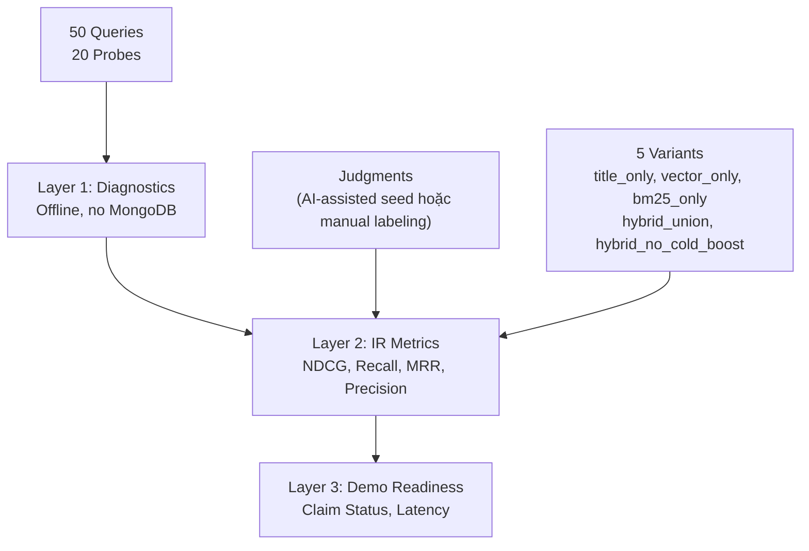

# Evaluation Framework — Walkthrough và Hướng dẫn sử dụng

## Tổng quan

Hệ thống evaluation được thiết kế theo **3 Layer** architecture:



---

## Cách hệ thống hoạt động

### Bước 1: Diagnostics (Layer 1) — Không cần MongoDB

Chạy 20 diagnostic probes để kiểm tra **query processing** đang hoạt động đúng chưa:

```bash
python scripts/run_eval_diagnostics.py \
  --probes evaluation/queries/diagnostic_probes.json \
  --out .runtime/evaluation/diagnostics_seed
```

**Kiểm tra gì:**
- `detect_language()` phân biệt đúng Vietnamese vs English?
- `extract_hard_filters()` extract đúng price range?
- Negation queries được đánh dấu `expected_unsupported`?
- Empty/whitespace queries raise `ValueError`?

**Output:** `layer1_summary.md` với pass rate.

### Bước 2: Build Judgment Pool — Cần MongoDB (và Ollama + BGE-M3 cho live query processing)

Chạy 50 queries qua tất cả 5 variants, thu thập kết quả để labeling:

```bash
python scripts/build_eval_pool.py \
  --queries evaluation/queries/retrieval_queries_seed.json \
  --out .runtime/evaluation/pool_seed \
  --top-k 20
```

**Output:** `judgment_pool.csv` — mỗi row là 1 (query, item) pair cần bạn label:

Lưu ý: repo hiện có sẵn bộ seed judgments theo hướng AI-assisted conservative. Nếu dùng để công bố/claim chính thức, vẫn nên có human audit.

| Cột | Ý nghĩa |
|---|---|
| `relevance` | **Bạn điền**: 0-3 (xem bảng dưới) |
| `reason` | **Bạn điền**: lý do cho score |
| `labels` | **Bạn điền**: `cold_item`, `new_seller`, etc. |

**Thang relevance:**

| Score | Nghĩa |
|---|---|
| 3 | Kết quả hoàn hảo — đúng ý người dùng |
| 2 | Có liên quan — đúng nhưng chưa đủ cụ thể |
| 1 | Liên quan mờ nhạt — cùng category nhưng sai intent |
| 0 | Không liên quan |

### Bước 3: Import judgments từ CSV sang JSON

Sau khi điền đầy đủ nhãn vào `judgment_pool.csv`, chạy script import để chuyển sang JSON và kiểm tra tính hợp lệ (validation) của dữ liệu:

```bash
python scripts/import_eval_judgments.py \
  --csv .runtime/evaluation/pool_seed/judgment_pool.csv \
  --out evaluation/judgments/retrieval_judgments_seed.json
```

*Tip: Thêm flag `--strict` nếu bạn muốn script báo lỗi ngay khi gặp dòng trống hoặc nhãn sai định dạng.*

### Bước 4: Full Evaluation (Layer 2+3) — Cần judgments

Chạy lệnh evaluation chính thức để đo chất lượng tìm kiếm:

```bash
python scripts/run_evaluation.py \
  --queries evaluation/queries/retrieval_queries_seed.json \
  --judgments evaluation/judgments/retrieval_judgments_seed.json \
  --out .runtime/evaluation/eval_seed \
  --top-k 10 \
  --k-values 1 3 5 10 \
  --relevance-threshold 2
```

**Output: `metrics_summary.md`** — Markdown report gồm:

1. **Variant Availability** — variant nào available/unavailable
2. **Variant Comparison** — NDCG@10, Recall@10, MRR@10, etc. cho mỗi variant
3. **Claim Status** — "Hybrid beats title-only baseline?" → supported/unsupported/needs_more_evidence
4. **Latency** — P50/P95 search latency
5. **Recommendations** — tự động đề xuất fix dựa trên metrics
6. **Commands** — liệt kê commands đã chạy và chưa chạy

### Smoke Test — Không cần gì ngoài Python

```bash
python scripts/run_evaluation.py \
  --queries evaluation/queries/retrieval_queries_seed.json \
  --judgments evaluation/judgments/retrieval_judgments_seed.json \
  --out .runtime/evaluation/smoke \
  --use-fake-results
```

Tạo report giả để kiểm tra framework hoạt động đúng — **không cần MongoDB, Ollama, hay BGE-M3**.

---

## 5 Variants so sánh gì?

| Variant | Cách hoạt động | Mục đích |
|---|---|---|
| `title_only` | Regex trên `items.title_en` + `items.brand` | **Baseline yếu** — hybrid phải thắng được cái này |
| `vector_only` | Chỉ HyPE vector search | Đo sức mạnh semantic search riêng |
| `bm25_only` | Chỉ BM25 proposition search | Đo sức mạnh keyword search riêng |
| `hybrid_union` | **Main system** — vector + BM25 + bonuses | Hệ thống production cần đánh giá |
| `hybrid_no_cold_boost` | Như hybrid nhưng bỏ COLD_START_BOOST | Ablation: cold boost có giúp gì không? |

---

## Cross-check Plan Checklist vs Implementation

| Checklist Item | Status | Note |
|---|---|---|
| `test_evaluation_dataset.py -v` passes | ✅ | Covered in the latest focused evaluation batch |
| `test_evaluation_diagnostics.py -v` passes | ✅ | Covered in the latest focused evaluation batch |
| `test_evaluation_guardrails.py -v` passes | ✅ | Covered in the latest focused evaluation batch |
| `test_evaluation_metrics.py -v` passes | ✅ | Covered in the latest focused evaluation batch |
| `test_evaluation_runner.py -v` passes | ✅ | Covered in the latest focused evaluation batch |
| `test_evaluation_variants.py -v` passes | ✅ | Covered in the latest focused evaluation batch |
| `test_pipeline.py test_validation.py` passes | ✅ 8 tests | Existing tests still pass |
| `test_llm_client.py` passes | ⚠️ | Pre-existing: `ollama` not installed |
| `run_eval_diagnostics.py --help` works | ✅ | |
| `build_eval_pool.py --help` works | ✅ | |
| `run_evaluation.py --help` works | ✅ | |
| `--use-fake-results` generates report | ✅ | 750 results, 0 failures |
| Layer 1 runs without MongoDB | ✅ | Only calls `detect_language`, `extract_hard_filters` |
| Layer 2 metrics from mocked results | ✅ | `_build_fake_results()` |
| Latency: query_processing vs search | ✅ | `query_processing_latency_ms`, `search_latency_ms`, `total_latency_ms` |
| Claim Status blocks unsupported claims | ✅ | 6 deterministic gates |
| Variant Availability table present | ✅ | In `metrics_summary.md` |
| `title_only` unavailable = recoverable | ✅ | Returns `FailureRecord(recoverable=True)` |
| `hybrid_no_cold_boost` no global mutation | ✅ | Test verifies `COLD_START_BOOST` unchanged |
| Runner never calls MongoDB writes | ✅ | `ReadOnlyMockCollection` test |
| Stale fixtures rejected by default | ✅ | `fixture_schema_version` check |
| Every CLI writes `manifest.json` | ✅ | All 3 CLIs write manifests |
| Import safety — no side effects | ✅ | 7 import tests pass |
| `evaluation/README.md` with labeling rules | ✅ | Decision tree + metric defs |
| Report lists commands run/not run | ✅ | `## Commands` section |

---

## File Structure Created

```
evaluation/                              ← Data files
  README.md                              ← Labeling rules + usage guide
  queries/
    diagnostic_probes.json               ← 20 Layer-1 probes
    retrieval_queries_seed.json          ← 50 Layer-2 queries
  judgments/
    retrieval_judgments_seed.json         ← Empty [] (pre-labeling)

src/evaluation/                          ← Python package
  __init__.py
  contracts.py                           ← 9 dataclasses + validation
  dataset.py                             ← JSON loading + dedup checks
  diagnostics.py                         ← 6 probe runners + summarizer
  metrics.py                             ← NDCG, Precision, Recall, MRR, HitRate, cold-start
  variants.py                            ← 5 variant runners + dispatcher
  runner.py                              ← Fixture cache + evaluation orchestrator
  reporting.py                           ← Markdown report + claim status + outputs

scripts/                                 ← CLI entrypoints
  run_eval_diagnostics.py                ← Layer 1 CLI
  build_eval_pool.py                     ← Pool builder for manual labeling
  run_evaluation.py                      ← Full evaluation CLI (+ smoke test)
  summarize_evaluation.py                ← Re-summarize existing run

tests/                                   ← Offline evaluation and guardrail tests
  test_evaluation_dataset.py             ← Contract + loading tests
  test_evaluation_diagnostics.py         ← Probe runner tests
  test_evaluation_guardrails.py          ← Import safety + read-only + mutation
  test_evaluation_metrics.py             ← IR metric correctness
  test_evaluation_runner.py              ← Runner + reporting tests
  test_evaluation_variants.py            ← Variant runner tests
```
